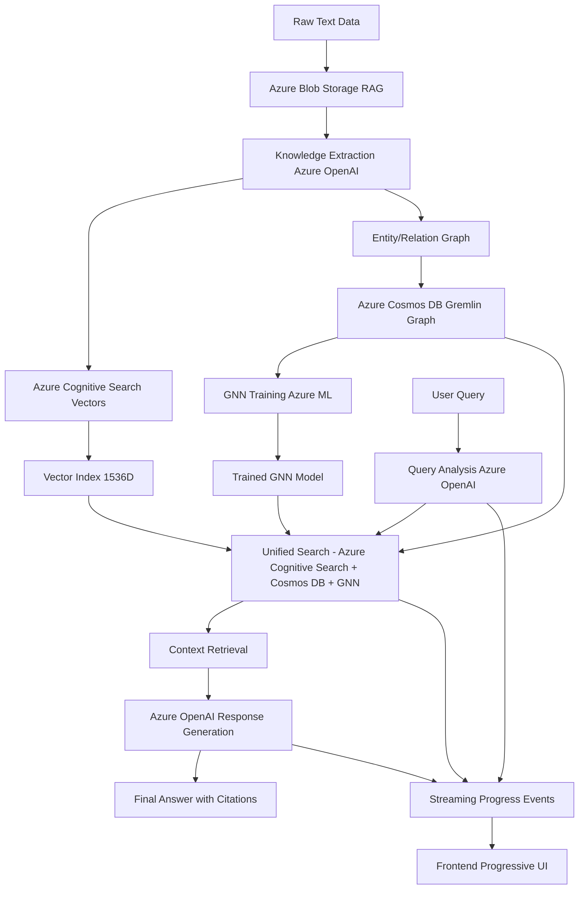

# CLAUDE.md

This file provides guidance to Claude Code when working with this **Azure Universal RAG system** - a production-grade platform combining knowledge graphs, vector search, and GNN training.

## Architecture Overview

### Core Components

- **Backend**: FastAPI service with Azure integrations (`backend/`)
- **Frontend**: React + TypeScript UI (`frontend/`)
- **Infrastructure**: Azure Bicep templates (`infra/`)
- **Azure Services**: OpenAI, Cognitive Search, Cosmos DB, Blob Storage, ML Workspace

### Data Flow



**Processing Phase**:

1. Raw text → Azure Blob Storage → Knowledge extraction (Azure OpenAI)
2. Parallel processing: Vector embeddings (1536D) + Entity/relation graph → Cosmos DB
3. GNN training on graph data → Trained model storage

**Query Phase**:
User query → Query analysis → Unified search (Vector + Graph + GNN) → Context retrieval → Response generation

**Real-time Features**: Streaming progress events to frontend progressive UI

## Key Services & Files

### Data Processing

- `core/utilities/intelligent_document_processor.py` - Document chunking and processing
- `core/azure_openai/knowledge_extractor.py` - Entity and relationship extraction
- `core/azure_search/search_client.py` - Vector search operations
- `core/azure_cosmos/cosmos_gremlin_client.py` - Graph database operations

### Orchestration

- `core/orchestration/rag_orchestration_service.py` - Main workflow coordinator
- `core/azure_ml/gnn_orchestrator.py` - GNN training coordination

## Common Commands

### Setup & Development

```bash
make setup              # Full project setup
make dev                # Start both backend + frontend
make health             # Check service health
make clean              # Clean sessions and logs
```

### Data Processing

```bash
make data-prep-full     # Complete data processing pipeline
make data-upload        # Upload docs & create chunks
make knowledge-extract  # Extract entities & relations
```

### Backend (cd backend)

```bash
make setup              # Python venv + Azure validation
make run                # Start FastAPI (localhost:8000)
make test               # Run pytest suite
```

### Frontend (cd frontend)

```bash
npm run dev             # Start Vite dev server (localhost:5174)
npm run build           # Production build
```

## Configuration

### Environment Setup

- `backend/.env` - Main Azure configuration
- `backend/config/environments/` - Environment-specific configs

### Required Azure Services

- Azure OpenAI (text processing)
- Azure Cognitive Search (vector search)
- Azure Cosmos DB with Gremlin API (knowledge graphs)
- Azure Blob Storage (data management)
- Azure ML Workspace (GNN training)

## Architecture Patterns

### Session Management

- Clean session replacement with unique timestamps
- Session summaries capture metrics and status
- Previous logs replaced (not accumulated)

### Error Handling

- Azure service retry logic
- Graceful degradation when services unavailable
- Comprehensive validation on startup

### Performance

- Async/await for Azure operations
- Batch processing for large datasets
- Connection pooling for database operations

## Technology Stack

**Backend**: FastAPI, Azure OpenAI, torch + torch-geometric, pandas, networkx
**Frontend**: React 19.1.0, TypeScript 5.8.3, Vite 7.0.4, axios
**Infrastructure**: Azure Bicep, Application Insights

## Development Guidelines

### Code Style

- Backend: Black formatter (line 88), isort imports
- Frontend: ESLint with TypeScript rules
- Follow existing patterns in `core/` modules

### Key Principles

- Never make assumptions - base decisions on existing code and facts
- Start simple but maintain professional quality
- Use Azure ecosystem best practices
- Validate Azure service health before operations

## Documentation References

For detailed implementation guidance, see:

- `/docs/workflows/` - Detailed workflow documentation
- `/docs/supervisor_demo/` - Demo and metrics documentation
- `/docs/COMPLETE_RAG_ARCHITECTURE.md` - Complete architecture guide

## Current Status

**Performance Metrics**:

- Sub-3-second query processing
- 85% relationship extraction accuracy
- 60% cache hit rate with 99% reduction in repeat processing

**Key Features**:

- Multi-hop reasoning with semantic path discovery
- Context-aware relationship weighting
- Real-time workflow visualization
- Enterprise-grade error handling and monitoring
