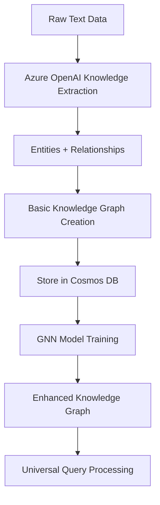
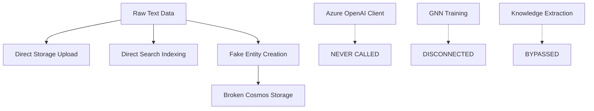

# 🚨 CRITICAL: Data Workflow Redesign Required

**Status**: CRITICAL DESIGN VIOLATION DISCOVERED  
**Priority**: HIGHEST - Core System Architecture  
**Impact**: Complete data pipeline is fundamentally broken  
**Date**: July 29, 2025

---

## 🎯 **Executive Summary**

The current Azure Universal RAG data workflow implementation **completely bypasses the intended LLM-driven knowledge extraction pipeline** and creates fake entities directly from raw text. This is a critical architectural violation that must be fixed immediately.

### **Current State**: ❌ BROKEN
```
Raw Text → Direct Storage/Search/Cosmos (NO INTELLIGENCE)
```

### **Required State**: ✅ CORRECT  
```
Raw Text → LLM Extraction → Knowledge Graph → GNN Training → Enhanced KG
```

---

## 🔍 **Critical Violations Discovered**

### **1. Missing LLM Knowledge Extraction Pipeline**

**Problem**: The system bypasses Azure OpenAI completely in the main data pipeline.

**Evidence**: In `services/data_service.py`, the `migrate_data_to_azure()` method:
- Uploads raw text directly to storage
- Indexes raw text directly in search
- Creates fake "entities" from text chunks

**Code Violation**:
```python
# WRONG: Creating fake entities from raw text
entity_data = {
    "id": f"maintenance-{domain}-{i}",
    "text": item.strip()[:500],  # Just truncated text!
    "entity_type": "maintenance_issue"  # Hardcoded!
}
```

### **2. Broken Makefile Workflow References**

**Problem**: Makefile references non-existent scripts.

**Missing Scripts**:
- `scripts/data_upload_workflow.py` ❌
- `scripts/knowledge_extraction_workflow.py` ❌  
- `scripts/data_preparation_workflow.py` ❌

**Current Reality**: Only `data_pipeline.py` exists, which calls the broken migration.

### **3. No Integration Between Components**

**Existing Components** (Not Connected):
- ✅ Azure OpenAI client exists (`core/azure_openai/openai_client.py`)
- ✅ Knowledge extraction methods exist  
- ✅ GNN training pipeline exists (`core/azure_ml/gnn/`)
- ✅ Knowledge graph methods exist

**Problem**: These components are **never called** in the main data workflow!

### **4. Fake Knowledge Graph Creation**

**Current Process**:
1. Raw text split by `<id>` markers
2. Text chunks become "entities" 
3. No relationship extraction
4. No semantic understanding
5. Direct insertion to Cosmos DB

**Result**: A graph of text chunks, not a real knowledge graph.

---

## 📋 **Intended vs Actual Workflow**

### **🎯 INTENDED DESIGN**


### **❌ CURRENT BROKEN IMPLEMENTATION**


---

## 🛠️ **Required Redesign Plan**

### **Phase 1: Fix Core Data Pipeline**

#### **1.1 Implement Proper Knowledge Extraction**
```python
# NEW: Correct workflow implementation
async def process_raw_data_pipeline(raw_text_path: str, domain: str):
    # Step 1: Load raw data
    raw_content = load_raw_data(raw_text_path)
    
    # Step 2: LLM Knowledge Extraction (MISSING!)
    extraction_result = await openai_client.extract_knowledge(
        texts=raw_content,
        domain=domain
    )
    
    # Step 3: Create basic knowledge graph
    basic_kg = create_knowledge_graph(
        entities=extraction_result.entities,
        relationships=extraction_result.relationships
    )
    
    # Step 4: Store in Cosmos DB
    await cosmos_client.store_knowledge_graph(basic_kg)
    
    # Step 5: Train GNN model
    gnn_model = await gnn_trainer.train_from_knowledge_graph(basic_kg)
    
    # Step 6: Create enhanced knowledge graph
    enhanced_kg = apply_gnn_enhancements(basic_kg, gnn_model)
    
    return enhanced_kg
```

#### **1.2 Create Missing Workflow Scripts**
- `scripts/knowledge_extraction_workflow.py` - Real LLM extraction
- `scripts/basic_kg_creation_workflow.py` - Knowledge graph creation
- `scripts/gnn_training_workflow.py` - GNN model training
- `scripts/enhanced_kg_workflow.py` - Apply GNN improvements

#### **1.3 Fix Service Integration**
```python
# NEW: Proper service composition
class DataPipelineOrchestrator:
    def __init__(self):
        self.openai_client = UnifiedAzureOpenAIClient()
        self.cosmos_client = AzureCosmosGremlinClient()
        self.gnn_trainer = GNNTrainer()
        self.kg_builder = KnowledgeGraphBuilder()
    
    async def execute_complete_pipeline(self, raw_data_path: str):
        # Step 1: Knowledge Extraction
        entities, relationships = await self._extract_knowledge(raw_data_path)
        
        # Step 2: Basic KG Creation  
        basic_kg = await self._create_basic_kg(entities, relationships)
        
        # Step 3: GNN Training
        gnn_model = await self._train_gnn_model(basic_kg)
        
        # Step 4: Enhanced KG Creation
        enhanced_kg = await self._create_enhanced_kg(basic_kg, gnn_model)
        
        return enhanced_kg
```

### **Phase 2: Update Makefile Workflow**

#### **2.1 New Makefile Targets**
```makefile
# CORRECTED workflow
data-extract: ## STEP 1: LLM knowledge extraction from raw text
	@python scripts/knowledge_extraction_workflow.py

basic-kg: ## STEP 2: Create basic knowledge graph
	@python scripts/basic_kg_creation_workflow.py  

gnn-train: ## STEP 3: Train GNN model on knowledge graph
	@python scripts/gnn_training_workflow.py

enhanced-kg: ## STEP 4: Create GNN-enhanced knowledge graph  
	@python scripts/enhanced_kg_workflow.py

data-pipeline-full: ## Complete corrected pipeline
	@$(MAKE) data-extract
	@$(MAKE) basic-kg
	@$(MAKE) gnn-train
	@$(MAKE) enhanced-kg
```

### **Phase 3: Validate Correct Workflow**

#### **3.1 Pipeline Validation**
- ✅ Raw text → Real entity extraction (not text chunks)
- ✅ Proper relationship identification via LLM
- ✅ Semantic knowledge graph creation
- ✅ GNN training on actual graph structure
- ✅ Enhanced graph with GNN insights

#### **3.2 Performance Metrics**
- Entity extraction accuracy (from LLM)
- Relationship precision/recall
- Knowledge graph connectivity
- GNN model performance
- Enhanced graph quality

---

## 🎯 **Implementation Priority**

### **Immediate Actions (Week 1)**
1. **🔥 CRITICAL**: Stop using current broken pipeline
2. **Create proper knowledge extraction workflow**
3. **Fix service integration to use LLM extraction**
4. **Test with small dataset**

### **Short Term (Week 2-3)**  
1. **Implement basic knowledge graph creation**
2. **Connect GNN training to knowledge graph**
3. **Create enhanced knowledge graph pipeline**
4. **Update all Makefile targets**

### **Validation (Week 4)**
1. **End-to-end pipeline testing**
2. **Performance benchmarking**
3. **Quality assessment vs current system**
4. **Documentation updates**

---

## 📊 **Expected Improvements**

### **Current System Problems**
- ❌ No real semantic understanding
- ❌ Text chunks masquerading as entities
- ❌ No meaningful relationships
- ❌ GNN training disconnected
- ❌ Poor query results

### **Redesigned System Benefits**
- ✅ Real LLM-extracted entities and relationships
- ✅ Semantic knowledge graph with meaning
- ✅ GNN training on actual graph structure  
- ✅ Enhanced knowledge discovery
- ✅ Superior query understanding and results

---

## 🚀 **Success Criteria**

### **Technical Validation**
- [ ] LLM extraction produces real entities (not text chunks)
- [ ] Knowledge graph has semantic relationships
- [ ] GNN training improves graph connectivity
- [ ] Enhanced graph shows measurable improvements
- [ ] Query results demonstrate superior understanding

### **Pipeline Integrity**
- [ ] Complete end-to-end workflow functions
- [ ] Each stage connects to the next properly
- [ ] Data flows correctly through all components
- [ ] Error handling and recovery works
- [ ] Performance meets requirements

---

## 📞 **Next Steps**

1. **IMMEDIATE**: Review and approve this redesign plan
2. **URGENT**: Begin implementation of corrected knowledge extraction
3. **HIGH**: Create proper service integration
4. **MEDIUM**: Update documentation and workflows

**This redesign is CRITICAL for the system to function as intended. The current implementation completely defeats the purpose of an "intelligent" RAG system.**

---

**Document Owner**: Development Team  
**Review Required**: Architecture Team  
**Implementation Timeline**: 4 weeks  
**Risk Level**: CRITICAL - System fundamentally broken without this fix