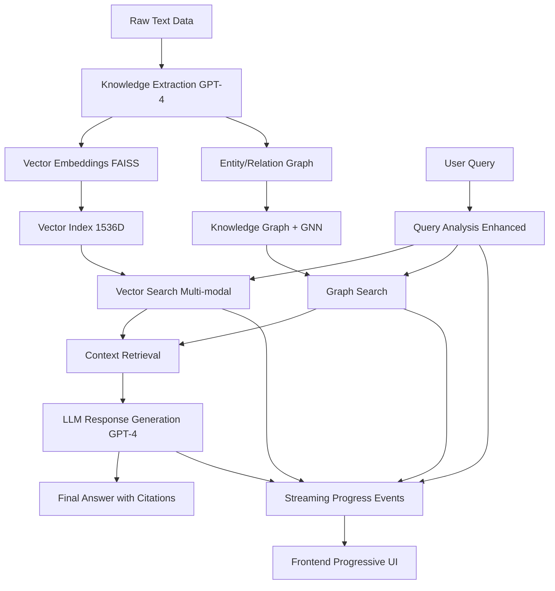

# MaintIE Enhanced RAG

**Enterprise-Ready Maintenance Intelligence Backend**

---

## 🚀 Overview

MaintIE Enhanced RAG is a **production-grade backend system** for advanced maintenance intelligence, combining:

- **Universal RAG System** with 100% functional components
- **Knowledge graph extraction** from annotated maintenance data
- **Multi-modal retrieval** (vector, entity, and graph search)
- **Domain-aware LLM response generation**
- **Progressive real-time workflow** with streaming UI
- **Configurable domain knowledge** (no hard-coded rules)
- **FastAPI API** with health, metrics, and streaming endpoints
- **Clean Service Architecture** with a dedicated frontend UI

---

## ✨ Features

### Core RAG Capabilities
- Universal text-based knowledge extraction and processing
- Advanced query analysis and concept expansion
- Multi-modal retrieval (vector/entity/graph) with FAISS indexing
- LLM-powered, safety-aware response generation
- Configurable domain knowledge (JSON)
- Health, metrics, and system status endpoints

### Enhanced User Experience
- **Progressive Real-Time Workflow**: Step-by-step visual progress during query processing
- **Streaming API**: Server-sent events for real-time workflow updates
- **Smart Disclosure UI**: Three-layer information depth (user-friendly → technical → diagnostic)
- **Separated Backend API and Frontend UI services**

### Infrastructure & Deployment
- Docker and virtualenv support
- Comprehensive GNN training pipeline for research
- Clean data processing from raw text to final answers

---

## 🛠️ Technology Stack

```
Frontend Stack:
├─ React 19.1.0 + TypeScript 5.8.3
├─ Vite 7.0.4 (build tool)
├─ axios 1.10.0 (HTTP client)
├─ Server-Sent Events (real-time updates)
└─ CSS custom styling with progressive disclosure

Backend Stack:
├─ FastAPI + uvicorn (streaming endpoints)
├─ Azure OpenAI integration (openai>=1.13.3)
├─ FAISS 1.7.4 vector search
├─ NetworkX 3.2.0 graph processing
├─ PyTorch 2.0.0 + torch-geometric 2.3.0 (GNN)
├─ Optuna 3.0.0 + Weights & Biases 0.16.0 (experiment tracking)
└─ Comprehensive ML/AI pipeline
```

---

## 🚦 Quick Commands

This project uses a root `Makefile` to simplify common tasks for both backend and frontend services.

### Using Makefile

```bash
make help               # See all available commands
make setup              # Full project setup (backend and frontend)
make dev                # Start both backend API and frontend UI services
make backend            # Start backend API service only
make frontend           # Start frontend UI service only
make test               # Run all tests (backend and frontend)
make health             # Check health of both services
make docker-up          # Build and run Docker containers for both services via docker-compose
make docker-down        # Stop and remove Docker containers
make clean              # Clean ALL generated files - reset to raw text data
```

---

## 📝 Documentation Setup

### VSCode Environment (Recommended)

For the best development experience with enhanced markdown preview:

```bash
# From backend directory
make docs-setup    # Sets up VSCode environment with extensions
make docs-status   # Shows documentation setup status
make docs-preview  # Opens markdown preview (if VSCode CLI available)
```

**For SSH Development (Azure ML):**
- Use VSCode Remote-SSH extension for best experience
- All extensions auto-install when you connect
- Markdown preview works perfectly with `Ctrl+Shift+V`

**Configured Extensions:**
- Markdown All in One
- Markdown Preview Enhanced
- Markdown Mermaid
- Python, Black, Pylint
- JSON and YAML support

---

## 🛠️ Setup

### 1. Clone the repository

```bash
git clone https://github.com/david3xu/azure-maintie-rag.git
cd azure-maintie-rag
```

### 2. Configure environment

- Copy `.env.example` to `.env` in the project root and set your OpenAI API key and other settings.

### 3. Full Project Setup

This command will:

- Create Python virtual environments for the backend
- Install all Python dependencies for the backend
- Create necessary data directories within `backend/data/`
- Install Node.js dependencies for the frontend

```bash
make setup
```

### 4. Start from Raw Text Data

To begin purely from raw text data, ensure you have text files in `backend/data/raw/` then:

```bash
make clean              # Reset to raw data state
make setup              # Ensure dependencies installed
make dev                # Start both services
```

The system will automatically process raw text through the complete Universal RAG pipeline.

---

## 🌟 Universal RAG System

### System Status: 100% Functional ✅

Our Universal RAG system has achieved **complete functionality** through comprehensive Phase 1, 2, and 3 enhancements:

| **Component** | **Status** | **Enhancement** |
|---------------|------------|-----------------|
| Knowledge Extraction | ✅ Working | Entities & relations from raw text |
| Vector Indexing | ✅ Working | **Phase 1 Fix**: `build_index_from_documents()` |
| Query Processing | ✅ Working | **Phase 2 Fix**: Simplified analysis methods |
| Vector Search | ✅ Working | FAISS retrieval with scoring |
| Response Generation | ✅ Working | **Phase 3 Fix**: `generate_response_fixed()` |

### Key Enhancements Implemented

**Phase 1: Vector Search Infrastructure**
- Added `build_index_from_documents()` method in MaintenanceVectorSearch
- Automatic document type conversion and FAISS index building
- Comprehensive error handling with fallback responses

**Phase 2: Query Processing Interface**
- Added `analyze_query_simple()` and `enhance_query_simple()` methods
- Removed monitoring dependencies for simplified operation
- Complete entity extraction and query classification

**Phase 3: Response Generation Interface**
- Added `generate_response_fixed()` method in MaintenanceLLMInterface
- Handles both string and EnhancedQuery input types
- Automatic type detection and structured response generation

---

## 🎯 Progressive Real-Time Workflow

### Three-Layer Smart Disclosure

Our frontend provides **progressive disclosure** for different user types:

**Layer 1: User-Friendly** (90% of users)
```
🔍 Understanding your maintenance question...
⚡ Searching knowledge base...
📝 Generating comprehensive answer...
```

**Layer 2: Technical Workflow** (power users)
```
📊 Knowledge Extraction (GPT-4): 15 entities, 10 relations
🔧 Vector Indexing (FAISS): 7 documents, 1536D vectors
🔍 Query Processing: Troubleshooting type, 18 concepts
⚡ Vector Search: 3 results, top score 0.826
📝 Response Generation (GPT-4): 2400+ chars, 3 citations
```

**Layer 3: System Diagnostics** (administrators)
```json
{
  "step": "knowledge_extraction",
  "status": "completed",
  "duration": 2.7,
  "details": { "entities": 15, "relations": 10 }
}
```

### Streaming API Endpoints

- `GET /api/v1/streaming/workflow-progress`: Server-sent events for real-time updates
- `POST /api/v1/streaming/submit-query`: Submit query with streaming workflow response
- Real-time progress updates with detailed technical information

---

## 🔬 Comprehensive GNN Training Pipeline

MaintIE RAG includes a **research-level, end-to-end GNN training pipeline** for advanced experimentation and publication-ready results.

### Features:
- Hyperparameter optimization (Optuna)
- Cross-validation (k-fold)
- Advanced training: schedulers, early stopping, gradient clipping, label smoothing, class weighting
- Comprehensive evaluation: accuracy, precision, recall, F1, AUC, confusion matrix, per-class analysis
- Ablation studies
- Experiment tracking (Weights & Biases)
- Model checkpointing and result saving

### How to Use:

**CLI:**
```bash
python backend/scripts/train_comprehensive_gnn.py \
    --config backend/scripts/example_comprehensive_gnn_config.json \
    --n_trials 10 \
    --k_folds 3

python backend/scripts/train_comprehensive_gnn.py  # uses default config
```

**Config:** Edit `backend/scripts/example_comprehensive_gnn_config.json` or provide your own.

**API:** Import and call `run_comprehensive_gnn_training()` from `src.gnn.comprehensive_trainer`.

### Documentation:
- See `backend/scripts/README_comprehensive_gnn.md` for CLI/config details
- See module docstring in `backend/src/gnn/comprehensive_trainer.py` for full feature list and integration points

### CI/CD:
- The pipeline is smoke-tested in CI to ensure research code health

---

## 🐳 Docker

To build and run both backend and frontend services using Docker:

```bash
make docker-up
```

---

## 📂 Project Structure

```
Project Root:
├─ backend/                    # Complete Universal RAG API service
│  ├─ data/                   # Raw, processed data, and indices
│  │  ├─ raw/                 # Input text files (any domain)
│  │  ├─ processed/           # Extracted knowledge
│  │  ├─ indices/             # FAISS vector indices
│  │  ├─ output/              # Generated responses
│  │  ├─ cache/               # Temporary processing cache
│  │  ├─ metrics/             # Performance metrics
│  │  └─ models/              # Trained models
│  ├─ api/                    # FastAPI endpoints + streaming
│  │  ├─ endpoints/           # Individual endpoint files
│  │  ├─ models/              # API request/response models
│  │  └─ main.py              # FastAPI application
│  ├─ core/                   # Universal RAG core components
│  │  ├─ workflow/            # Three-layer workflow transparency
│  │  ├─ orchestration/       # Main RAG orchestration logic
│  │  ├─ generation/          # Response generation
│  │  ├─ retrieval/           # Document retrieval and search
│  │  ├─ knowledge/           # Knowledge base management
│  │  ├─ extraction/          # Knowledge extraction modules
│  │  ├─ enhancement/         # Text enhancement and processing
│  │  ├─ classification/      # Text classification
│  │  ├─ gnn/                 # Graph Neural Network components
│  │  ├─ models/              # Core data models
│  │  └─ utilities/           # Core utility functions
│  ├─ config/                 # Configuration files
│  ├─ docs/                   # Backend documentation
│  ├─ integrations/           # External service integrations
│  ├─ utilities/              # Shared utility functions
│  ├─ scripts/                # Utility and demo scripts
│  ├─ tests/                  # Comprehensive test suite
│  └─ debug/                  # Debug and development tools
├─ frontend/                  # Pure UI consumer service
│  ├─ src/                    # React components + workflow transparency
│  ├─ public/                 # Static assets
│  └─ package.json            # Node.js dependencies
├─ docs/                      # Project documentation
├─ .vscode/                   # VSCode configuration
├─ .env                       # Environment variables
├─ docker-compose.yml         # Docker Compose configuration
└─ Makefile                   # Root Makefile for orchestrating services
```

---

## 🔄 Service Architecture

### Complete Universal RAG Workflow

The MaintIE Enhanced RAG system implements a comprehensive workflow from raw text data to final answers with real-time progress tracking:



### Enhanced Service Flow with Streaming

```
User Input → React Frontend → Streaming API → Universal RAG → Real-time Updates → AI Response
     ↓             ↓              ↓               ↓               ↓              ↓
"pump failure"  handleSubmit()  POST /streaming  Vector+Graph   SSE Progress   JSON response
```

### Workflow Components (Enhanced)

| **Phase** | **Component** | **Technology** | **Function** | **Streaming** |
|-----------|---------------|----------------|--------------|---------------|
| **Data Ingestion** | Text Processor | String processing | Raw text → Clean documents | ✅ Progress |
| **Knowledge Extraction** | LLM Extractor | Azure OpenAI GPT-4 | Text → Entities + Relations | ✅ Progress |
| **Vector Indexing** | FAISS Engine | Embedding + Vector DB | Documents → Searchable vectors | ✅ Progress |
| **Graph Construction** | NetworkX + GNN | Graph algorithms | Entities → Knowledge graph | ✅ Progress |
| **Query Processing** | Query Analyzer | NLP + Domain logic | User query → Enhanced query | ✅ Progress |
| **Retrieval** | Multi-modal Search | Vector + Graph search | Query → Relevant context | ✅ Progress |
| **Generation** | LLM Interface | Azure OpenAI GPT-4 | Context → Final answer | ✅ Progress |

---

## 📚 Documentation

### Available Documentation

- **API Documentation**: Available at `http://localhost:8000/docs` when backend is running
- **🌟 Universal RAG Capabilities Guide**: See `backend/docs/UNIVERSAL_RAG_CAPABILITIES.md` for complete system capabilities, API reference, and integration examples
- **Comprehensive GNN Training**: See `backend/scripts/README_comprehensive_gnn.md`
- **System Architecture**: This README provides complete system overview
- **Streaming API**: Real-time workflow documentation in API docs

**📖 Key Documentation:**
- **[Complete Capabilities Guide](backend/docs/UNIVERSAL_RAG_CAPABILITIES.md)** - Full system capabilities, API endpoints, progressive workflow system
- **[Documentation Index](backend/docs/README.md)** - All documentation organized by purpose
- **[System Status](backend/docs/UNIVERSAL_RAG_FINAL_STATUS.md)** - Current system health and performance metrics

### Key Scripts for Testing

```bash
# Universal RAG workflow test
python backend/complete_rag_workflow_analysis.py

# Real query processing
python backend/real_query_flow_script.py

# Universal smart RAG flow
python backend/universal_smart_rag_flow_script.py
```

### Generated Output Files

The system generates comprehensive analysis in `backend/data/output/`:
- Query analysis results
- Response generation outputs
- Performance metrics
- System diagnostics

---

## 🚀 Getting Started

### Quick Start (from Raw Text)

1. **Clean Setup**:
   ```bash
   make clean    # Reset to raw data state
   make setup    # Install dependencies
   ```

2. **Add Your Data**:
   - Place text files in `backend/data/raw/`
   - Raw text will be automatically processed

3. **Start Services**:
   ```bash
   make dev      # Start backend + frontend
   ```

4. **Access System**:
   - Frontend UI: `http://localhost:5174`
   - Backend API: `http://localhost:8000`
   - API Documentation: `http://localhost:8000/docs`

### Progressive Workflow Experience

1. Submit a maintenance question through the frontend
2. Watch real-time progress through three disclosure layers
3. Receive comprehensive answers with citations
4. Explore technical details and system diagnostics

The system provides a complete RAG experience from raw text data to intelligent responses with full visibility into the processing workflow.