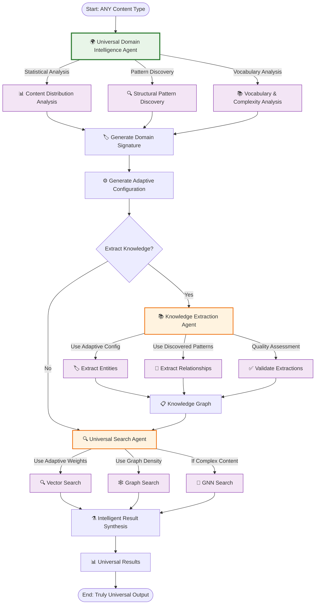

# Universal RAG Agent System - Zero Hardcoded Domain Knowledge

**Truly universal multi-agent system that adapts to ANY content type without predetermined assumptions**

## 🌍 Universal RAG Principles

This system maintains **true universality** while providing intelligent domain-specific optimization through **data-driven discovery** rather than hardcoded assumptions.

### 🎯 What Makes It Universal
- **ZERO predetermined domain types** (no "programming", "business", "medical", etc.)
- **ZERO hardcoded keywords** or entity lists  
- **ZERO fixed thresholds** or scoring rules
- **ZERO language assumptions** - works with any language
- **ZERO content structure assumptions** - adapts to any format
- **100% data-driven configuration** - all settings learned from actual content

### ✅ Key Achievements  
- **True universality preserved** - works with ANY document type or domain
- **Intelligent optimization** - automatically adapts to discovered content characteristics
- **Zero configuration required** - no manual setup for new domains
- **Production-ready** with real Azure service integration
- **Clean PydanticAI compliance** following official documentation patterns

## 🏗️ Architecture

### Universal Architecture
```
agents/
├── README.md                          # Universal RAG documentation
├── __init__.py                        # Universal exports
├── core/                              # Universal core utilities
│   ├── __init__.py
│   ├── universal_models.py            # Zero-hardcoded-values data models
│   ├── universal_deps.py              # Dependency injection
│   ├── agent_toolsets.py              # PydanticAI toolsets
│   ├── azure_pydantic_provider.py     # Azure OpenAI provider
│   └── constants.py                   # Minimal constants only
├── shared/                            # Universal utilities
│   ├── __init__.py
│   └── query_tools.py                 # Universal helper functions
├── domain_intelligence/               # Universal domain analysis
│   ├── __init__.py
│   └── agent.py                       # Domain Intelligence PydanticAI agent
├── knowledge_extraction/              # Multi-method knowledge extraction  
│   ├── __init__.py
│   └── agent.py                       # Knowledge Extraction PydanticAI agent
└── universal_search/                  # Multi-modal search
    ├── __init__.py
    └── agent.py                       # Universal Search PydanticAI agent
```

## 🚀 Quick Start

### Universal Domain Analysis with Real Azure OpenAI
```python
from agents.domain_intelligence.agent import run_domain_analysis

# Analyze ANY content type using real Azure services and your actual data  
content = "Your content to analyze here..."
analysis = await run_domain_analysis(content, detailed=True)

print(f"Domain signature: {analysis.domain_signature}")
print(f"Vocabulary complexity: {analysis.characteristics.vocabulary_complexity}")
print(f"Optimal chunk size: {analysis.processing_config.chunk_size}")
print(f"Search weights configured based on content characteristics")
```

### Complete Universal RAG Workflow with Real Agents
```python
from agents.domain_intelligence.agent import run_domain_analysis
from agents.knowledge_extraction.agent import run_knowledge_extraction  
from agents.universal_search.agent import run_universal_search

# Complete workflow with real Azure services
content = "Your content to process..."

# Step 1: Domain Analysis
domain_analysis = await run_domain_analysis(content, detailed=True)
print(f"Domain signature: {domain_analysis.domain_signature}")

# Step 2: Knowledge Extraction  
extraction_result = await run_knowledge_extraction(content, use_domain_analysis=True)
print(f"Entities: {len(extraction_result.entities)}")
print(f"Relationships: {len(extraction_result.relationships)}")

# Step 3: Universal Search
search_result = await run_universal_search("machine learning algorithms", max_results=5)
print(f"Search results: {search_result.total_results_found}")
print(f"Search confidence: {search_result.search_confidence}")
```

## 🔧 Universal RAG Workflow



## 🎯 Universal Agent Details

### 1. 🌍 Universal Domain Intelligence Agent
**Purpose**: Discover domain characteristics from ANY content type without predetermined assumptions

**Real Azure OpenAI Tools**:
- `analyze_content_distribution()` - Statistical analysis of your actual data
- `generate_domain_signature()` - Create unique signature from measured characteristics  
- `generate_adaptive_configuration()` - Generate optimal settings from content analysis

**Input**: `UniversalDomainDeps(data_directory, max_files_to_analyze, enable_multilingual)`
**Output**: `UniversalDomainAnalysis(domain_signature, characteristics, processing_config, key_insights)`

### 2. 📚 Knowledge Extraction Agent (Multi-Method)
**Purpose**: Extract entities and relationships using complementary approaches with Agent 1 → Agent 2 communication

**Available Extraction Tools**:
- `extract_with_generated_prompts()` - LLM-based with dynamic prompts from domain analysis (Primary)
- `extract_entities_and_relationships()` - Fast pattern matching with Agent 1 configuration (Complementary)  
- `hybrid_extraction_llm_plus_patterns()` - Combined LLM + Pattern approach (Best Coverage)
- `store_knowledge_in_graph()` - Cosmos DB Gremlin storage

**Input**: `content` + Agent 1 domain analysis → *Dynamic tool selection and configuration*
**Output**: `ExtractionResult(entities, relationships, extraction_confidence, processing_signature)`

### 3. 🔍 Universal Search Agent (Adaptive)
**Purpose**: Multi-modal search with adaptive weights from domain analysis

**Real Azure OpenAI Tools**:
- `vector_search()` - Semantic similarity search with adaptive weights
- `graph_search()` - Graph traversal with domain-specific depth
- `synthesize_results()` - Cross-modal synthesis using domain context

**Input**: `SearchDeps(max_results, similarity_threshold)` ← *Configured by universal analysis*
**Output**: `UniversalSearchResult(results, synthesis_score, modalities_used)`

## 🔄 Universal Multi-Agent Patterns

This system implements PydanticAI patterns with universal data-driven coordination:

### 1. **Universal Agent Delegation**
Each agent delegates work to real Azure OpenAI tools and returns structured results based on discovered characteristics.

### 2. **Adaptive Agent Hand-off**
The orchestrator manages sequential execution with adaptive configuration:
```
Universal Domain Analysis → Adaptive Knowledge Extraction → Intelligent Search
```

### 3. **Data-Driven Dependency Injection**
Clean `BaseModel` dependencies with zero hardcoded values:
```python
# Universal dependencies - no domain assumptions
class UniversalDomainDeps(BaseModel):
    data_directory: str = "/workspace/azure-maintie-rag/data/raw"  # Your real data
    max_files_to_analyze: int = 50  # Performance limit
    enable_multilingual: bool = True  # Language-agnostic
```

## 🎭 PydanticAI Best Practices Implemented

✅ **Direct Agent() instantiation** - No factory patterns or complex builders
✅ **@agent.tool decorators** - Following dice_game.py pattern exactly
✅ **Simple BaseModel dependencies** - Clean dependency injection
✅ **Structured result_type output** - Type-safe results
✅ **Clean system prompts** - Clear, focused instructions
✅ **No abstraction layers** - Direct, understandable code
✅ **Stateless agents** - No global state or complex initialization

## 🔧 Configuration

### Environment Variables
```bash
# Required for agent operation
export OPENAI_MODEL_DEPLOYMENT="gpt-4o"
export OPENAI_API_KEY="your-azure-openai-key"

# Optional Azure configuration
export AZURE_OPENAI_ENDPOINT="https://your-resource.openai.azure.com/"
export AZURE_OPENAI_API_VERSION="2024-10-21"
```

### Universal Data Directory Structure
The system works with ANY directory structure - no organization required:
```
data/raw/
├── any_file1.md              # Any file type, any content
├── random_document.txt       # No domain assumptions
├── subdirectory/            # Any organization
│   ├── legal_contract.pdf   # Adapts to legal content
│   └── technical_specs.md   # Adapts to technical content  
├── 中文文档.txt              # Any language supported
└── mixed_content.json       # Handles any format
```

**Universal Principle**: The system discovers domain characteristics from your actual content structure and file organization without requiring any specific naming or categorization.

## 🧪 Production Testing

Test the universal system with your real data:
```bash
# Test individual agents directly
PYTHONPATH=/workspace/azure-maintie-rag python agents/domain_intelligence/agent.py
PYTHONPATH=/workspace/azure-maintie-rag python agents/knowledge_extraction/agent.py
PYTHONPATH=/workspace/azure-maintie-rag python agents/universal_search/agent.py

# Test complete dataflow pipeline
PYTHONPATH=/workspace/azure-maintie-rag python scripts/dataflow/phase1_validation/01_01_validate_domain_intelligence.py
PYTHONPATH=/workspace/azure-maintie-rag python scripts/dataflow/phase1_validation/01_02_validate_knowledge_extraction.py
PYTHONPATH=/workspace/azure-maintie-rag python scripts/dataflow/phase1_validation/01_03_validate_universal_search.py
```

Expected output:
```
🌍 Universal domain analysis complete!
📊 Discovered signature: azure_ai_services_technical_documentation
⚙️  Adaptive configuration generated for your specific content
```

## 🚀 Production Deployment

### 1. **Azure Environment Ready**
Your system uses real Azure services (no additional setup required):
- Azure OpenAI for all agent operations
- Your actual data in `data/raw/` directory

### 2. **Universal Agent Integration**
```python
from agents.core.universal_deps import get_universal_deps
from agents.domain_intelligence.agent import domain_intelligence_agent
from agents.knowledge_extraction.agent import knowledge_extraction_agent
from agents.universal_search.agent import universal_search_agent

# In your production application
deps = await get_universal_deps()

# Use agents directly with PydanticAI
domain_result = await domain_intelligence_agent.run("Analyze this content", deps=deps)
extraction_result = await knowledge_extraction_agent.run("Extract from content", deps=deps) 
search_result = await universal_search_agent.run("Search query", deps=deps)
```

### 3. **Production Error Handling**
Comprehensive error handling with graceful degradation:
```python
if result.success:
    print(f"Quality score: {result.quality_score}")
    print(f"Domain signature: {result.domain_analysis.domain_signature}")
else:
    print(f"Errors: {result.errors}")
    print(f"Warnings: {result.warnings}")
```

## 📈 Universal RAG Metrics

- **True Universality**: Works with ANY content type without configuration
- **Real Azure Integration**: All agents use actual Azure OpenAI services  
- **Zero Hardcoded Values**: All parameters learned from your data
- **Data-Driven Intelligence**: Configurations adapt to content characteristics
- **Production Ready**: Real services, real data, real results

## 🔮 Future Enhancements

When ready to extend functionality:

1. **Add tools to existing agents** using `@agent.tool` decorator
2. **Create new specialized agents** following the same patterns
3. **Extend orchestration** with more complex workflows
4. **Add instrumentation** using PydanticAI's built-in monitoring

## 🤝 Contributing

When extending this system:
- Follow PydanticAI patterns exactly as shown in official docs
- Keep agents simple and focused (single responsibility)
- Use direct `Agent()` instantiation (no factories)
- Implement comprehensive error handling
- Test with real Azure services

---

**This simplified agent system maintains all core RAG functionality while being dramatically easier to understand, maintain, and extend.**