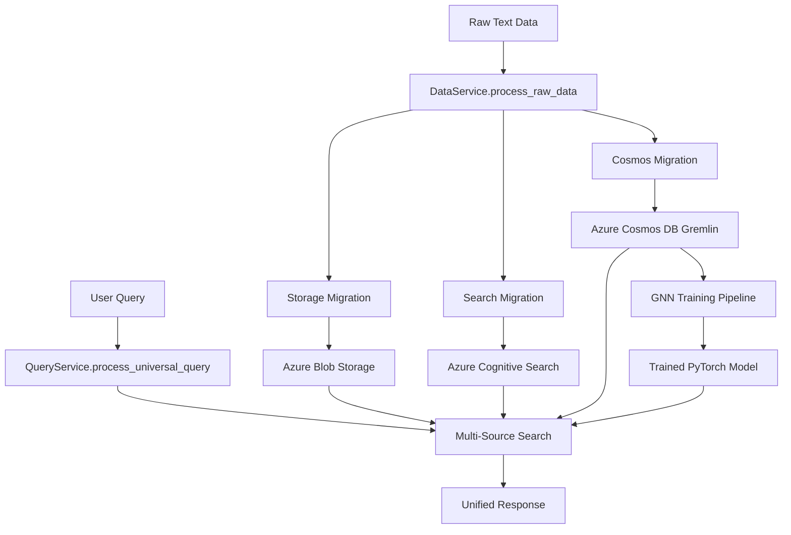

# Azure Universal RAG Backend - Architecture Overview

**Technical architecture and implementation details for the backend system**

📖 **Related Documentation:**
- ⬅️ [Backend Overview](README.md)
- 🔧 [Developer Guide](DEVELOPER_GUIDE.md)
- 📊 [Development Status](DEVELOPMENT_STATUS.md)
- 🌐 [System Architecture](../ARCHITECTURE.md) → [API Reference](../API_REFERENCE.md)

---

## 🏗️ **Backend Architecture Overview**

The Azure Universal RAG backend implements a **layered service architecture** with clean separation of concerns and comprehensive Azure service integration.

### **Architecture Principles**
- ✅ **Service-Oriented Architecture**: Clear separation between API, business logic, and infrastructure
- ✅ **Dependency Injection**: Loose coupling between components
- ✅ **Async/Await First**: All Azure operations are asynchronous
- ✅ **Configuration as Code**: Unified settings management
- ✅ **Enterprise Security**: Managed identity + RBAC integration

---

## 📁 **Directory Architecture Analysis**

**Total**: 79 Python files across 4 main directories

### **📁 Actual Directory Structure**

```
backend/ (Production-Ready Architecture)
├── 🚀 api/                          # FastAPI Application Layer (15 files)
│   ├── main.py                      # FastAPI app + middleware + CORS
│   ├── dependencies.py              # Dependency injection patterns
│   ├── middleware.py                # Request/response middleware
│   ├── endpoints/                   # REST API endpoints (7 files)
│   │   ├── query_endpoint.py        # POST /api/v1/query/universal
│   │   ├── health_endpoint.py       # GET /health + /api/v1/system/health-detailed
│   │   ├── gnn_endpoint.py          # ML model training + inference
│   │   ├── graph_endpoint.py        # Knowledge graph operations
│   │   ├── workflow_endpoint.py     # Workflow management
│   │   ├── demo_endpoint.py         # Demo and testing endpoints
│   │   └── gremlin_endpoint.py      # Direct Gremlin graph queries
│   ├── models/                      # Pydantic models (4 files)
│   │   ├── query_models.py          # Request/response models
│   │   ├── response_models.py       # API response schemas
│   │   └── stream_models.py         # Streaming event models
│   └── streaming/                   # Server-Sent Events (2 files)
│       ├── progress_stream.py       # Real-time progress updates
│       └── workflow_stream.py       # Workflow status streaming
│
├── 🏗️ services/                     # Business Logic Layer (14 files)
│   ├── infrastructure_service.py    # Azure service orchestration
│   ├── data_service.py              # Data lifecycle management
│   ├── query_service.py             # Universal query processing
│   ├── ml_service.py                # GNN training + inference
│   ├── graph_service.py             # Knowledge graph operations
│   ├── knowledge_service.py         # Knowledge extraction workflows
│   ├── workflow_service.py          # Workflow management
│   ├── cleanup_service.py           # Resource cleanup
│   ├── flow_service.py              # Azure ML Prompt Flow integration
│   ├── prompt_service.py            # Prompt engineering
│   ├── pipeline_service.py          # Data pipeline orchestration
│   └── (3 additional services)
│
├── 🧠 core/                         # Azure Infrastructure Layer (42 files)
│   ├── azure_openai/               # Azure OpenAI Integration (2 files)
│   │   └── openai_client.py        # GPT-4 + text-embedding-ada-002
│   ├── azure_search/               # Azure Cognitive Search (2 files)
│   │   └── search_client.py        # Vector search + indexing
│   ├── azure_cosmos/               # Azure Cosmos DB (3 files)
│   │   ├── cosmos_client.py         # Document DB operations
│   │   └── cosmos_gremlin_client.py # Graph database (Gremlin API)
│   ├── azure_storage/              # Azure Blob Storage (2 files)
│   │   └── storage_client.py       # Multi-account storage
│   ├── azure_ml/                   # Azure ML + GNN (15 files)
│   │   ├── ml_client.py             # ML workspace integration
│   │   ├── gnn_orchestrator.py     # GNN training orchestration
│   │   └── gnn/                     # PyTorch GNN models (8 files)
│   │       ├── model.py             # GCN architecture (7.4M params)
│   │       ├── trainer.py           # Training pipeline
│   │       ├── data_loader.py       # Graph data loading
│   │       └── feature_engineering.py # Node feature extraction
│   ├── azure_monitoring/           # Application Insights (1 file)
│   ├── azure_auth/                 # Authentication (2 files)
│   ├── models/                     # Data models (2 files)
│   └── utilities/                  # Shared utilities (5 files)
│
├── ⚙️ config/                       # Configuration Management (4 files)
│   ├── settings.py                 # Unified settings (487 lines)
│   ├── environments/               # Environment-specific configs
│   └── azure_config_validator.py   # Azure service validation
│
└── 🔗 integrations/                 # Legacy integrations (3 files)
    ├── azure_manager.py            # Legacy service manager
    ├── azure_openai_wrapper.py     # Legacy OpenAI wrapper
    └── azure_services.py           # Legacy monolithic service (1000+ lines)
```

---

## 🔄 **Service Architecture Patterns**

### **1. Layered Architecture Pattern**

```
📱 Presentation Layer (API)
    ↓ Dependency Injection
🏗️ Business Logic Layer (Services)  
    ↓ Infrastructure Abstraction
🧠 Infrastructure Layer (Core)
    ↓ Azure SDK Integration
☁️ Azure Cloud Services
```

### **2. Dependency Injection Pattern**

**Infrastructure Service as Foundation**:
```python
# services/infrastructure_service.py (Central Service Registry)
class InfrastructureService:
    def __init__(self):
        # Initialize all Azure clients
        self.openai_client = UnifiedAzureOpenAIClient()
        self.search_client = UnifiedSearchClient()
        self.storage_client = UnifiedStorageClient()
        self.cosmos_client = AzureCosmosGremlinClient()
        self.ml_client = AzureMLClient()
```

**Service Layer Dependency Injection**:
```python
# All business services depend on InfrastructureService
class DataService:
    def __init__(self, infrastructure: InfrastructureService):
        self.infra = infrastructure
        self.openai = infrastructure.openai_client
        self.search = infrastructure.search_client
        self.cosmos = infrastructure.cosmos_client
```

### **3. Async/Await Integration Pattern**

```python
# All Azure operations are async
async def process_universal_query(self, query: str):
    # Parallel Azure operations
    analysis_task = self.openai.analyze_query(query)
    search_task = self.search.search_documents(query)
    graph_task = self.cosmos.find_related_entities(query)
    
    # Await all operations
    analysis, search_results, graph_results = await asyncio.gather(
        analysis_task, search_task, graph_task
    )
    
    return self._fuse_results(analysis, search_results, graph_results)
```

---

## 🚀 **API Architecture**

### **FastAPI Application Structure**

**Main Application** (`api/main.py`):
```python
app = FastAPI(
    title="Azure Universal RAG API",
    description="Production-grade Azure-powered Universal RAG system",
    version="1.0.0"
)

# Include routers
app.include_router(query_router, prefix="/api/v1")
app.include_router(health_router)
app.include_router(graph_router, prefix="/api/v1")
```

### **Endpoint Architecture**

| Endpoint | Purpose | Implementation |
|----------|---------|----------------|
| **POST /api/v1/query/universal** | Universal query processing | Multi-source search + GNN inference |
| **GET /api/v1/query/stream/{query_id}** | Real-time progress streaming | Server-Sent Events |
| **GET /health** | Basic health check | Fast service validation |
| **GET /api/v1/system/health-detailed** | Comprehensive health | All Azure services |
| **POST /api/v1/ml/train-gnn** | GNN model training | Azure ML integration |
| **GET /api/v1/graph/entities/{domain}** | Knowledge graph queries | Cosmos DB Gremlin |

### **Request/Response Models**

**Universal Query Model**:
```python
class UniversalQueryRequest(BaseModel):
    query: str                      # User query text
    domain: str = "maintenance"     # Domain scoping
    max_results: int = 10           # Result limit
    search_mode: str = "hybrid"     # vector|graph|hybrid
    enable_streaming: bool = True   # Real-time progress
    confidence_threshold: float = 0.7
```

**Streaming Progress Model**:
```python
class ProgressEvent(BaseModel):
    event_type: str                 # step_start|step_complete|error
    step: str                       # Processing step name
    progress: float                 # 0.0 - 1.0
    duration: Optional[float]       # Step duration
    azure_service: Optional[str]    # Service involved
    details: Dict[str, Any]         # Step-specific data
```

---

## 🧠 **Core Infrastructure Architecture**

### **Azure Client Architecture**

**Unified Client Pattern**:
```python
# Each Azure service has a unified client interface
class UnifiedAzureOpenAIClient:
    async def analyze_query(self, query: str) -> QueryAnalysis
    async def generate_response(self, context: str) -> str
    async def get_embedding(self, text: str) -> List[float]

class UnifiedSearchClient:
    async def search_documents(self, query: str) -> SearchResults
    async def index_documents(self, docs: List[Dict]) -> IndexResult
    async def create_index(self, index_name: str) -> bool

class AzureCosmosGremlinClient:
    async def add_entity(self, entity: Dict) -> str
    async def find_paths(self, start: str, end: str) -> List[Path]
    async def traverse_graph(self, entities: List[str]) -> GraphResult
```

### **Authentication Architecture**

**Hybrid Authentication Strategy**:
```python
# Managed Identity for RBAC services
rbac_services = ['openai', 'search', 'storage', 'ml']
for service in rbac_services:
    credential = DefaultAzureCredential()  # Managed identity

# API Key for compatibility services  
cosmos_client = CosmosClient(
    endpoint=settings.azure_cosmos_endpoint,
    credential=settings.azure_cosmos_key  # API key for Gremlin
)
```

---

## 🤖 **GNN Architecture Integration**

### **PyTorch GNN Model Architecture**

**Model Definition** (`core/azure_ml/gnn/model.py`):
```python
class UniversalGNNModel(torch.nn.Module):
    def __init__(self, input_dim=1540, hidden_dim=512, num_classes=41):
        super().__init__()
        self.conv1 = GCNConv(input_dim, hidden_dim)
        self.conv2 = GCNConv(hidden_dim, hidden_dim)  
        self.conv3 = GCNConv(hidden_dim, num_classes)
        self.dropout = nn.Dropout(0.3)

    def forward(self, x, edge_index):
        x = F.relu(self.conv1(x, edge_index))
        x = self.dropout(x)
        x = F.relu(self.conv2(x, edge_index))
        x = self.dropout(x)
        x = self.conv3(x, edge_index)
        return F.log_softmax(x, dim=1)
```

**Training Pipeline Architecture**:
```python
class GNNTrainingPipeline:
    def __init__(self, azure_ml_client):
        self.ml_client = azure_ml_client
        
    async def train_model(self, graph_data):
        # Feature engineering from entity embeddings
        node_features = self._extract_node_features(graph_data)
        
        # Graph structure from relationships
        edge_index = self._build_edge_index(graph_data)
        
        # PyTorch training loop
        model = UniversalGNNModel()
        optimizer = torch.optim.Adam(model.parameters())
        
        for epoch in range(200):
            loss = self._train_epoch(model, node_features, edge_index)
            if self._should_early_stop(loss):
                break
                
        return model
```

### **GNN Integration in Query Processing**

```python
# Multi-source query processing with GNN enhancement
async def process_universal_query(self, query: str):
    # 1. Query analysis (Azure OpenAI)
    analysis = await self.openai.analyze_query(query)
    
    # 2. Vector search (Azure Cognitive Search)
    vector_results = await self.search.search_documents(analysis.keywords)
    
    # 3. Graph traversal (Azure Cosmos DB)
    graph_results = await self.cosmos.traverse_graph(analysis.entities)
    
    # 4. GNN enhancement (PyTorch model)
    gnn_predictions = await self.ml.predict_relationships(analysis.entities)
    
    # 5. Multi-source fusion
    return self._fuse_results(vector_results, graph_results, gnn_predictions)
```

---

## 📊 **Data Flow Architecture**

### **Complete Data Lifecycle**



### **Query Processing Pipeline**

**Phase 1: Query Analysis**
```python
analysis = await openai_client.analyze_query(query)
# Output: {keywords: [...], entities: [...], intent: "..."}
```

**Phase 2: Multi-Source Search**
```python
# Parallel search operations
vector_task = search_client.search_documents(analysis.keywords)
graph_task = cosmos_client.find_related_entities(analysis.entities)  
gnn_task = ml_client.predict_relationships(analysis.entities)

results = await asyncio.gather(vector_task, graph_task, gnn_task)
```

**Phase 3: Result Fusion**
```python
fused_results = self._fuse_multi_source_results(
    vector_results=results[0],
    graph_results=results[1], 
    gnn_results=results[2]
)
```

**Phase 4: Response Generation**
```python
response = await openai_client.generate_response(
    query=query,
    context=fused_results.context,
    sources=fused_results.sources
)
```

---

## ⚙️ **Configuration Architecture**

### **Unified Settings Management**

**Settings Hierarchy** (`config/settings.py`):
```python
class Settings(BaseSettings):
    # Azure Service Endpoints (auto-populated by azd)
    azure_openai_endpoint: str = Field(env="AZURE_OPENAI_ENDPOINT")
    azure_search_endpoint: str = Field(env="AZURE_SEARCH_ENDPOINT")
    azure_cosmos_endpoint: str = Field(env="AZURE_COSMOS_ENDPOINT")
    
    # Authentication Strategy
    use_managed_identity: bool = Field(default=True)
    cosmos_use_managed_identity: bool = Field(default=False)
    
    # Environment-Specific Configuration
    environment: str = Field(default="development", env="ENVIRONMENT")
    
    # Performance Settings
    openai_max_tokens: int = Field(default=500)
    similarity_threshold: float = Field(default=0.7)
    vector_search_top_k: int = Field(default=10)
```

### **Environment-Specific Scaling**
```python
SERVICE_CONFIGS = {
    'development': {
        'search_sku': 'basic',
        'cosmos_throughput': 'serverless',
        'ml_compute_instances': 1,
        'batch_size': 10
    },
    'production': {
        'search_sku': 'standard', 
        'cosmos_throughput': 'provisioned',
        'ml_compute_instances': 10,
        'batch_size': 100
    }
}
```

---

## 🔐 **Security Architecture**

### **Authentication Flow**
```
User Request → Azure Load Balancer → Container Apps → FastAPI App
                                                        ↓
                                               Managed Identity
                                                        ↓
Azure OpenAI ← Azure Search ← Azure Storage ← Azure Cosmos ← Azure ML
```

### **RBAC Integration**
- **Storage Blob Data Contributor**: Read/write blob operations
- **Search Index Data Contributor**: Vector search operations  
- **Cognitive Services OpenAI User**: GPT-4 + embeddings
- **Key Vault Secrets Officer**: Secret retrieval
- **AzureML Data Scientist**: ML workspace operations

---

**📖 Navigation:**
- ⬅️ [Backend Overview](README.md)
- 🔧 [Developer Guide](DEVELOPER_GUIDE.md)
- 📊 [Development Status](DEVELOPMENT_STATUS.md)
- 🌐 [System Architecture](../ARCHITECTURE.md)

---

**Architecture Status**: ✅ **Production-Ready** | **Last Updated**: July 29, 2025