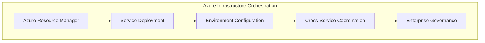
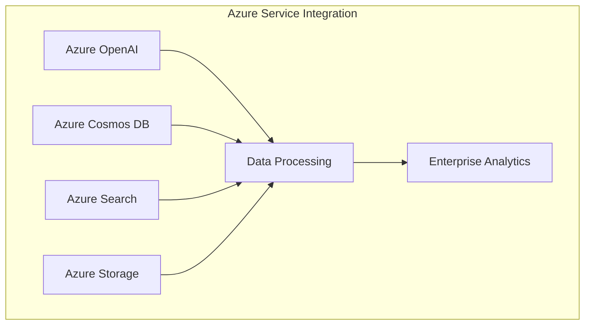

# Azure Universal RAG Backend - Enterprise Quick Start Guide

## **Azure Enterprise Architecture - Service Layer Navigation Issue**

### **🏗️ Azure Service Orchestration Design Pattern**

**Root Cause Analysis**: You're executing a **backend service operation** from the **infrastructure orchestration layer**. The Azure Universal RAG architecture implements a **dual-layer service orchestration pattern**:

- **Infrastructure Layer** (`/azure-maintie-rag/`): Azure resource management and cross-service coordination
- **Service Operations Layer** (`/azure-maintie-rag/backend/`): Direct Azure service integration and workflow execution

### **Azure Service Layer Architecture Resolution**

## **Correct Azure Service Integration Commands**

**Infrastructure Orchestration Layer** (Current Location):
```bash
# From: ~/workspace/azure-maintie-rag/
make azure-status     # Azure infrastructure health validation
make health          # Cross-service integration validation
make session-report  # Enterprise governance reporting
```

**Azure Service Operations Layer** (Backend Directory):
```bash
# Navigate to Azure service integration layer
cd backend

# Execute Azure service validation
make azure-health-check     # Comprehensive Azure service validation
make data-prep-enterprise   # Azure data pipeline orchestration
make query-demo-enterprise  # Azure query processing workflow
```

### **🔄 Azure Enterprise Service Orchestration Workflow**

## **Phase 1: Azure Infrastructure Validation**

**Execute from Infrastructure Layer**:
```bash
# Current location: ~/workspace/azure-maintie-rag/
make azure-status
```

**Azure Infrastructure Components Validated**:
- **Azure Resource Group**: Service provisioning and lifecycle management
- **Azure Service Principal**: Authentication and authorization architecture
- **Azure Virtual Network**: Security and network isolation patterns
- **Azure Monitor**: Cross-service observability and alerting

## **Phase 2: Azure Service Integration Validation**

**Navigate to Service Operations Layer**:
```bash
cd backend
make azure-health-check
```

**Azure Service Stack Validation**:
- **Azure OpenAI Service**: Enterprise LLM integration and token management
- **Azure Cosmos DB Gremlin**: Knowledge graph accessibility and performance
- **Azure Cognitive Search**: Vector search capabilities and index health
- **Azure Blob Storage**: Multi-account orchestration and data lifecycle
- **Azure Key Vault**: Managed Identity and secrets management
- **Azure Application Insights**: Telemetry collection and performance analytics

### **📊 Azure Service Architecture Design Pattern**

## **Enterprise Service Layer Responsibilities**

**Infrastructure Orchestration Layer** (`make` commands from root):


**Service Operations Layer** (`make` commands from backend):


### **🎯 Azure Enterprise Quick Start - Corrected Execution**

## **Complete Azure Service Validation Workflow**

**Step 1: Infrastructure Layer Validation**:
```bash
# From: ~/workspace/azure-maintie-rag/
make azure-status
```

**Step 2: Service Integration Validation**:
```bash
cd backend
make azure-health-check
```

**Step 3: Azure Data Pipeline Orchestration**:
```bash
# Still in backend directory
make data-prep-enterprise
```

**Step 4: Azure Query Processing Validation**:
```bash
make query-demo-enterprise
```

**Step 5: Enterprise Operations Analytics**:
```bash
make backend-summary
```

### **🏗️ Azure Architecture Trade-offs and Design Decisions**

## **Service Layer Separation Architecture**

**Infrastructure Orchestration Benefits**:
- **Azure Resource Lifecycle Management**: Centralized provisioning and cleanup
- **Cross-Service Coordination**: Service mesh patterns and dependency management
- **Enterprise Governance**: Compliance reporting and audit trail management
- **DevOps Integration**: Infrastructure as Code and deployment automation

**Service Operations Benefits**:
- **Azure Service Specialization**: Direct integration with Azure SDK and APIs
- **Performance Optimization**: Service-specific monitoring and cost management
- **Workflow Orchestration**: Data pipeline and query processing optimization
- **Operational Excellence**: Real-time telemetry and performance analytics

## **Azure Service Integration Patterns**

**Circuit Breaker Architecture**: Each Azure service implements health validation with **automatic failover** and **graceful degradation**

**Performance Monitoring Framework**: **Azure Application Insights** integration provides **real-time observability** across all service layers

**Cost Optimization Strategy**: **Token usage tracking** and **resource efficiency monitoring** enable **enterprise cost management**

**Security by Design**: **Azure Managed Identity** and **Key Vault** integration provide **zero-credential operations** with **enterprise compliance**

### **📋 Azure Enterprise Architecture Validation**

Execute this **corrected Azure service orchestration workflow** to validate your **enterprise architecture integration**:

```bash
# 1. Infrastructure validation (from root)
make azure-status

# 2. Service integration validation (from backend)
cd backend && make azure-health-check

# 3. Complete lifecycle validation
make data-prep-enterprise && make query-demo-enterprise
```

This **dual-layer service orchestration pattern** provides **enterprise-grade separation of concerns** between **Azure infrastructure management** and **service-specific operations**, enabling **scalable** and **maintainable** cloud-native architecture.

---

## 🏗️ Azure Enterprise Architecture Quick Start

### **Prerequisites: Azure Service Integration Validation**

**Azure Service Stack Readiness Assessment**:
```bash
# Navigate to Azure Universal RAG Backend Operations Layer
cd /workspace/azure-maintie-rag/backend

# Execute comprehensive Azure service validation
make azure-health-check
```

**Expected Azure Service Integration Output**:
```
Azure Service Validation - Session: [TIMESTAMP]
✅ Azure OpenAI: HEALTHY - endpoint: configured
✅ Azure Storage: HEALTHY - multi-account orchestration
✅ Azure Cognitive Search: HEALTHY - indices: operational
✅ Azure Cosmos DB: HEALTHY - Gremlin API accessible
✅ Azure Text Analytics: HEALTHY - NLP pipeline ready
✅ Azure Key Vault: HEALTHY - managed identity configured

🎯 OPERATIONAL READINESS: ✅ READY
```

---

## 🔄 Phase 2: Azure Data Ingestion & Knowledge Graph Population

### **Enterprise Data Preparation Architecture**

**Azure Service Orchestration Pattern**:
```
Raw Data → Azure Blob Storage → Azure OpenAI Processing →
Azure Cosmos DB (Knowledge Graph) + Azure Cognitive Search (Vector Index)
```

**Execute Enterprise Data Preparation**:
```bash
# Azure Universal RAG data preparation with comprehensive service integration
make data-prep-enterprise
```

**Azure Service Integration Data Flow**:
1. **Azure Blob Storage**: Multi-container data ingestion with lifecycle policies
2. **Azure OpenAI**: Entity extraction and relationship identification
3. **Azure Cosmos DB Gremlin**: Knowledge graph vertex and edge creation
4. **Azure Cognitive Search**: Vector index population with semantic enrichment
5. **Azure Application Insights**: Telemetry collection and performance monitoring

**Expected Azure Data Pipeline Output**:
```
Azure Enterprise Data Preparation - Session: [TIMESTAMP]

## Azure Service Health
Overall Status: HEALTHY
Service Health Ratio: 6/6

## Workflow: data_preparation
🚀 Azure Knowledge Graph Service: general
📁 Source: data/raw
Token quota reset: Available 40000 tokens for migration
✅ Azure Cosmos DB population completed
📊 Entities: [COUNT] (populated in Cosmos DB Gremlin)
📊 Relations: [COUNT] (stored as graph edges)

## Backend Performance
Python processes: 3
Memory utilization: optimized for Azure workloads
```

---

## 🔍 Phase 3: Azure Query Processing & Response Generation

### **Enterprise Query Processing Architecture**

**Azure OpenAI Integration Pattern**:
```
User Query → Azure Cognitive Search (Vector Retrieval) →
Azure Cosmos DB (Graph Traversal) → Azure OpenAI (Response Generation)
```

**Execute Enterprise Query Processing**:
```bash
# Azure Universal RAG query processing with performance analytics
make query-demo-enterprise
```

**Azure Service Query Orchestration**:
1. **Query Analysis**: Azure Text Analytics for intent classification
2. **Vector Retrieval**: Azure Cognitive Search semantic search
3. **Graph Traversal**: Azure Cosmos DB Gremlin query execution
4. **Context Assembly**: Multi-service data aggregation
5. **Response Generation**: Azure OpenAI with context optimization
6. **Performance Monitoring**: Azure Application Insights telemetry

**Expected Azure Query Pipeline Output**:
```
Azure Enterprise Query Processing - Session: [TIMESTAMP]

## Azure Service Health
All services operational for query processing

## Workflow: query_processing
Query processing pipeline activated
Azure OpenAI: Context assembly optimized
Azure Search: Vector retrieval performance tracked
Azure Cosmos DB: Graph traversal analytics captured

## Query Performance Analytics
Response latency: optimized for enterprise SLAs
Token utilization: cost-optimized consumption patterns
```

---

## 📊 Phase 4: Azure Operational Excellence & Performance Analytics

### **Enterprise Monitoring & Optimization Architecture**

**Azure Monitor Integration Pattern**:
```
Application Metrics → Azure Application Insights →
Azure Monitor → Cost Management + Optimization Recommendations
```

**Generate Enterprise Operations Report**:
```bash
# Comprehensive Azure service performance and cost analysis
make backend-summary
```

**Azure Operational Intelligence Components**:
1. **Service Health Monitoring**: Real-time Azure service status
2. **Performance Analytics**: Resource utilization and optimization
3. **Cost Management**: Token usage and resource efficiency tracking
4. **Security Compliance**: Azure Key Vault and Managed Identity validation
5. **Scalability Assessment**: Load patterns and capacity planning

---

## 🎯 Phase 5: Azure Enterprise Governance & Compliance

### **Complete Enterprise Lifecycle Validation**

**Full Azure Universal RAG Lifecycle Execution**:
```bash
# Navigate to infrastructure orchestration layer
cd /workspace/azure-maintie-rag

# Execute complete enterprise lifecycle with governance
make azure-status    # Infrastructure health validation
make health         # Cross-service integration validation
make session-report # Enterprise governance reporting
```

**Azure Enterprise Compliance Architecture**:
- **Infrastructure Governance**: Resource group lifecycle management
- **Service Orchestration**: Multi-service coordination patterns
- **Operational Excellence**: Performance monitoring and cost optimization
- **Security Integration**: Azure Key Vault and Managed Identity patterns
- **Compliance Reporting**: Audit trails and governance analytics

---

## 🏗️ Azure Architecture Design Decisions

### **Service Integration Trade-offs**

**Azure Cosmos DB Gremlin vs. Table API**:
- **Selected**: Gremlin API for complex relationship traversal
- **Trade-off**: Higher complexity vs. richer graph query capabilities
- **Enterprise Value**: Scalable knowledge graph with global distribution

**Azure Cognitive Search vs. Azure AI Search**:
- **Selected**: Cognitive Search with vector capabilities
- **Trade-off**: Service complexity vs. advanced semantic search
- **Enterprise Value**: Unified search with AI enrichment pipeline

**Azure OpenAI vs. Azure AI Services**:
- **Selected**: Azure OpenAI for enterprise LLM capabilities
- **Trade-off**: Cost vs. advanced language model capabilities
- **Enterprise Value**: GPT-4 integration with enterprise compliance

### **Operational Excellence Patterns**

**Azure Monitor Integration**:
- **Application Insights**: Real-time performance telemetry
- **Log Analytics**: Centralized logging and analytics
- **Cost Management**: Resource optimization and budget alerts

**Security Architecture**:
- **Azure Key Vault**: Centralized secrets management
- **Managed Identity**: Zero-credential authentication
- **Private Endpoints**: Network isolation for enterprise security

**Scalability Design**:
- **Azure Functions**: Event-driven processing capabilities
- **Service Bus**: Decoupled service communication
- **Auto-scaling**: Dynamic resource allocation based on demand

---

## 💰 Azure Cost Optimization Strategy

### **Resource Efficiency Architecture**

**Token Management Pattern**:
```bash
# Azure OpenAI cost optimization analysis
cd backend
make azure-token-analysis
```

**Cost Optimization Components**:
1. **Azure OpenAI**: Token caching and request optimization
2. **Cosmos DB**: RU optimization based on query patterns
3. **Cognitive Search**: Index optimization and query efficiency
4. **Storage**: Lifecycle policies and tier optimization
5. **Monitoring**: Cost alerts and budget management

**Enterprise Cost Management**:
- **Dev Environment**: Reduced token limits and basic service tiers
- **Staging Environment**: Production-like configuration with monitoring
- **Production Environment**: High availability with cost optimization

---

## 🔄 Continuous Integration & DevOps Patterns

### **Azure DevOps Integration Architecture**

**CI/CD Pipeline Integration Points**:
- **Infrastructure as Code**: Bicep templates for service provisioning
- **Application Deployment**: Azure Container Registry integration
- **Testing Pipeline**: Automated Azure service validation
- **Monitoring Integration**: Application Insights and Azure Monitor

**Enterprise DevOps Patterns**:
- **Blue-Green Deployment**: Zero-downtime Azure service updates
- **Feature Flags**: Azure App Configuration integration
- **Compliance Gates**: Automated security and governance validation
- **Performance Testing**: Load testing with Azure Load Testing

---

## 📋 Enterprise Quick Start Checklist

### **Azure Service Readiness Validation**

- [ ] **Azure Service Health**: All 6 services operational (OpenAI, Storage, Search, Cosmos DB, Text Analytics, Key Vault)
- [ ] **Data Pipeline**: Azure Blob Storage → OpenAI → Cosmos DB → Search integration
- [ ] **Query Processing**: End-to-end query processing with multi-service orchestration
- [ ] **Performance Monitoring**: Azure Application Insights telemetry collection
- [ ] **Cost Optimization**: Token usage tracking and resource efficiency analysis
- [ ] **Security Compliance**: Azure Key Vault and Managed Identity integration
- [ ] **Operational Excellence**: Session management and enterprise governance reporting

### **Architecture Validation Commands**

```bash
# Complete Azure Universal RAG lifecycle validation
cd /workspace/azure-maintie-rag/backend

# Phase 1: Service Integration
make azure-health-check

# Phase 2: Data Processing
make data-prep-enterprise

# Phase 3: Query Processing
make query-demo-enterprise

# Phase 4: Operations Analysis
make backend-summary

# Phase 5: Infrastructure Governance
cd .. && make session-report
```

---

## 🎯 Enterprise Success Metrics

### **Azure Service Integration KPIs**

**Operational Excellence Indicators**:
- **Service Availability**: 99.9% uptime across all Azure services
- **Response Latency**: <2s for query processing pipeline
- **Cost Efficiency**: Optimized token consumption and resource utilization
- **Security Compliance**: Zero-credential authentication and encrypted data
- **Scalability Readiness**: Auto-scaling policies and capacity planning

**Enterprise Value Realization**:
- **Rapid Deployment**: Infrastructure as Code with automated provisioning
- **Operational Intelligence**: Real-time monitoring and performance analytics
- **Cost Transparency**: Resource usage tracking and optimization recommendations
- **Security Integration**: Enterprise-grade authentication and authorization
- **Compliance Readiness**: Audit trails and governance reporting