# Domain Patterns Architecture: Complete Core Integration

## Overview

This document provides a comprehensive view of how `domain_patterns.py` should integrate with **ALL** core modules in the Azure Universal RAG backend, not just the hardcoded value fixes.

## Complete Core Module Map

```mermaid
graph TB
    subgraph "Configuration Hub"
        DP[domain_patterns.py]
        DPM[DomainPatternManager]
        
        subgraph "Pattern Types"
            QP[QueryPatterns]
            TP[TrainingPatterns]
            MP[MetadataPatterns]
            PP[PromptPatterns]
            NP[NamingPatterns]
            IP[IndexPatterns]
        end
    end
    
    subgraph "Authentication & Session Layer"
        SM[azure_auth/session_manager.py]
        BC[azure_auth/base_client.py]
    end
    
    subgraph "Storage & Data Layer"
        SC[azure_storage/storage_client.py]
        CC[azure_cosmos/cosmos_client.py]
        CGC[azure_cosmos/cosmos_gremlin_client.py]
        SRC[azure_search/search_client.py]
    end
    
    subgraph "AI & Processing Layer"
        OAI[azure_openai/openai_client.py]
        IDP[utilities/intelligent_document_processor.py]
        CS[azure_ml/classification_service.py]
    end
    
    subgraph "ML & Training Layer"
        GO[azure_ml/gnn_orchestrator.py]
        GDM[models/gnn_data_models.py]
        FE[azure_ml/gnn/feature_engineering.py]
        DL[azure_ml/gnn/data_loader.py]
        TR[azure_ml/gnn/trainer.py]
        MOD[azure_ml/gnn/model.py]
        UP[azure_ml/gnn/unified_training_pipeline.py]
        DB[azure_ml/gnn/data_bridge.py]
        GP[azure_ml/gnn_processor.py]
        MLC[azure_ml/ml_client.py]
    end
    
    subgraph "Monitoring & Utilities Layer"
        AIC[azure_monitoring/app_insights_client.py]
        LU[utilities/logging_utils.py]
        FU[utilities/file_utils.py]
        CL[utilities/config_loader.py]
        URM[models/universal_rag_models.py]
    end
    
    %% Current Integrations (Green)
    DP --> DPM
    DPM --> QP & TP & MP & PP & NP
    DPM -.->|✅ Currently Uses| OAI
    DPM -.->|✅ Currently Uses| SRC
    DPM -.->|✅ Currently Uses| GO
    
    %% Missing Critical Integrations (Red)
    DPM -.->|❌ Should Use| GDM
    DPM -.->|❌ Should Use| CGC
    DPM -.->|❌ Should Use| CS
    DPM -.->|❌ Should Use| IDP
    
    %% Missing Strategic Integrations (Orange)
    DPM -.->|🟡 Could Use| SC
    DPM -.->|🟡 Could Use| AIC
    DPM -.->|🟡 Could Use| FE
    DPM -.->|🟡 Could Use| DL
    DPM -.->|🟡 Could Use| TR
    DPM -.->|🟡 Could Use| UP
    DPM -.->|🟡 Could Use| FU
    DPM -.->|🟡 Could Use| LU
    
    %% Independent Modules (Gray)
    DPM -.->|⚪ Infrastructure| SM
    DPM -.->|⚪ Infrastructure| BC
    DPM -.->|⚪ Infrastructure| CL
    
    %% Style classes
    classDef critical fill:#ffcccc,stroke:#ff6b6b,stroke-width:3px
    classDef strategic fill:#ffe5b3,stroke:#ff9500,stroke-width:2px
    classDef current fill:#ccffcc,stroke:#00cc00,stroke-width:2px
    classDef infrastructure fill:#f0f0f0,stroke:#999999,stroke-width:1px
    
    class GDM,CGC,CS,IDP critical
    class SC,AIC,FE,DL,TR,UP,FU,LU strategic
    class OAI,SRC,GO current
    class SM,BC,CL infrastructure
```



## Integration Strategy by Layer

### 🔴 Critical Priority: AI & Data Processing

#### 1. **azure_openai/openai_client.py**
**Current Status**: ✅ Partially integrated  
**Integration Points**:
```python
# EXISTING (Good)
extraction_focus = DomainPatternManager.get_extraction_focus(domain)

# MISSING (Should Add)
prompts = DomainPatternManager.get_prompts(domain)
model_config = prompts.model_name, prompts.temperature, prompts.max_tokens
rate_limit = prompts.requests_per_minute
chunk_size = prompts.chunk_size
```

#### 2. **azure_cosmos/cosmos_gremlin_client.py**
**Current Status**: ❌ Not integrated  
**Integration Points**:
```python
# MISSING (Critical)
metadata = DomainPatternManager.get_metadata(domain)
default_entity_type = metadata.default_entity_type
default_relation_type = metadata.default_relation_type
timeout = DomainPatternManager.get_training(domain).query_timeout
```

#### 3. **utilities/intelligent_document_processor.py**
**Current Status**: ❌ Not integrated  
**Integration Points**:
```python
# MISSING (Should Add)
prompts = DomainPatternManager.get_prompts(domain)
self.max_chunk_size = prompts.chunk_size
self.overlap_size = prompts.overlap_size
processing_focus = prompts.processing_focus
```

#### 4. **azure_ml/classification_service.py**
**Current Status**: ❌ Not integrated  
**Integration Points**:
```python
# MISSING (Critical)
training = DomainPatternManager.get_training(domain)
confidence_threshold = training.min_avg_confidence
batch_size = training.batch_size
validation_threshold = training.min_entities_threshold
```

### 🟡 Strategic Priority: ML & Training Layer

#### 5. **models/gnn_data_models.py**
**Current Status**: ❌ Not integrated  
**Integration Points**:
```python
# MISSING (High Priority)
@dataclass
class GNNConfig:
    def __init__(self, domain: str = "general"):
        training = DomainPatternManager.get_training(domain)
        self.model_type = training.model_type
        self.hidden_dim = training.hidden_dim
        self.learning_rate = training.learning_rate
        # ... all other training parameters
```

#### 6. **azure_ml/gnn/feature_engineering.py**
**Current Status**: 🟡 Minimal integration  
**Integration Points**:
```python
# SHOULD ADD
training = DomainPatternManager.get_training(domain)
embedding_dim = training.embedding_dim
feature_config = training.feature_engineering_params
normalization = training.normalize_features
```

#### 7. **azure_storage/storage_client.py**
**Current Status**: ❌ Not integrated  
**Integration Points**:
```python
# COULD ADD
naming = DomainPatternManager.get_naming(domain)
container_name = naming.get_container_name(domain, base_name)
file_patterns = naming.file_naming_patterns
retry_config = DomainPatternManager.get_training(domain).retry_config
```

### ⚪ Infrastructure: Monitoring & Utilities

#### 8. **azure_monitoring/app_insights_client.py**
**Current Status**: ❌ Not integrated  
**Integration Points**:
```python
# COULD ADD
monitoring = DomainPatternManager.get_monitoring_config(domain)
sampling_rate = monitoring.sampling_rate
custom_metrics = monitoring.domain_specific_metrics
alert_thresholds = monitoring.alert_config
```

#### 9. **utilities/file_utils.py**
**Current Status**: ❌ Not integrated  
**Integration Points**:
```python
# COULD ADD
naming = DomainPatternManager.get_naming(domain)
file_extensions = naming.allowed_file_types
sanitization_rules = naming.file_name_sanitization
max_file_size = naming.max_file_size_mb
```

## Required Domain Pattern Extensions

### Enhanced Pattern Classes

```python
# Extended PromptPatterns
@dataclass
class PromptPatterns:
    extraction_focus: str
    completion_context: str
    query_enhancement: str
    
    # NEW: Processing Configuration
    model_name: str = "gpt-4"
    temperature: float = 0.1
    max_tokens: int = 2000
    requests_per_minute: int = 50
    chunk_size: int = 1000
    overlap_size: int = 200
    processing_focus: str = "comprehensive"

# NEW: MonitoringPatterns
@dataclass 
class MonitoringPatterns:
    sampling_rate: float = 1.0
    alert_thresholds: Dict[str, float]
    custom_metrics: List[str]
    log_level: str = "INFO"
    retention_days: int = 30

# NEW: StoragePatterns
@dataclass
class StoragePatterns:
    container_patterns: Dict[str, str]
    file_naming_conventions: Dict[str, str]
    allowed_file_types: List[str]
    max_file_size_mb: int = 100
    compression_enabled: bool = True
    retry_config: Dict[str, int]

# Enhanced TrainingPatterns
@dataclass
class TrainingPatterns:
    # ... existing fields ...
    
    # NEW: GNN Model Configuration
    model_type: str = "gcn"
    hidden_dim: int = 128
    num_layers: int = 2
    dropout: float = 0.5
    weight_decay: float = 1e-5
    epochs: int = 100
    patience: int = 20
    embedding_dim: int = 768
    
    # NEW: Infrastructure Configuration
    query_timeout: int = 30
    max_wait_time: int = 3600
    check_interval: int = 60
    retry_attempts: int = 3
    
    # NEW: Feature Engineering
    feature_engineering_params: Dict[str, Any]
    normalize_features: bool = True
    feature_selection_method: str = "auto"
```

## Integration Implementation Patterns

### Pattern 1: Constructor Integration
```python
class SomeService:
    def __init__(self, domain: str = "general"):
        self.domain = domain
        self.patterns = DomainPatternManager.get_patterns(domain)
        self.training_config = DomainPatternManager.get_training(domain)
        self.configure_from_patterns()
```

### Pattern 2: Method-Level Integration
```python
class SomeService:
    def process_data(self, data: Any, domain: str = "general"):
        metadata = DomainPatternManager.get_metadata(domain)
        entity_type = metadata.get_entity_type_for_context(context)
        # ... use domain-specific processing
```

### Pattern 3: Configuration Factory
```python
class ConfigFactory:
    @staticmethod
    def create_config(service_type: str, domain: str) -> Dict[str, Any]:
        if service_type == "gnn":
            return DomainPatternManager.get_training(domain).to_gnn_config()
        elif service_type == "openai":
            return DomainPatternManager.get_prompts(domain).to_openai_config()
```

## Complete File Integration Roadmap

### Phase 1: Critical Fixes (Week 1)
- [ ] `gnn_data_models.py` - Use TrainingPatterns for GNN config
- [ ] `cosmos_gremlin_client.py` - Use MetadataPatterns for entity types
- [ ] `openai_client.py` - Complete PromptPatterns integration
- [ ] `classification_service.py` - Use training thresholds

### Phase 2: Strategic Enhancements (Week 2)
- [ ] `intelligent_document_processor.py` - Domain-aware chunking
- [ ] `feature_engineering.py` - Training-pattern-driven features
- [ ] `storage_client.py` - Domain-specific storage patterns
- [ ] `search_client.py` - Enhanced domain integration

### Phase 3: Infrastructure Optimization (Week 3)
- [ ] `app_insights_client.py` - Domain monitoring patterns
- [ ] `file_utils.py` - Domain naming conventions
- [ ] `logging_utils.py` - Domain-specific log levels
- [ ] All GNN modules - Complete training pattern integration

### Phase 4: Validation & Testing (Week 4)
- [ ] Integration testing for all patterns
- [ ] Performance validation
- [ ] Documentation updates
- [ ] Migration guides

## Benefits of Complete Integration

### 1. **Consistency**
Every service uses the same domain-specific configurations

### 2. **Maintainability** 
Single source of truth for all domain logic

### 3. **Extensibility**
Adding new domains only requires pattern configuration

### 4. **Testing**
Centralized configuration makes testing easier

### 5. **Performance**
Domain-optimized configurations for each service

### 6. **Monitoring**
Domain-aware metrics and alerting

## Integration Verification Matrix

| Module | Query Patterns | Training Patterns | Metadata Patterns | Prompt Patterns | Naming Patterns | Monitoring Patterns |
|--------|---------------|------------------|------------------|----------------|----------------|-------------------|
| openai_client.py | ✅ | ❌ | ❌ | 🟡 | ❌ | ❌ |
| cosmos_gremlin_client.py | ❌ | 🟡 | ❌ | ❌ | 🟡 | ❌ |
| search_client.py | ✅ | ❌ | 🟡 | ❌ | ✅ | ❌ |
| gnn_data_models.py | ❌ | ❌ | ❌ | ❌ | ❌ | ❌ |
| classification_service.py | ❌ | ❌ | ❌ | ❌ | ❌ | ❌ |
| storage_client.py | ❌ | ❌ | ❌ | ❌ | ❌ | ❌ |
| app_insights_client.py | ❌ | ❌ | ❌ | ❌ | ❌ | ❌ |

**Legend**: ✅ Fully Integrated | 🟡 Partially Integrated | ❌ Not Integrated

## Next Steps

1. **Review complete integration strategy**
2. **Prioritize based on business impact**
3. **Implement phase-by-phase**
4. **Validate each integration thoroughly**
5. **Update documentation and training materials**

The goal is to make `domain_patterns.py` the **central nervous system** of the entire core codebase, ensuring every component is domain-aware and consistently configured.