# Hardcoded Value Centralization Analysis

## Overview

This document analyzes hardcoded values found in the Azure Universal RAG backend core modules and provides a centralization strategy using `domain_patterns.py`.

## Current Architecture

```mermaid
graph TD
    A[domain_patterns.py] --> B[DomainPatternManager]
    B --> C[QueryPatterns]
    B --> D[TrainingPatterns]
    B --> E[MetadataPatterns]
    B --> F[PromptPatterns]
    B --> G[NamingPatterns]
    
    %% Current Usage (Green = Good, Red = Bad)
    H[openai_client.py] -.->|✅ Uses| B
    I[search_client.py] -.->|✅ Uses| B
    J[gnn_orchestrator.py] -.->|✅ Uses| B
    
    %% Problematic Files
    K[gnn_data_models.py] -.->|❌ Bypasses| D
    L[cosmos_gremlin_client.py] -.->|❌ Bypasses| E
    M[azure_monitoring/*] -.->|❌ No Integration| A
    N[azure_ml/classification_service.py] -.->|❌ Magic Numbers| A
    
    style K fill:#ffcccc
    style L fill:#ffcccc
    style M fill:#ffcccc
    style N fill:#ffcccc
    style H fill:#ccffcc
    style I fill:#ccffcc
    style J fill:#ccffcc
```



## Hardcoded Values Audit

### 🔴 Critical Issues

#### 1. GNN Training Configuration (`gnn_data_models.py:341-353`)

**Current (Hardcoded):**
```python
@dataclass
class GNNConfig:
    model_type: str = "gcn"
    hidden_dim: int = 128
    num_layers: int = 2
    dropout: float = 0.5
    learning_rate: float = 0.001
    weight_decay: float = 1e-5
    batch_size: int = 32
    epochs: int = 100
    patience: int = 20
    embedding_dim: int = 768
```

**Should Use:**
```python
# From domain_patterns.py TrainingPatterns
training_config = DomainPatternManager.get_training(domain)
# training_config.batch_size, training_config.learning_rate, etc.
```

#### 2. OpenAI Model Parameters (`openai_client.py:97-100`)

**Current (Hardcoded):**
```python
response = self._client.chat.completions.create(
    model="gpt-4",
    temperature=0.1,
    max_tokens=2000
)
```

**Should Use:**
```python
# Need to extend PromptPatterns to include model config
prompts = DomainPatternManager.get_prompts(domain)
# prompts.model_name, prompts.temperature, prompts.max_tokens
```

#### 3. Cosmos DB Entity Types (`cosmos_gremlin_client.py:135`)

**Current (Hardcoded):**
```python
.property('entity_type', '{entity_data.get("entity_type", "document")}')
```

**Should Use:**
```python
default_type = DomainPatternManager.get_entity_type(domain, "structured")
.property('entity_type', '{entity_data.get("entity_type", default_type)}')
```

#### 4. Data Validation Thresholds (`gnn_data_models.py:187-189`)

**Current (Hardcoded):**
```python
min_entities = 10
min_relations = 5
min_avg_confidence = 0.5
```

**Should Use:**
```python
# Need to extend TrainingPatterns to include validation thresholds
training = DomainPatternManager.get_training(domain)
# training.min_entities_threshold, training.min_relations_threshold
```

### 🟡 Medium Priority Issues

#### 5. Rate Limiting (`openai_client.py:226`)

**Current (Hardcoded):**
```python
def __init__(self, requests_per_minute: int = 50):
```

**Should Use:**
```python
# Extend PromptPatterns to include rate limiting
prompts = DomainPatternManager.get_prompts(domain)
# prompts.requests_per_minute
```

#### 6. Timeout Values

**Current (Hardcoded):**
- `cosmos_gremlin_client.py:354` - `timeout_seconds: int = 30`
- `gnn_orchestrator.py:141` - `max_wait_time = 3600`
- `gnn_orchestrator.py:142` - `check_interval = 60`

**Should Use:**
```python
# Extend TrainingPatterns to include timeout configs
training = DomainPatternManager.get_training(domain)
# training.query_timeout, training.max_wait_time, training.check_interval
```

#### 7. Chunking Parameters (`openai_client.py:182`)

**Current (Hardcoded):**
```python
def _chunk_text(self, text: str, chunk_size: int = 1000) -> List[str]:
```

**Should Use:**
```python
# Extend PromptPatterns to include chunking config
prompts = DomainPatternManager.get_prompts(domain)
# prompts.chunk_size
```

## Required Domain Pattern Extensions

### 1. Enhanced PromptPatterns

```python
@dataclass
class PromptPatterns:
    """Prompt templates and focus areas for LLM operations"""
    extraction_focus: str
    completion_context: str
    query_enhancement: str
    
    # NEW: Model Configuration
    model_name: str = "gpt-4"
    temperature: float = 0.1
    max_tokens: int = 2000
    requests_per_minute: int = 50
    chunk_size: int = 1000
```

### 2. Enhanced TrainingPatterns

```python
@dataclass
class TrainingPatterns:
    """Training and ML configuration patterns"""
    # Existing fields...
    trigger_threshold: int
    training_frequency: str
    model_retention_days: int
    deployment_tier: str
    batch_size: int
    learning_rate: float
    train_ratio: float
    validation_ratio: float
    
    # NEW: GNN Model Configuration
    model_type: str = "gcn"
    hidden_dim: int = 128
    num_layers: int = 2
    dropout: float = 0.5
    weight_decay: float = 1e-5
    epochs: int = 100
    patience: int = 20
    embedding_dim: int = 768
    
    # NEW: Validation Thresholds
    min_entities_threshold: int = 10
    min_relations_threshold: int = 5
    min_avg_confidence: float = 0.5
    
    # NEW: Timeout Configuration
    query_timeout: int = 30
    max_wait_time: int = 3600
    check_interval: int = 60
```

### 3. Enhanced MetadataPatterns

```python
@dataclass
class MetadataPatterns:
    """Metadata patterns for document and entity types"""
    # Existing fields...
    document_types: Dict[str, str]
    entity_types: Dict[str, str]
    relationship_types: Dict[str, str]
    title_patterns: Dict[str, str]
    
    # NEW: Default Fallback Values
    default_entity_type: str = "entity"
    default_relation_type: str = "relates_to"
    default_confidence: float = 1.0
```

## Implementation Strategy

### Phase 1: Extend Domain Patterns (High Priority)

1. **Update `domain_patterns.py`** with enhanced pattern classes
2. **Update domain configurations** (MAINTENANCE_TRAINING, GENERAL_TRAINING, etc.)
3. **Add new manager methods** for accessing extended configurations

### Phase 2: Core Module Updates (High Priority)

1. **Fix `gnn_data_models.py`**
   - Replace hardcoded GNNConfig defaults with domain pattern lookups
   - Update validation thresholds to use domain patterns

2. **Fix `cosmos_gremlin_client.py`**
   - Replace hardcoded entity type defaults
   - Use domain-specific timeout values

3. **Fix `openai_client.py`**
   - Make model parameters domain-configurable
   - Use domain-specific rate limiting and chunking

### Phase 3: Monitoring and ML Services (Medium Priority)

1. **Update classification service** magic numbers
2. **Centralize monitoring thresholds**
3. **Make Azure ML parameters domain-configurable**

## File Dependency Map

```mermaid
graph TB
    subgraph "Configuration Layer"
        DP[domain_patterns.py]
        DPM[DomainPatternManager]
    end
    
    subgraph "Core Services Layer"
        OAI[azure_openai/openai_client.py]
        COS[azure_cosmos/cosmos_gremlin_client.py]
        SRC[azure_search/search_client.py]
        MON[azure_monitoring/*]
    end
    
    subgraph "ML/GNN Layer"
        GDM[models/gnn_data_models.py]
        GOR[azure_ml/gnn_orchestrator.py]
        FE[azure_ml/gnn/feature_engineering.py]
        CS[azure_ml/classification_service.py]
    end
    
    subgraph "Utility Layer"
        IDI[utilities/intelligent_document_processor.py]
        FU[utilities/file_utils.py]
        CL[utilities/config_loader.py]
    end
    
    %% Current Good Connections
    DP --> DPM
    DPM -.->|✅ Uses| OAI
    DPM -.->|✅ Uses| SRC
    DPM -.->|✅ Uses| GOR
    
    %% Missing Connections (Need to Fix)
    DPM -.->|❌ Should Use| GDM
    DPM -.->|❌ Should Use| COS
    DPM -.->|❌ Should Use| MON
    DPM -.->|❌ Should Use| CS
    DPM -.->|❌ Should Use| FE
    DPM -.->|❌ Should Use| IDI
    
    %% Style problematic connections
    classDef missing stroke:#ff6b6b,stroke-width:3px,stroke-dasharray: 5 5
    class GDM,COS,MON,CS,FE,IDI missing
```



## Verification Checklist

After implementing centralization:

- [x] All training parameters come from `TrainingPatterns`
- [x] All model parameters come from `PromptPatterns`
- [x] All entity/relation types use `MetadataPatterns`
- [x] No magic numbers in core modules (Phase 1 & 2 complete)
- [x] Domain-specific configurations work correctly
- [x] Backward compatibility maintained
- [ ] Unit tests updated to reflect changes

## Benefits of Centralization

1. **Consistency**: All domain-specific values in one place
2. **Maintainability**: Easy to update configurations without code changes
3. **Extensibility**: Adding new domains requires only pattern configuration
4. **Testing**: Centralized configuration makes testing easier
5. **Documentation**: Clear separation of business logic and configuration

## Implementation Status

### ✅ HARDCODED VALUE CENTRALIZATION COMPLETE (July 29, 2025)

**Phase 1: Enhanced Domain Patterns (COMPLETE)**
- ✅ Extended `PromptPatterns` with model configuration fields (gpt-4o, temperature, max_tokens, etc.)
- ✅ Extended `TrainingPatterns` with GNN model config and validation thresholds  
- ✅ Extended `MetadataPatterns` with default fallback values

**Phase 2: Core Module Updates (COMPLETE)**
- ✅ Fixed `gnn_data_models.py` - GNN config now uses domain patterns via property decorators
- ✅ Fixed `cosmos_gremlin_client.py` - Entity types and timeouts centralized
- ✅ Fixed `openai_client.py` - Model parameters, rate limiting, chunking centralized

**Testing & Verification (COMPLETE)**
- ✅ Domain pattern centralization tested and working
- ✅ Backward compatibility maintained  
- ✅ All critical hardcoded values eliminated
- ✅ **Production deployment successful** - Live system using centralized configuration
- ✅ **Environment synchronization working** - Automatic azd environment detection and config sync

**Additional Achievements:**
- ✅ **Environment Management**: Automatic detection of azd environment (`staging`) 
- ✅ **Azure Integration**: OpenAI model updated to gpt-4o with GlobalStandard SKU
- ✅ **Infrastructure Deployment**: Complete Azure service stack deployed and operational

### 📋 REMAINING TASKS

**Phase 3: Optional Enhancements**
- [ ] Update classification service magic numbers (`azure_ml/classification_service.py`)
- [ ] Centralize monitoring thresholds (`azure_monitoring/*`)
- [ ] Make Azure ML parameters domain-configurable (`azure_ml/gnn/feature_engineering.py`)
- [ ] Add comprehensive unit tests for centralized configurations

## Migration Guide

### For Existing Code Using Old Hardcoded Values:

**OLD (Hardcoded):**
```python
# GNN Training
config = GNNTrainingConfig()  # Used hardcoded defaults

# OpenAI Calls  
response = client.chat.completions.create(
    model="gpt-4", temperature=0.1, max_tokens=2000
)

# Validation
if entities >= 10 and relations >= 5:  # Magic numbers
```

**NEW (Domain-Configured):**
```python
# GNN Training
config = GNNTrainingConfig(domain="maintenance")  # Uses domain patterns

# OpenAI Calls
prompts = DomainPatternManager.get_prompts(domain)
response = client.chat.completions.create(
    model=prompts.model_name, 
    temperature=prompts.temperature, 
    max_tokens=prompts.max_tokens
)

# Validation  
training = DomainPatternManager.get_training(domain)
if entities >= training.min_entities_threshold and relations >= training.min_relations_threshold:
```