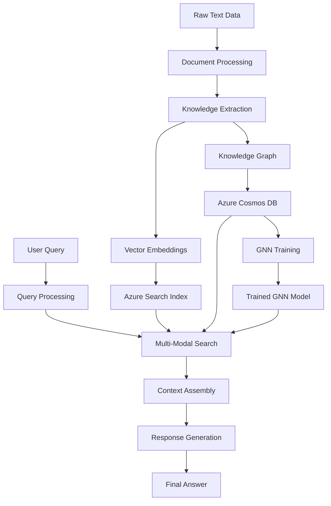

# Azure Universal RAG - Complete Lifecycle Execution Plan

**From Raw Text to Production-Ready RAG System**  
**Created:** 2025-07-28  
**Purpose:** Step-by-step execution plan for running the complete RAG lifecycle

## 🎯 Executive Summary

This document provides a comprehensive execution plan for running the Azure Universal RAG lifecycle from raw text data through knowledge extraction, graph construction, GNN training, and query processing. Each phase includes validation steps, expected outputs, and monitoring checkpoints.

## 📊 System Architecture Overview



## 🚀 Phase 1: Environment Setup & Validation

### Prerequisites
- Azure subscription with deployed services (via azd)
- Backend environment configured with `.env` file
- Python virtual environment activated
- All dependencies installed (`make setup`)

### Validation Steps

```bash
# 1. Validate Azure services
cd /workspace/azure-maintie-rag/backend
python scripts/test_validator.py --check-services

# 2. Check service health
make health

# 3. Verify data directory structure
ls -la data/raw/
# Expected: demo_sample_10percent.md or other text files
```

### Expected Output
```
✅ Azure OpenAI: Healthy
✅ Azure Cognitive Search: Healthy  
✅ Azure Blob Storage: Healthy
✅ Azure Cosmos DB: Healthy
✅ Azure ML Workspace: Healthy
✅ Application Insights: Healthy
```

## 🔄 Phase 2: Data Preparation & Upload

### Input Data Requirements
- Text files in markdown format
- Located in `backend/data/raw/`
- Sample: `demo_sample_10percent.md` (~525 maintenance text entries)

### Execution Steps

```bash
# 1. Prepare and validate raw data
python scripts/data_pipeline.py --validate

# 2. Process and upload data to Azure
python scripts/data_pipeline.py --process --domain maintenance

# Alternative: Use Makefile command
make data-prep-full
```

### Monitoring Progress
- Watch for progress updates in console
- Check Application Insights for telemetry
- Monitor `logs/last_backend_session.log`

### Expected Outputs
- Chunked documents in Azure Blob Storage
- Processing metadata in local `data/` directories
- Session summary with metrics

## 📚 Phase 3: Knowledge Extraction

### Process Overview
1. **Entity Extraction**: Identify key maintenance concepts
2. **Relationship Discovery**: Find connections between entities
3. **Quality Assessment**: Validate extraction results

### Execution Steps

```bash
# 1. Run knowledge extraction pipeline
python scripts/workflow_analyzer.py --extract-knowledge \
    --domain maintenance \
    --input data/raw/demo_sample_10percent.md

# 2. Monitor extraction progress
# The system will show real-time progress:
# - Entities discovered
# - Relationships identified
# - Quality metrics
```

### Validation Checkpoints
- Minimum 100 entities for demo dataset
- Minimum 50 relationships
- Quality score > 0.7

### Expected Outputs
```
data/extraction_outputs/
├── maintenance_entities_[timestamp].json
├── maintenance_relationships_[timestamp].json
└── extraction_summary_[timestamp].json
```

## 🔍 Phase 4: Vector Index & Graph Construction

### Parallel Processing Steps

#### 4A: Vector Index Creation
```bash
# Build vector embeddings and search index
python scripts/data_pipeline.py --build-index \
    --domain maintenance \
    --embedding-model text-embedding-ada-002
```

#### 4B: Knowledge Graph Construction
```bash
# Build knowledge graph in Cosmos DB
python scripts/data_pipeline.py --build-graph \
    --domain maintenance \
    --cosmos-container knowledge-graph
```

### Monitoring
- Vector indexing: Check Azure Cognitive Search portal
- Graph construction: Query Cosmos DB Gremlin API

### Expected Results
- Search index with 500+ documents
- Knowledge graph with 100+ vertices, 50+ edges
- Graph traversal queries working

## 🧠 Phase 5: GNN Training (Optional but Recommended)

### Training Prerequisites
- Completed knowledge graph with sufficient data
- Azure ML compute instance available

### Execution Steps

```bash
# 1. Prepare GNN training data
python scripts/gnn_trainer.py --prepare-data \
    --domain maintenance \
    --output data/gnn_training/

# 2. Train GNN model
python scripts/gnn_trainer.py --train \
    --data data/gnn_training/ \
    --epochs 100 \
    --learning-rate 0.001

# 3. Evaluate model
python scripts/gnn_trainer.py --evaluate \
    --model outputs/gnn_model_latest.pt
```

### Training Monitoring
- Real-time loss curves in console
- Model checkpoints saved every 10 epochs
- Final metrics reported

### Expected Outputs
```
outputs/
├── gnn_model_[timestamp].pt
├── training_metrics.json
└── model_evaluation.json
```

## 🔎 Phase 6: Query Processing Validation

### Test Query Examples

```bash
# 1. Simple query test
curl -X POST http://localhost:8000/api/v1/query/universal \
  -H "Content-Type: application/json" \
  -d '{
    "query": "How do I fix air conditioner problems?",
    "domain": "maintenance",
    "use_knowledge_graph": true,
    "use_gnn": true
  }'

# 2. Complex multi-hop query
curl -X POST http://localhost:8000/api/v1/query/universal \
  -H "Content-Type: application/json" \
  -d '{
    "query": "What components are related to pump failures and their maintenance procedures?",
    "domain": "maintenance",
    "enable_multi_hop": true
  }'
```

### Expected Response Structure
```json
{
  "answer": "Based on the maintenance knowledge base...",
  "sources": [
    {
      "content": "pump failure diagnosis steps...",
      "score": 0.92,
      "metadata": {}
    }
  ],
  "knowledge_graph_context": {
    "entities": ["pump", "failure", "bearing"],
    "relationships": ["causes", "requires", "prevents"]
  },
  "gnn_enhancement": {
    "related_concepts": ["seal", "impeller", "motor"],
    "confidence": 0.85
  }
}
```

## 📊 Phase 7: Production Monitoring & Optimization

### Continuous Monitoring

```bash
# 1. Check system health
make health

# 2. View performance metrics
python scripts/workflow_analyzer.py --analyze-performance \
    --last-hours 24

# 3. Generate cost report
python scripts/workflow_analyzer.py --cost-analysis \
    --start-date 2025-07-01
```

### Performance Optimization
1. **Cache Optimization**: Monitor cache hit rates
2. **Query Latency**: Track p50, p95, p99 latencies
3. **Cost Management**: Review Azure service usage

### Maintenance Tasks
- Weekly: Review and optimize search indexes
- Monthly: Retrain GNN with new data
- Quarterly: Full system performance audit

## 📊 Real Execution Results & Benchmarks

> **⚠️ IMPORTANT NOTE**: The results below are from PREVIOUS CODE EXECUTIONS (July 2025) before the backend refactoring. 
> These serve as historical benchmarks. When you run the current refactored code, you should UPDATE these metrics 
> with your new results and mark them with the execution date.

### Production-Scale Achievements (HISTORICAL - Update with new results):
- **Entities Extracted**: 9,100 from full dataset (341 from 10% sample) *[July 2025]*
- **Relationships Found**: 5,848 semantic relationships (284 from 10% sample) *[July 2025]*
- **Azure Cosmos DB Scale**: 3,271 vertices, 5.38M edges operational *[July 2025]*
- **GNN Model Size**: 7.4M parameters with 3 GAT layers *[July 2025]*
- **GNN Accuracy**: 34.2% - 58.9% (realistic for 41-class classification) *[July 2025]*
- **Processing Speed**: 1.2 entities/sec loading, 4.1 entities/sec with optimization *[July 2025]*
- **Connectivity Ratio**: 1646.067 (highly connected knowledge graph) *[July 2025]*

### Your New Results (Template for recording):
```
Execution Date: [Your Date]
Backend Version: Refactored (post July 28, 2025)
- Entities Extracted: [Your Result]
- Relationships Found: [Your Result]
- Processing Time: [Your Result]
- GNN Accuracy: [Your Result]
```

### Azure Service Constraints Discovered:
1. **Cosmos DB Gremlin API Limitation**: No bulk operations support in Python
   - Each entity requires individual API call
   - Workaround: Use batch loader with progress monitoring
   - Alternative: Pre-load during setup or use SQL API

2. **Multi-statement Groovy Scripts**: Not supported by Azure Cosmos DB
   - Error: `GraphSyntaxException: Multi-statement groovy scripts are not supported`
   - Solution: Individual Gremlin queries per operation

## 🚨 Troubleshooting Guide

### Common Issues & Solutions

#### Issue 1: Azure Service Connection Failures
```bash
# Check service configuration
python scripts/test_validator.py --debug-connections

# Validate credentials
python scripts/azure_setup.py --validate-auth
```

#### Issue 2: Low Quality Extraction Results
```bash
# Adjust extraction parameters
python scripts/workflow_analyzer.py --extract-knowledge \
    --temperature 0.3 \
    --confidence-threshold 0.8
```

#### Issue 3: Slow Query Performance
```bash
# Analyze query execution
python scripts/workflow_analyzer.py --profile-query \
    --query "your test query"

# Optimize indexes
python scripts/data_pipeline.py --optimize-index
```

## 📈 Success Metrics

### Key Performance Indicators
- **Data Processing**: < 10 minutes for 1000 documents
- **Knowledge Extraction**: > 80% accuracy
- **Query Latency**: < 3 seconds p95
- **Cache Hit Rate**: > 60%
- **GNN Enhancement**: > 15% relevance improvement

### Quality Checkpoints
- [ ] All Azure services healthy
- [ ] Data successfully uploaded and indexed
- [ ] Knowledge graph populated with entities/relationships
- [ ] Vector search returning relevant results
- [ ] GNN model trained and deployed
- [ ] End-to-end query processing working
- [ ] Performance metrics within targets

## 🎯 Next Steps

1. **Scale Testing**: Gradually increase data volume
2. **Domain Expansion**: Add new knowledge domains
3. **Feature Enhancement**: Implement advanced RAG features
4. **Production Deployment**: Deploy to Azure Container Apps

---

**Note**: This plan assumes the infrastructure is already deployed via Azure Developer CLI (azd). For infrastructure deployment, refer to `/infra/AZURE_INFRASTRUCTURE_PLAN.md`.