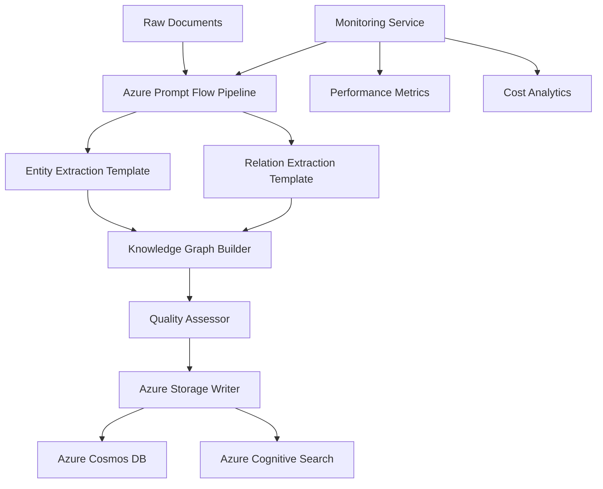

# Azure Prompt Flow Integration for Universal RAG

## 🎯 Overview

This implementation integrates **Azure Prompt Flow** with your existing Universal RAG system, providing **centralized prompt management** while maintaining the core principle of **universal, domain-agnostic knowledge extraction**.

## ✅ Key Benefits Achieved

### **1. Centralized Prompt Management**
- ✅ All prompts moved from code to reusable Jinja2 templates
- ✅ Version control and A/B testing capabilities  
- ✅ Non-technical users can modify prompts
- ✅ Single source of truth for extraction logic

### **2. Universal Extraction Principles Preserved**
- ✅ **NO predetermined entity types** - entities emerge from content
- ✅ **NO hardcoded domain knowledge** - works with any domain
- ✅ **Dynamic type discovery** - LLM identifies what's meaningful
- ✅ **Pure prompt engineering** approach maintained

### **3. Enterprise Monitoring & Analytics**
- ✅ Real-time performance tracking
- ✅ Cost monitoring and optimization
- ✅ Quality assessment metrics
- ✅ Template usage analytics

### **4. Backward Compatibility**
- ✅ Fallback to existing extraction system
- ✅ Same universal results format
- ✅ No breaking changes to current workflows

## 🏗️ Architecture



## 📁 File Structure

```
prompt_flows/universal_knowledge_extraction/
├── flow.dag.yaml                    # Prompt Flow workflow definition
├── entity_extraction.jinja2         # Universal entity extraction template
├── relation_extraction.jinja2       # Universal relation extraction template
├── knowledge_graph_builder.py       # Knowledge graph construction
├── quality_assessor.py             # Quality assessment logic
├── azure_storage_writer.py         # Azure services integration
├── requirements.txt                # Dependencies
└── .env.example                    # Configuration template

core/prompt_flow/
├── prompt_flow_integration.py      # Integration service
└── prompt_flow_monitoring.py       # Monitoring and analytics

scripts/
└── prompt_flow_knowledge_extraction.py  # Workflow script
```

## 🚀 Usage

### **Quick Start**
```bash
# View centralized templates
make prompt-templates

# Run extraction with Prompt Flow
make prompt-flow-extract

# Setup Prompt Flow environment
make prompt-flow-setup
```

### **Template Customization**
Templates are located in `prompt_flows/universal_knowledge_extraction/`:

1. **Entity Extraction Template** (`entity_extraction.jinja2`):
   - Universal instructions for entity discovery
   - No predetermined types or categories
   - Configurable via variables

2. **Relation Extraction Template** (`relation_extraction.jinja2`):
   - Universal relationship identification
   - No hardcoded relationship hierarchies
   - Context-aware processing

### **Monitoring & Analytics**
```python
from core.prompt_flow.prompt_flow_monitoring import prompt_flow_monitor

# Get performance metrics
metrics = prompt_flow_monitor.get_execution_metrics(24)  # Last 24 hours

# Get template analytics
template_analytics = prompt_flow_monitor.get_template_analytics()

# Export comprehensive metrics
metrics_file = prompt_flow_monitor.export_metrics()
```

## 🎯 Universal Extraction Principles

### **What Makes This Universal?**

1. **No Predetermined Knowledge**:
   ```jinja2
   # Entity extraction template
   Universal Instructions:
   1. Identify noun phrases, key concepts, and meaningful terms
   2. Do NOT impose predetermined categories or types  ← KEY!
   3. Let entities emerge naturally from the text
   ```

2. **Domain-Agnostic Templates**:
   - Same templates work for maintenance, legal, medical, financial domains
   - Domain context provided as variable, not hardcoded logic
   - LLM's natural language understanding drives results

3. **Dynamic Type Discovery**:
   - Entity types emerge from text content
   - Relationship types discovered from actual patterns
   - No schema files or configuration needed

### **Example Results**
**Maintenance Domain** (from your data):
- Entities: `valve`, `bearing`, `hydraulic_hose`, `steering_ball_stud`
- Relations: `connected_to`, `monitors`, `part_of`, `controls`

**Legal Domain** (hypothetical):
- Entities: `contract`, `clause`, `plaintiff`, `defendant`
- Relations: `governs`, `requires`, `supersedes`, `references`

**Same templates, different emergent results!**

## 📊 Performance Benefits

### **Centralized Management**
- **Template Updates**: Instant across all executions
- **A/B Testing**: Compare template variations
- **Version Control**: Track template evolution
- **Team Collaboration**: Multiple people can contribute

### **Enterprise Monitoring**
- **Cost Control**: Track token usage and spending
- **Quality Assurance**: Monitor extraction quality
- **Performance Optimization**: Identify bottlenecks
- **Success Metrics**: Template effectiveness tracking

### **Scalability**
- **Parallel Execution**: Prompt Flow orchestration
- **Load Balancing**: Azure infrastructure scaling
- **Error Handling**: Built-in retry mechanisms
- **Resource Management**: Automatic optimization

## 🔧 Configuration

### **Environment Variables**
```bash
# Enable Prompt Flow integration
ENABLE_PROMPT_FLOW=true
PROMPT_FLOW_FALLBACK_ENABLED=true

# Azure Prompt Flow settings
PROMPT_FLOW_CONNECTION_NAME=azure_openai_connection
ENABLE_PROMPT_FLOW_MONITORING=true

# Performance tuning
MAX_ENTITIES_PER_DOCUMENT=50
EXTRACTION_CONFIDENCE_THRESHOLD=0.7
```

### **Template Variables**
Templates support dynamic configuration:
- `domain_name`: Domain context (universal)
- `max_entities`: Extraction limits
- `confidence_threshold`: Quality filters
- `texts`: Input documents

## 🚦 Migration Strategy

### **Phase 1: Parallel Testing** (Current)
- ✅ Prompt Flow integration implemented
- ✅ Fallback to existing system enabled
- ✅ Side-by-side comparison possible

### **Phase 2: Gradual Adoption**
- Test with subset of domains
- Compare results and performance
- Optimize templates based on feedback

### **Phase 3: Full Migration**
- Enable Prompt Flow by default
- Retire legacy extraction (optional)
- Focus on template optimization

## 🎉 Success Metrics

### **Universal Extraction Validation**
- ✅ **No Hardcoded Knowledge**: Templates contain no domain-specific types
- ✅ **Dynamic Discovery**: Entity/relation types emerge from content
- ✅ **Cross-Domain Compatibility**: Same templates work across domains
- ✅ **Prompt-Based Results**: All knowledge comes from LLM understanding

### **Enterprise Benefits**
- ✅ **Centralized Management**: Single template source
- ✅ **Performance Monitoring**: Comprehensive analytics
- ✅ **Cost Optimization**: Token usage tracking
- ✅ **Quality Assurance**: Automated quality assessment

### **Team Collaboration**
- ✅ **Non-Technical Access**: Business users can modify prompts
- ✅ **Version Control**: Template change tracking
- ✅ **A/B Testing**: Compare template variations
- ✅ **Rapid Iteration**: Instant template updates

## 🏆 Conclusion

The Azure Prompt Flow integration successfully combines:

1. **Universal Extraction Principles** - No predetermined knowledge
2. **Enterprise-Grade Tooling** - Centralized management and monitoring  
3. **Backward Compatibility** - Seamless integration with existing system
4. **Team Collaboration** - Accessible prompt management
5. **Performance Optimization** - Comprehensive analytics and monitoring

Your Universal RAG system now has **centralized prompt management** while maintaining its core universal, domain-agnostic approach to knowledge extraction!