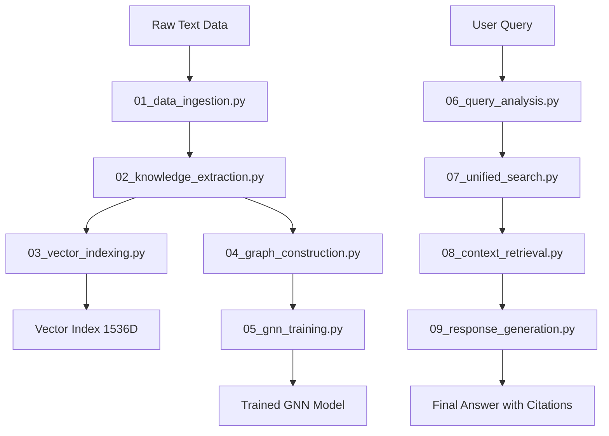

# Data Flow Scripts

**Purpose**: Scripts that directly reflect the README data flow architecture

**Status**: ✅ **CURRENT** - Living documentation of Azure Universal RAG pipeline

**Architecture**: Each script represents a specific stage in the README data flow

---

## 📊 **README Data Flow Architecture**



## 🔄 **Processing Phase Scripts**

**Sequential Execution** - Each stage depends on the previous:

| Script | Data Flow Stage | Input | Output |
|--------|----------------|-------|---------|
| `01_data_ingestion.py` | Raw text → Blob Storage | Local files | Azure Blob Storage |
| `02_knowledge_extraction.py` | Blob → Knowledge extraction | Blob data | Entities & Relationships |
| `03_vector_indexing.py` | Text → Vector embeddings | Text chunks | Azure Cognitive Search index |
| `04_graph_construction.py` | Entities → Graph database | Entities/Relations | Azure Cosmos DB Gremlin |
| `05_gnn_training.py` | Graph → GNN training | Graph data | Trained GNN model |

## 🔍 **Query Phase Scripts**

**Sequential Execution** - Real-time query processing:

| Script | Data Flow Stage | Input | Output |
|--------|----------------|-------|---------|
| `06_query_analysis.py` | Query → Analysis | User query | Analyzed query intent |
| `07_unified_search.py` | Query → Multi-modal search | Query + indices | Search results |
| `08_context_retrieval.py` | Results → Context prep | Search results | Ranked context |
| `09_response_generation.py` | Context → Final response | Context | Answer + citations |

## 🚀 **Orchestration Scripts**

**Full Pipeline Execution**:

| Script | Purpose | Executes |
|--------|---------|----------|
| `00_full_pipeline.py` | Complete processing pipeline | Scripts 01-05 in sequence |
| `10_query_pipeline.py` | Complete query pipeline | Scripts 06-09 in sequence |
| `11_streaming_monitor.py` | Real-time progress events | Progress tracking + streaming |

## 🛠️ **Support Scripts**

| Script | Purpose |
|--------|---------|
| `setup_azure_services.py` | Initialize all Azure services |
| `demo_full_workflow.py` | End-to-end demonstration |

---

## 📋 **Usage Examples**

### **Execute Individual Stages**:
```bash
cd backend/scripts/dataflow

# Processing Phase (sequential)
python 01_data_ingestion.py --source /path/to/data
python 02_knowledge_extraction.py --domain general
python 03_vector_indexing.py --index-name rag-index
python 04_graph_construction.py --graph-name knowledge-graph
python 05_gnn_training.py --epochs 10

# Query Phase (real-time)
python 06_query_analysis.py --query "How does maintenance work?"
python 07_unified_search.py --analyzed-query result.json
python 08_context_retrieval.py --search-results results.json
python 09_response_generation.py --context context.json
```

### **Execute Full Pipelines**:
```bash
# Complete processing (one command)
python 00_full_pipeline.py --source /path/to/data --domain general

# Complete query processing
python 10_query_pipeline.py --query "How does maintenance work?"

# Full demonstration
python demo_full_workflow.py
```

### **Makefile Integration**:
```bash
# Individual stages  
make data-ingestion
make knowledge-extract
make vector-indexing
make graph-construction
make gnn-training

# Full pipelines
make data-prep-full     # Executes 00_full_pipeline.py
make query-demo         # Executes 10_query_pipeline.py
make full-demo          # Executes demo_full_workflow.py
```

---

## ✅ **Benefits of Data Flow Architecture**

1. **📊 Perfect README Alignment**: Each script directly demonstrates README pipeline stages
2. **🎯 Educational Value**: New developers understand system by running scripts 01→09
3. **🧪 Granular Testing**: Test each data flow stage independently
4. **🚀 Perfect Demos**: Show exact README architecture to stakeholders
5. **🔄 Clear Dependencies**: Numbered sequence shows stage relationships
6. **📚 Living Documentation**: Scripts serve as executable README examples

**Result**: Scripts are now living, executable documentation of your README data flow! 🎉