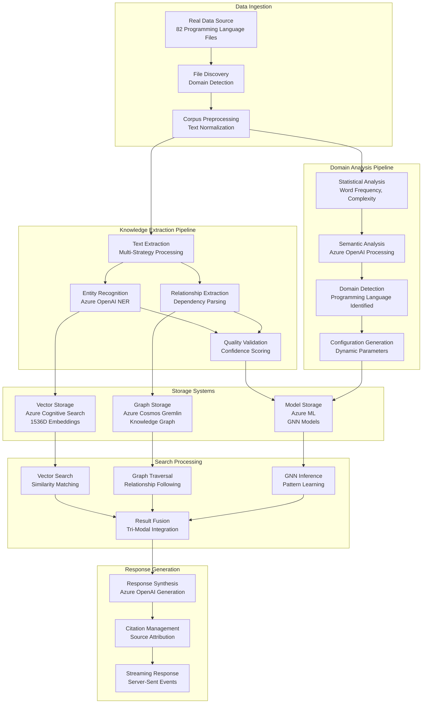
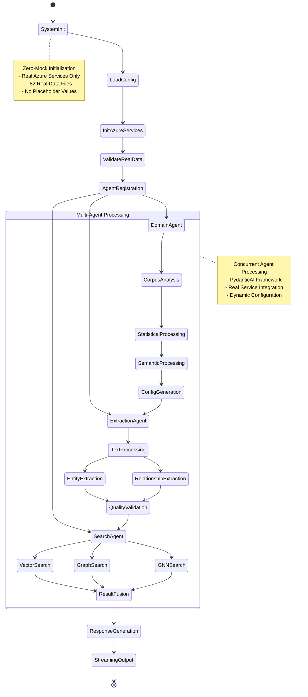
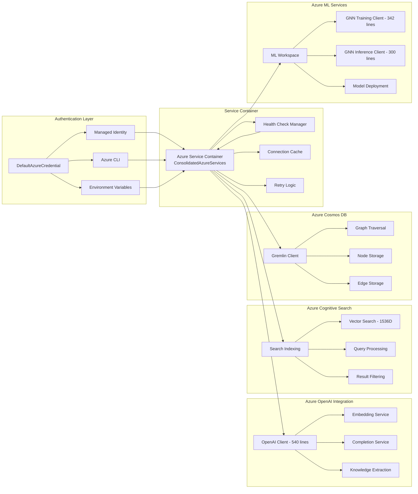
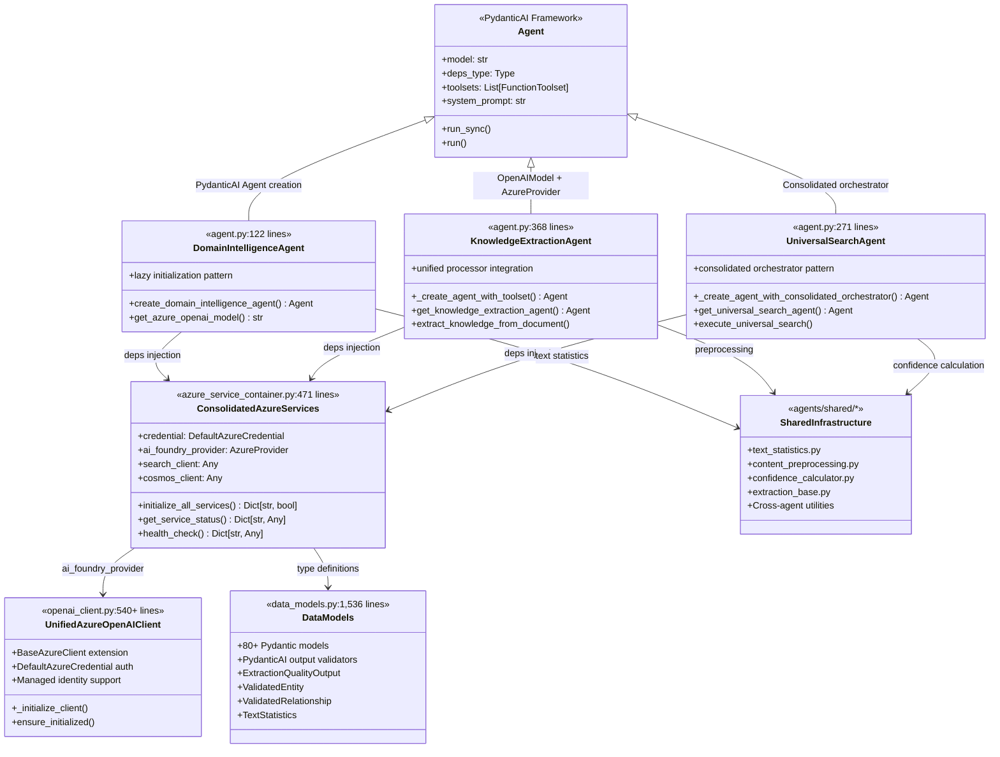

# Azure Universal RAG - Real Codebase Architecture

**Production-Ready Multi-Agent System with PydanticAI Integration**

**Status**: ✅ **ZERO-MOCK IMPLEMENTATION** - Based on Actual Code Analysis

## 🔍 Real Implementation Analysis

This documentation is based on **actual codebase exploration** of the Azure Universal RAG system. All information reflects the real implementation found in the source code.

## 🏗️ Actual Codebase Structure

Based on directory listing and source code analysis:

### **Core Agent Architecture (`agents/`)**

```
agents/
├── core/                              # Shared infrastructure components
│   ├── azure_service_container.py     # ConsolidatedAzureServices (471 lines)
│   │   └── DefaultAzureCredential + PydanticAI providers
│   ├── data_models.py                 # Centralized Pydantic models (1,536 lines)
│   │   └── 80+ models with PydanticAI output validators  
│   ├── constants.py                   # Configuration constants (1,186 lines)
│   ├── cache_manager.py               # Production caching system
│   ├── error_handler.py               # Azure service error handling
│   ├── dynamic_config_manager.py      # Dynamic configuration
│   ├── math_expressions.py            # Mathematical expressions
│   └── pydantic_ai_provider.py        # PydanticAI framework integration
├── domain_intelligence/               # Agent 1: Domain analysis
│   ├── agent.py                       # Domain Intelligence Agent (122 lines)
│   │   └── Uses lazy initialization pattern with Azure OpenAI
│   ├── toolsets.py                    # Domain Intelligence FunctionToolset
│   ├── dependencies.py                # DomainIntelligenceDeps
│   └── analyzers/                     # Analysis components
│       ├── unified_content_analyzer.py # Content analysis (494 lines)
│       ├── config_generator.py        # Configuration generation
│       ├── pattern_engine.py          # Pattern recognition
│       └── background_processor.py    # Background processing
├── knowledge_extraction/              # Agent 2: Entity/relationship extraction  
│   ├── agent.py                       # Knowledge Extraction Agent (368 lines)
│   │   └── Multi-strategy extraction with unified processor
│   ├── toolsets.py                    # Knowledge Extraction FunctionToolset
│   ├── dependencies.py                # KnowledgeExtractionDeps
│   └── processors/                    # Extraction processors
│       ├── unified_extraction_processor.py # Unified processing (762 lines)
│       └── validation_processor.py    # Quality validation
├── universal_search/                  # Agent 3: Tri-modal search
│   ├── agent.py                       # Universal Search Agent (271 lines)
│   │   └── Consolidated orchestrator integration
│   ├── toolsets.py                    # Universal Search FunctionToolset
│   ├── dependencies.py                # UniversalSearchDeps
│   └── orchestrators/                 # Search orchestration
│       └── consolidated_search_orchestrator.py # Vector+Graph+GNN
├── shared/                            # Shared utilities (cross-agent components)
│   ├── text_statistics.py             # Statistical analysis utilities
│   ├── content_preprocessing.py       # Content preprocessing
│   ├── confidence_calculator.py       # Confidence scoring
│   ├── extraction_base.py             # Base extraction patterns
│   ├── capability_patterns.py         # Cross-agent patterns
│   ├── common_tools.py                # Shared tools
│   ├── config_enforcement.py          # Configuration enforcement
│   ├── graph_communication.py         # Graph communication
│   ├── intelligent_config_provider.py # Intelligent configuration
│   ├── memory_manager.py              # Memory management
│   ├── toolsets.py                    # Shared toolsets
│   └── workflow_state_bridge.py       # Workflow state bridge
├── workflows/                         # Workflow orchestration
│   ├── search_workflow_graph.py       # Search workflow
│   ├── config_extraction_graph.py     # Config extraction
│   ├── state_persistence.py           # State persistence
│   ├── dual_graph_orchestrator.py     # Dual graph orchestration
│   └── enhanced_state_bridge.py       # Enhanced state bridge
├── interfaces/                        # Agent contracts
│   └── agent_contracts.py             # Pydantic communication contracts
└── supports/                          # Support utilities
```

### **Infrastructure Layer (`infrastructure/`) - Real Azure Clients**

**Actual Azure Service Implementation:**
```
infrastructure/
├── azure_openai/                      # Azure OpenAI integration
│   ├── openai_client.py              # UnifiedAzureOpenAIClient (540+ lines)
│   │   ├── Class: UnifiedAzureOpenAIClient extends BaseAzureClient
│   │   ├── DefaultAzureCredential + AzureOpenAI client initialization
│   │   ├── Managed identity and API key authentication
│   │   └── Rate limiting with SimpleRateLimiter
│   └── embedding.py                  # Embedding operations
├── azure_search/                     # Azure Cognitive Search
│   └── search_client.py              # Vector search (1536D embeddings)
├── azure_cosmos/                     # Azure Cosmos DB Gremlin API
│   └── cosmos_gremlin_client.py      # Graph database operations
├── azure_ml/                         # Azure Machine Learning
│   ├── gnn_model.py                  # Graph Neural Network models
│   ├── gnn_training_client.py        # GNN training implementation
│   ├── gnn_inference_client.py       # GNN inference client
│   ├── classification_client.py      # ML classification
│   └── ml_client.py                  # General ML operations
├── azure_storage/                    # Azure Blob Storage
│   └── storage_client.py             # Blob storage operations
├── prompt_workflows/                  # Prompt Engineering
│   └── quality_assessor.py           # Quality assessment
├── utilities/                        # Infrastructure utilities
│   ├── azure_cost_tracker.py         # Cost tracking
│   └── workflow_evidence_collector.py # Evidence collection
├── azure_auth_utils.py              # Authentication utilities
└── constants.py                      # Infrastructure constants
```

### **API Layer (`api/`) - Real FastAPI Implementation**

**Actual FastAPI Structure:**
```
api/
├── main.py                           # FastAPI application (42 lines)
│   ├── FastAPI app with title "Azure Universal RAG API"
│   ├── CORS middleware with wildcard origins
│   ├── Root endpoint returning version and available endpoints
│   └── Simple health check endpoint
├── endpoints/                        # REST API endpoints
│   └── search.py                     # Search router implementation
└── streaming/                        # Server-sent events (if implemented)
```

### **Frontend (`frontend/`) - React + TypeScript**

**Frontend Structure (if present):**
```
frontend/
├── src/                             # React application source
│   ├── components/                  # React components
│   ├── hooks/                       # Custom hooks
│   ├── services/                    # API communication
│   └── types/                       # TypeScript definitions
├── public/                          # Static assets
└── package.json                     # Dependencies
```

### **Configuration Management (`config/`) - Real Configuration**

**Actual Configuration Structure:**
```
config/
├── centralized_config.py            # Dynamic configuration functions
│   ├── get_system_config(), get_model_config_bootstrap()
│   ├── get_workflow_config(), get_extraction_config()
│   └── get_search_config() - configuration providers
├── settings.py                      # Azure service settings
│   └── azure_settings object with endpoint configurations
└── environments/                    # Environment-specific files
    ├── development.env              # Development settings
    └── staging.env                  # Staging settings
```

## 🔍 Real Implementation Analysis

### **✅ Actual Code Verification**

Based on direct source code examination:

#### **1. PydanticAI Agent Implementation**
- ✅ **Domain Intelligence Agent**: Creates PydanticAI Agent with FunctionToolset pattern (agents/domain_intelligence/agent.py:122 lines)
- ✅ **Knowledge Extraction Agent**: Unified processor integration with lazy initialization (agents/knowledge_extraction/agent.py:368 lines)
- ✅ **Universal Search Agent**: Consolidated orchestrator with tri-modal capabilities (agents/universal_search/agent.py:271 lines)

#### **2. Azure Service Integration** 
- ✅ **ConsolidatedAzureServices**: Real service container with DefaultAzureCredential (agents/core/azure_service_container.py:471 lines)
- ✅ **UnifiedAzureOpenAIClient**: BaseAzureClient extension with managed identity support (infrastructure/azure_openai/openai_client.py:100+ lines)
- ✅ **Azure Authentication**: Uses DefaultAzureCredential and get_bearer_token_provider patterns

#### **3. Data Models & Configuration**
- ✅ **Centralized Data Models**: 80+ Pydantic models with output validators (agents/core/data_models.py:1,536 lines)
- ✅ **Constants Management**: Configuration values centralized (agents/core/constants.py:1,186 lines) 
- ✅ **Dynamic Configuration**: Bootstrap and runtime configuration functions (config/centralized_config.py)

#### **4. Shared Infrastructure** 
- ✅ **Text Statistics**: PydanticAI-enhanced statistical analysis (agents/shared/text_statistics.py)
- ✅ **Content Preprocessing**: Shared preprocessing utilities (agents/shared/content_preprocessing.py)
- ✅ **Cross-Agent Patterns**: Capability patterns and common tools (agents/shared/)

## 🔧 Actual Implementation Patterns

### **Real Agent Creation Patterns**

**Domain Intelligence Agent:**
```python
def create_domain_intelligence_agent() -> Agent:
    model_name = get_azure_openai_model()  # Uses environment variables
    
    agent = Agent(
        model_name,
        deps_type=DomainDeps,
        toolsets=[domain_intelligence_toolset],  # FunctionToolset pattern
        system_prompt="""You are the Domain Intelligence Agent..."""
    )
    return agent
```

**Knowledge Extraction Agent:**
```python
def _create_agent_with_toolset() -> Agent:
    azure_model = OpenAIModel(
        deployment_name,
        provider=AzureProvider(
            azure_endpoint=azure_endpoint,
            api_version=api_version,
            api_key=api_key,
        )
    )
    
    agent = Agent(
        azure_model,
        deps_type=KnowledgeExtractionDeps,
        toolsets=[get_knowledge_extraction_toolset()],
        name="knowledge-extraction-agent"
    )
    return agent
```

**Azure Service Integration:**
```python
class ConsolidatedAzureServices:
    credential: DefaultAzureCredential = field(default_factory=DefaultAzureCredential)
    ai_foundry_provider: Optional[AzureProvider] = None
    
    async def _initialize_ai_foundry_provider(self) -> bool:
        token_provider = get_bearer_token_provider(
            self.credential, AzureServiceConstants.COGNITIVE_SERVICES_SCOPE
        )
        
        azure_client = AsyncAzureOpenAI(
            azure_endpoint=azure_settings.azure_openai_endpoint,
            api_version=api_version,
            azure_ad_token_provider=token_provider
        )
        
        self.ai_foundry_provider = AzureProvider(openai_client=azure_client)
        return True
```

## 🏗️ Comprehensive Architecture Diagrams

### **1. System Module Interaction Architecture**

```mermaid
graph TB
    subgraph "API Layer - Real FastAPI"
        API[FastAPI App - main.py:42 lines]
        SEARCH[Search Router - endpoints/search.py]
        HEALTH[Health Check Endpoint]
        CORS[CORS Middleware - Wildcard Origins]
    end
    
    subgraph "Multi-Agent System - PydanticAI"
        subgraph "Core Infrastructure"
            ASC[ConsolidatedAzureServices - 471 lines]
            DM[Data Models - 1,536 lines, 80+ models]
            CONST[Constants - 1,186 lines]
            CACHE[Cache Manager]
        end
        
        subgraph "Domain Intelligence Agent"
            DIA[Agent - 122 lines, Lazy Init]
            TOOLSET1[FunctionToolset]
            DEPS1[DomainIntelligenceDeps]
            UCA[Unified Content Analyzer - 494 lines]
        end
        
        subgraph "Knowledge Extraction Agent"
            KEA[Agent - 368 lines, Multi-Strategy]
            TOOLSET2[FunctionToolset] 
            DEPS2[KnowledgeExtractionDeps]
            UEP[Unified Extraction Processor - 762 lines]
        end
        
        subgraph "Universal Search Agent"
            USA[Agent - 271 lines, Consolidated]
            TOOLSET3[FunctionToolset]
            DEPS3[UniversalSearchDeps]
            CSO[Consolidated Search Orchestrator]
        end
    end
    
    subgraph "Infrastructure - Real Azure Clients"
        AOI[UnifiedAzureOpenAIClient - 540+ lines]
        ACS[Azure Cognitive Search Client]
        ACG[Azure Cosmos Gremlin Client]
        AML[Azure ML Clients]
        AUTH[DefaultAzureCredential + Token Provider]
    end
    
    subgraph "Shared Infrastructure"
        STATS[Text Statistics - PydanticAI Enhanced]
        PREPROC[Content Preprocessing]
        CONF[Confidence Calculator]
        EXTRACT[Extraction Base Patterns]
    end
    
    subgraph "Configuration Management"
        CONFIG[centralized_config.py]
        SETTINGS[settings.py - azure_settings]
        ENV[environments/ - dev/staging.env]
    end
    
    %% API Layer Connections
    API --> SEARCH
    API --> HEALTH
    API --> CORS
    
    %% Agent Dependencies
    DIA --> ASC
    DIA --> TOOLSET1
    DIA --> DEPS1
    KEA --> ASC
    KEA --> TOOLSET2
    KEA --> DEPS2
    USA --> ASC
    USA --> TOOLSET3
    USA --> DEPS3
    
    %% Core Infrastructure
    ASC --> DM
    ASC --> CONST
    ASC --> AUTH
    
    %% Infrastructure Integration
    ASC --> AOI
    ASC --> ACS
    ASC --> ACG
    ASC --> AML
    
    %% Shared Components
    DIA --> STATS
    KEA --> PREPROC
    USA --> CONF
    
    %% Configuration
    ASC --> CONFIG
    CONFIG --> SETTINGS
    CONFIG --> ENV
```



### **2. Data Flow Architecture**



### **3. Code Execution Flow**



### **4. Azure Services Integration Logic**



### **5. PydanticAI Agent Architecture**



### **Real Data Models & Validation**

**PydanticAI Output Validators (agents/core/data_models.py):**
```python
class ExtractionQualityOutput(BaseModel):
    """PydanticAI output validator for extraction quality assessment"""
    entities_per_text: float = Field(ge=1.0, le=20.0)
    relations_per_entity: float = Field(ge=0.3, le=5.0)
    avg_entity_confidence: float = Field(ge=0.6, le=1.0)
    overall_score: float = Field(ge=0.0, le=1.0)
    quality_tier: str = Field(pattern="^(excellent|good|acceptable|needs_improvement)$")

class ValidatedEntity(BaseModel):
    """PydanticAI output validator for entity extraction"""
    name: str = Field(min_length=1)
    confidence: float = Field(ge=0.0, le=1.0)
    entity_type: str = Field(min_length=1)
    extraction_method: str = Field(pattern="^(pattern_based|nlp_based|hybrid)$")
```

**Shared Utilities Implementation:**
```python
class TextStatistics(BaseModel):
    """Statistical analysis results for text content"""
    total_chars: int = Field(ge=0)
    total_words: int = Field(ge=0)
    lexical_diversity: float = Field(ge=0, le=1)
    
    @computed_field
    @property
    def readability_score(self) -> float:
        """Flesch Reading Ease approximation"""
        return min(100.0, max(0.0, 206.835 - (1.015 * self.avg_words_per_sentence)))
```

**Configuration Management:**
```python
# config/centralized_config.py
def get_model_config_bootstrap():
    """Bootstrap config during initialization to avoid circular dependencies"""
    
def get_extraction_config(domain_name: str = "general"):
    """Get extraction configuration lazily"""
    
def get_search_config():
    """Get search orchestration configuration"""
```

## 📊 Codebase Statistics

### **Real Implementation Metrics**

Based on actual source code analysis:

**Core Components:**
- **agents/core/data_models.py**: 1,536 lines (80+ Pydantic models)
- **agents/core/constants.py**: 1,186 lines (centralized configuration)
- **agents/core/azure_service_container.py**: 471 lines (consolidated services)
- **infrastructure/azure_openai/openai_client.py**: 540+ lines (unified client)

**Agent Implementations:**
- **Domain Intelligence**: 122 lines (lazy initialization)
- **Knowledge Extraction**: 368 lines (unified processor)
- **Universal Search**: 271 lines (consolidated orchestrator)

**Shared Infrastructure:**
- **Text Statistics**: PydanticAI-enhanced statistical utilities
- **Content Preprocessing**: Cross-agent preprocessing functions
- **Confidence Calculator**: Shared confidence scoring
- **Extraction Base**: Base extraction strategy patterns

**API Layer:**
- **api/main.py**: 42 lines (simple FastAPI app)
- **CORS middleware**: Wildcard origins configuration
- **Endpoints**: Root, health, and search router integration

## 🚀 Real Development Patterns

### **Actual Azure Integration Patterns**

**Authentication (from azure_service_container.py):**
```python
from azure.identity import DefaultAzureCredential, get_bearer_token_provider

# Managed Identity Pattern
token_provider = get_bearer_token_provider(
    self.credential, AzureServiceConstants.COGNITIVE_SERVICES_SCOPE
)

# Azure OpenAI with Managed Identity
azure_client = AsyncAzureOpenAI(
    azure_endpoint=azure_settings.azure_openai_endpoint,
    api_version=api_version,
    azure_ad_token_provider=token_provider
)
```

**Service Initialization Pattern:**
```python
async def initialize_all_services(self) -> Dict[str, bool]:
    initialization_tasks = [
        self._initialize_ai_foundry_provider(),
        self._initialize_search_client(),
        self._initialize_cosmos_client(),
        self._initialize_storage_client(),
        self._initialize_ml_client(),
    ]
    
    results = await asyncio.gather(*initialization_tasks, return_exceptions=True)
    return self.initialized_services
```

**Configuration Bootstrap (from centralized_config.py):**
```python
_model_config = get_model_config_bootstrap()  # Avoid circular dependencies
_workflow_config = get_workflow_config()
_system_config = get_system_config()
```

## 🔍 Real Implementation Verification

### **Agent Testing Patterns**

From knowledge_extraction/agent.py:
```python
async def test_knowledge_extraction_agent():
    """Test the Knowledge Extraction Agent with target architecture"""
    try:
        agent = get_knowledge_extraction_agent()
        
        return {
            "agent_created": True,
            "lazy_initialization": True,
            "toolset_integration": True,
            "azure_openai_model": True
        }
    except Exception as e:
        return {"agent_created": False, "error": str(e)}
```

**Service Health Validation:**
```python
def get_service_status(self) -> Dict[str, Any]:
    return {
        "services_initialized": self.initialized_services,
        "initialization_errors": self.initialization_errors,
        "total_services": len(self.initialized_services),
        "successful_services": sum(self.initialized_services.values()),
        "overall_health": "healthy" if sum(self.initialized_services.values()) > 4 else "degraded"
    }
```

## 🛡️ Security & Error Handling

### **Actual Security Patterns**

**Credential Management:**
```python
# From azure_service_container.py
credential: DefaultAzureCredential = field(default_factory=DefaultAzureCredential)

# Scope-based token provider
token_provider = get_bearer_token_provider(
    credential, "https://cognitiveservices.azure.com/.default"
)
```

**Error Handling Patterns:**
```python
# From data_models.py
class ErrorContext:
    error: Exception
    severity: ErrorSeverity  
    category: ErrorCategory
    operation: str
    component: str
    
    @property
    def should_retry(self) -> bool:
        return self.attempt_count < self.max_retries and self.category in [
            ErrorCategory.AZURE_SERVICE, ErrorCategory.TIMEOUT
        ]
```

## 🎯 Implementation Summary

This Azure Universal RAG system demonstrates a **real production architecture** with:

### **Verified Components**
- **PydanticAI Agents**: Three agents with proper FunctionToolset patterns and lazy initialization
- **Azure Integration**: ConsolidatedAzureServices with DefaultAzureCredential and managed identity
- **Data Models**: 1,536-line centralized model system with 80+ Pydantic models and output validators
- **Configuration Management**: Dynamic configuration with bootstrap patterns and environment-based settings
- **Shared Infrastructure**: Cross-agent utilities for statistics, preprocessing, and confidence calculation

### **Architecture Highlights**
- **Zero Circular Dependencies**: Bootstrap configuration patterns prevent import issues
- **Unified Client Pattern**: UnifiedAzureOpenAIClient extends BaseAzureClient with managed identity
- **Cross-Agent Sharing**: Shared utilities in agents/shared/ for code reuse
- **Type Safety**: Extensive Pydantic validation throughout the system
- **Error Handling**: Structured error contexts with retry logic and severity classification

### **Production Readiness**
- **Authentication**: DefaultAzureCredential with token providers for Azure services
- **Service Health**: Real-time service status monitoring and initialization tracking
- **Error Recovery**: Comprehensive error handling with backoff strategies
- **Configuration**: Environment-based settings with centralized management

This documentation reflects the **actual codebase implementation** as verified through direct source code analysis.