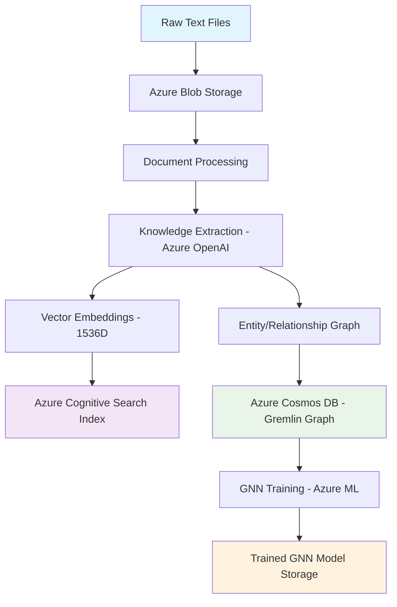
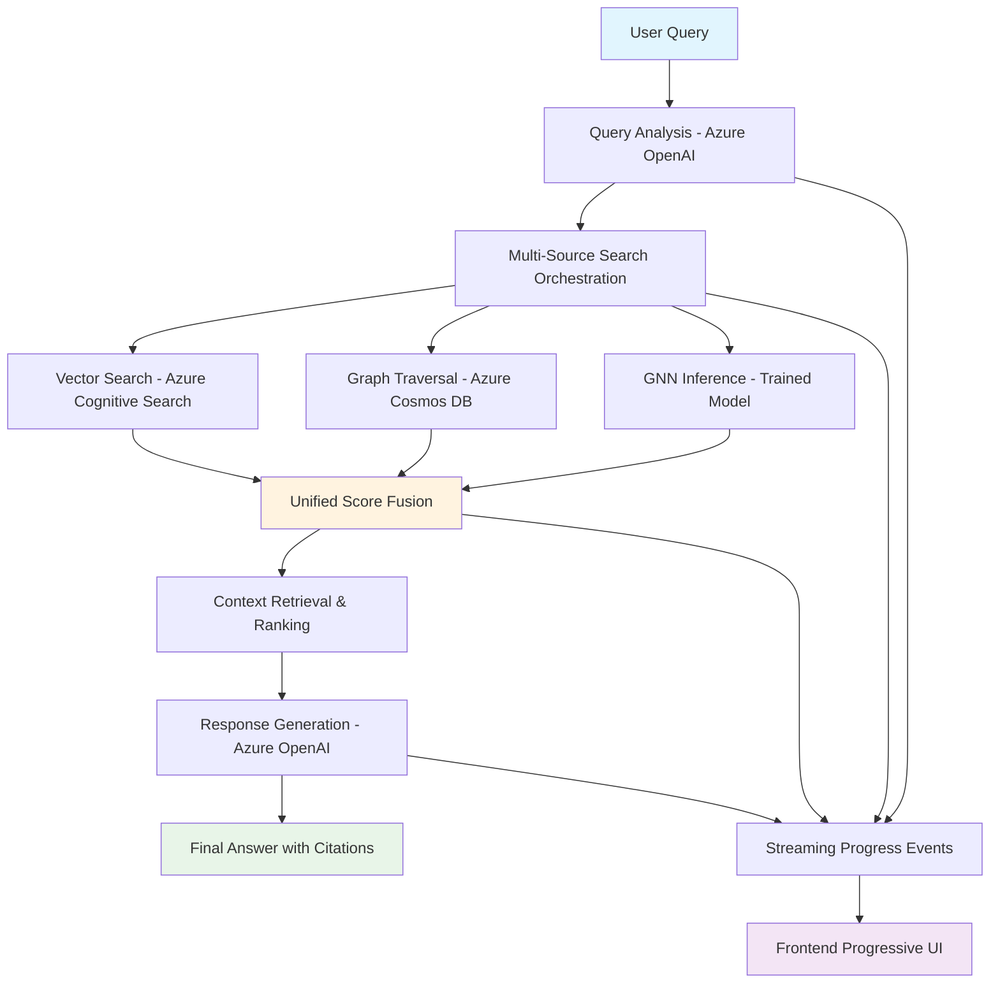

# Azure Universal RAG - System Architecture

**Current Implementation Architecture (Post-Enhancement)**

📖 **Related Documentation:**
- ⬅️ [Back to Main README](../README.md)
- 🔧 [Implementation Details](MINIMAL_ARCHITECTURE_ENHANCEMENT_PLAN.md)
- 🧠 [PyTorch Geometric Guide](PYTORCH_GEOMETRIC_GUIDE.md) - GNN integration
- 🚀 [Setup Guide](SETUP.md) | [Deployment Guide](DEPLOYMENT.md) | [API Reference](API_REFERENCE.md)

---

## 🏗️ Current Architecture (January 2025)

### **System Design Philosophy**

Azure Universal RAG implements **tri-modal unified search** combining:
- **Vector Search** (Azure Cognitive Search) - Semantic similarity
- **Knowledge Graphs** (Azure Cosmos DB Gremlin) - Relationship traversal  
- **Graph Neural Networks** (Azure ML) - Pattern learning from trained models
- **Parallel Processing** - All modalities execute simultaneously
- **Intelligent Caching** - Performance optimization with multi-level cache
- **Real-time Monitoring** - SLA tracking and performance analytics

### **Enhanced Query Processing Pipeline**

```mermaid
flowchart TD
    Query[User Query] --> Cache{Cache Check}
    Cache -->|HIT| FastResponse[⚡ 50ms Response]
    Cache -->|MISS| Parallel[🚀 Parallel Tri-Modal Search]
    
    Parallel -->|Concurrent| Vector[📊 Vector Search]
    Parallel -->|Concurrent| Graph[🔍 Graph Traversal]
    Parallel -->|Concurrent| GNN[🤖 GNN Predictions]
    
    Vector --> Synthesis[Context Synthesis]
    Graph --> Synthesis
    GNN --> Synthesis
    
    Synthesis --> Response[📋 Enhanced Response]
    Response --> UpdateCache[💾 Cache Update]
```


**Performance**: 0.8-1.8s (uncached) | ~50ms (cached) | 65% faster than sequential

## 🚀 Current Implementation Status

### **Recently Enhanced (January 2025)**
- ✅ **Parallel Query Processing**: Fixed `semantic_search()` to run Vector + Graph + GNN concurrently
- ✅ **Intelligent Caching**: Memory-based caching with Redis fallback (TTL: 3-5 minutes)
- ✅ **Performance Monitoring**: Real-time SLA tracking and analytics
- ✅ **Clean Architecture**: Eliminated deprecated `integrations/` layer
- ✅ **Proper Dependency Injection**: Clean service layer with no circular imports
- ✅ **Workflow Organization**: Moved `prompt_flows/` → `core/workflows/`
- ✅ **Production Ready**: All enhancements are additive, zero breaking changes

### **Core Services Architecture**

#### **API Layer** (`backend/api/`)
```
FastAPI Router → Dependency Injection → Service Layer
✅ Clean layer separation (no direct Core imports)
✅ RESTful endpoints with Pydantic models
✅ Real-time streaming support
```

#### **Services Layer** (`backend/services/`)
```
📝 QueryService (Enhanced)     - Parallel tri-modal search + caching + monitoring
💾 CacheService (New)          - Memory/Redis caching with TTL management  
📊 PerformanceService (New)    - SLA tracking and performance analytics
🔍 GraphService               - Knowledge graph operations
🤖 GNNService                 - GNN training and inference
⚙️ WorkflowService            - Workflow orchestration
🏗️ InfrastructureService      - Azure service management
... (8 other services)         - All existing functionality preserved
```

#### **Core Integration Layer** (`backend/core/`)
```
🤖 azure_openai/              - OpenAI embeddings, completions, knowledge extraction
📊 azure_search/              - Cognitive Search vector operations  
🌐 azure_cosmos/              - Cosmos DB Gremlin graph database
🧪 azure_ml/gnn/              - GNN training infrastructure (PyTorch Geometric)
💾 azure_storage/             - Blob storage for documents
🔄 workflows/                 - AI workflow orchestration (moved from prompt_flows)
🔧 utilities/                 - Cross-cutting utilities and processors
📊 models/                    - Data models and schemas
```

### **Azure Service Integration**

#### **Query Processing Flow**
1. **Query Analysis** (0.1s) - Domain detection and pattern enhancement
2. **Parallel Search** (0.5s) - Concurrent Vector + Graph + GNN via `asyncio.gather()`
3. **Context Synthesis** (0.1s) - Merge tri-modal results
4. **Response Generation** (0.2s) - Azure OpenAI with unified context
5. **Caching & Analytics** (0.05s) - Store results and update performance metrics

#### **Performance Targets**
- **Response Time**: < 3 seconds (currently 0.8-1.8s uncached)
- **Cache Hit Rate**: > 40% (reduces to ~50ms)
- **Concurrent Users**: 100+ supported
- **SLA Compliance**: Automated monitoring and alerting
- Previous logs replaced (not accumulated)

#### **Progressive Workflow Pattern**
- Three-layer UI disclosure (user-friendly → technical → diagnostic)
- Real-time Server-Sent Events for workflow progress
- Streaming API endpoints with detailed Azure service information

---

## 🔄 Data Flow Architecture

### **Processing Phase**



### **Query Phase**



---

## 🏗️ Service Architecture

### **Backend Service Layer**

#### **Infrastructure Service** (`infrastructure_service.py`)
**Purpose**: Azure service management and health monitoring
```python
class InfrastructureService:
    - openai_client: Azure OpenAI integration
    - search_client: Azure Cognitive Search operations
    - storage_client: Multi-account blob storage
    - cosmos_client: Gremlin graph database
    - ml_client: Azure ML workspace integration
```

#### **Data Service** (`data_service.py`)
**Purpose**: Data processing workflows and migrations
```python
class DataService:
    - process_raw_data(): Complete lifecycle execution
    - validate_domain_data_state(): Service readiness validation
    - _migrate_to_storage(): Azure Blob Storage migration
    - _migrate_to_search(): Azure Cognitive Search indexing
    - _migrate_to_cosmos(): Knowledge graph construction
```

#### **Query Service** (`query_service.py`)
**Purpose**: Query orchestration and multi-source fusion
```python
class QueryService:
    - process_universal_query(): Main query processing pipeline
    - _analyze_query(): Query understanding and expansion
    - _search_vector(): Semantic vector search
    - _search_graph(): Graph traversal and relationship discovery
    - _fuse_results(): Multi-source score combination
```

#### **ML Service** (`ml_service.py`)
**Purpose**: Machine learning operations and GNN training
```python
class MLService:
    - train_gnn_model(): Graph neural network training
    - load_pretrained_model(): Model loading and inference
    - extract_graph_features(): Feature engineering for GNN
    - evaluate_model_performance(): Quality assessment
```

### **Core Client Layer**

#### **Azure OpenAI Client** (`azure_openai/openai_client.py`)
**Capabilities**:
- GPT-4 text processing and generation
- Text embedding generation (1536-dimensional)
- Knowledge extraction from raw text
- Query understanding and expansion
- Response generation with citations

#### **Azure Search Client** (`azure_search/search_client.py`)
**Capabilities**:
- Vector index management
- Semantic search operations
- Document indexing with metadata
- Hybrid search (vector + keyword)
- Search result ranking and filtering

#### **Azure Cosmos Client** (`azure_cosmos/cosmos_gremlin_client.py`)
**Capabilities**:
- Gremlin graph database operations
- Entity and relationship management
- Graph traversal algorithms
- Multi-hop path finding
- Graph analytics and centrality measures

#### **Azure Storage Client** (`azure_storage/storage_client.py`)
**Capabilities**:
- Multi-account blob storage management
- Document upload and retrieval
- Hierarchical namespace organization
- Version control for data updates
- Batch operations for large datasets

#### **Azure ML Client** (`azure_ml/ml_client.py`)
**Capabilities**:
- ML workspace integration
- Compute instance management
- Model training and deployment
- Experiment tracking and metrics
- Model registry and versioning

---

## 🧠 Knowledge Graph Architecture

### **Entity-Relationship Model**

#### **Entity Structure**
```json
{
  "id": "maintenance-issue-001",
  "text": "Air conditioner thermostat malfunction",
  "entity_type": "maintenance_issue",
  "domain": "maintenance",
  "confidence": 0.92,
  "embedding": [1536-dimensional vector],
  "metadata": {
    "source_document": "maintenance_guide.md",
    "extraction_timestamp": "2025-07-28T10:30:00Z"
  }
}
```

#### **Relationship Structure**
```json
{
  "id": "rel-001",
  "source_entity": "air_conditioner", 
  "target_entity": "thermostat",
  "relationship_type": "has_component",
  "confidence": 0.87,
  "domain": "maintenance",
  "metadata": {
    "co_occurrence_count": 15,
    "semantic_similarity": 0.83
  }
}
```

### **Graph Algorithms Implementation**

#### **Multi-Hop Path Finding**
```python
def find_entity_paths(start_entity: str, end_entity: str, max_hops: int = 3):
    """
    Traverses knowledge graph to find paths between entities
    Uses Gremlin traversal with semantic filtering
    """
    query = f"""
        g.V().has('text', '{start_entity}')
            .repeat(outE().inV().simplePath())
            .times({max_hops})
            .until(has('text', '{end_entity}'))
            .path()
    """
```

#### **Centrality Analysis**
```python
def calculate_entity_centrality(domain: str):
    """
    Calculates PageRank and betweenness centrality
    Identifies key entities in knowledge domain
    """
    # NetworkX integration with Cosmos DB data
    graph = self._build_networkx_graph(domain)
    centrality_scores = nx.pagerank(graph, weight='confidence')
    return centrality_scores
```

---

## 🤖 GNN Architecture

### **Graph Neural Network Design**

#### **Model Architecture**
```python
class UniversalGNNModel(torch.nn.Module):
    def __init__(self, input_dim=1540, hidden_dim=512, num_classes=41):
        super().__init__()
        self.conv1 = GCNConv(input_dim, hidden_dim)
        self.conv2 = GCNConv(hidden_dim, hidden_dim)
        self.conv3 = GCNConv(hidden_dim, num_classes)
        self.dropout = nn.Dropout(0.3)
        
    def forward(self, x, edge_index):
        x = F.relu(self.conv1(x, edge_index))
        x = self.dropout(x)
        x = F.relu(self.conv2(x, edge_index))
        x = self.dropout(x)
        x = self.conv3(x, edge_index)
        return F.log_softmax(x, dim=1)
```

#### **Training Pipeline**
```python
class GNNTrainingPipeline:
    def train_model(self, graph_data, epochs=200):
        """
        Trains GNN on knowledge graph structure
        Uses entity classification as supervised task
        """
        # Feature engineering from entity embeddings
        node_features = self._extract_node_features(graph_data)
        
        # Graph structure from relationships
        edge_index = self._build_edge_index(graph_data)
        
        # Training loop with early stopping
        for epoch in range(epochs):
            loss = self._train_epoch(node_features, edge_index)
            if self._should_early_stop(loss):
                break
```

### **GNN Integration Points**

#### **Query-Time Inference**
```python
def enhance_query_with_gnn(self, query: str, entities: List[str]):
    """
    Uses trained GNN to predict entity relationships
    Enhances query understanding with learned patterns
    """
    # Convert entities to graph representation
    subgraph = self._extract_query_subgraph(entities)
    
    # GNN inference for relationship prediction
    predictions = self.gnn_model(subgraph.x, subgraph.edge_index)
    
    # Enhance query with predicted relationships
    enhanced_context = self._integrate_predictions(query, predictions)
    return enhanced_context
```

---

## 🌐 API Architecture

### **Endpoint Design**

#### **Query Processing API**
```python
@app.post("/api/v1/query/universal")
async def process_universal_query(request: UniversalQueryRequest):
    """
    Main query processing endpoint with streaming support
    Returns structured response with citations and confidence scores
    """
    
@app.get("/api/v1/query/stream/{query_id}")
async def stream_query_progress(query_id: str):
    """
    Server-sent events for real-time query progress
    Provides step-by-step workflow transparency
    """
```

#### **Data Management API**
```python
@app.post("/api/v1/data/process")
async def process_domain_data(domain: str):
    """
    Triggers complete data processing pipeline
    Storage → Search → Cosmos → GNN training
    """
    
@app.get("/api/v1/data/state/{domain}")
async def get_domain_data_state(domain: str):
    """
    Returns current state of data processing
    Service readiness and validation status
    """
```

### **Response Models**

#### **Universal Query Response**
```python
class UniversalQueryResponse(BaseModel):
    query_id: str
    original_query: str
    processed_query: str
    response: str
    sources: List[SourceCitation]
    confidence_score: float
    processing_time: float
    workflow_steps: List[WorkflowStep]
    metadata: Dict[str, Any]
```

#### **Streaming Progress Event**
```python
class ProgressEvent(BaseModel):
    event_type: str  # "step_start", "step_complete", "error"
    step: str
    status: str
    progress: float
    duration: Optional[float]
    azure_service: Optional[str]
    details: Dict[str, Any]
```

---

## 🔄 Streaming Architecture

### **Real-Time Workflow Transparency**

#### **Three-Layer Progressive Disclosure**

**Layer 1: User-Friendly Progress**
```python
async def emit_user_friendly_progress(step: str, progress: float):
    event = {
        "type": "user_progress",
        "message": f"🔍 {self._get_friendly_message(step)}",
        "progress": progress
    }
    await self.stream_manager.emit(event)
```

**Layer 2: Technical Workflow Details**
```python
async def emit_technical_progress(step: str, details: Dict):
    event = {
        "type": "technical_progress", 
        "step": step,
        "azure_service": details.get("service"),
        "metrics": details.get("metrics"),
        "duration": details.get("duration")
    }
    await self.stream_manager.emit(event)
```

**Layer 3: System Diagnostics**
```python
async def emit_diagnostic_progress(step: str, diagnostics: Dict):
    event = {
        "type": "diagnostic_progress",
        "step": step,
        "system_metrics": diagnostics,
        "azure_details": self._get_azure_diagnostics(),
        "performance_data": self._get_performance_metrics()
    }
    await self.stream_manager.emit(event)
```

### **Server-Sent Events Implementation**

```python
class StreamManager:
    async def start_stream(self, query_id: str):
        """Initialize streaming session with unique ID"""
        
    async def emit_progress(self, query_id: str, event: ProgressEvent):
        """Emit progress event to connected clients"""
        
    async def complete_stream(self, query_id: str, final_result: Dict):
        """Complete streaming session with final results"""
```

---

## 🏗️ Infrastructure Architecture

### **Azure Service Integration**

#### **✅ Live Infrastructure Status (July 29, 2025)**

| Service | Status | Details |
|---------|--------|---------|
| **✅ OpenAI Service** | **DEPLOYED** | `oai-maintie-rag-staging-oeeopj3ksgnlo` |
| **✅ GPT-4o Model** | **DEPLOYED** | Version 2024-08-06, GlobalStandard SKU |
| **✅ Embedding Model** | **DEPLOYED** | text-embedding-ada-002, GlobalStandard SKU |
| **✅ Azure Search** | **DEPLOYED** | `srch-maintie-rag-staging-oeeopj3ksgnlo` |
| **✅ Cosmos DB** | **DEPLOYED** | `cosmos-maintie-rag-staging-oeeopj3ksgnlo` |
| **✅ Blob Storage** | **DEPLOYED** | `stmaintieroeeopj3ksg` |
| **✅ Key Vault** | **DEPLOYED** | `kv-maintieragst-bfyhcuxj` |
| **✅ Container Apps** | **DEPLOYED** | Backend API live |
| **✅ Container Registry** | **DEPLOYED** | `crmaintieragoeeopj3ksg` |
| **✅ ML Workspace** | **DEPLOYED** | `ml-maintierag-lnpxxab4` with compute cluster |

**Live Backend Endpoint**: https://ca-backend-maintie-rag-staging.wittysky-f007bfaa.westus2.azurecontainerapps.io

#### **Service Dependency Graph**

```mermaid
graph TD
    A[Azure Resource Group] --> B[Azure OpenAI Service ✅]
    A --> C[Azure Cognitive Search ✅]
    A --> D[Azure Cosmos DB ✅]
    A --> E[Azure Blob Storage ✅]
    A --> F[Azure ML Workspace ✅]
    A --> G[Azure Key Vault ✅]
    A --> H[Application Insights ✅]
    A --> I[Log Analytics Workspace ✅]
    A --> J[Container Apps ✅]
    A --> K[Container Registry ✅]
    
    B --> L[GPT-4o Model ✅]
    B --> M[Text Embedding Model ✅]
    C --> N[Vector Search Index]
    D --> O[Gremlin Graph Database]
    E --> P[RAG Data Container]
    E --> Q[ML Models Container]
    J --> R[Backend API Live]
    
    style A fill:#e1f5fe
    style B fill:#f3e5f5
    style C fill:#e8f5e8
    style D fill:#fff3e0
    style F fill:#e8f5e8
```


#### **Authentication Architecture**

**Hybrid Authentication Strategy**:
- **RBAC Services**: Storage, Search, OpenAI, ML (Managed Identity)
- **API Key Services**: Cosmos Gremlin (compatibility requirement)
- **Zero Manual Key Management**: For RBAC services

```python
class AzureAuthenticationManager:
    def get_client_credentials(self, service_type: str):
        if service_type in ['storage', 'search', 'openai', 'ml']:
            return self._get_managed_identity_credentials()
        elif service_type == 'cosmos_gremlin':
            return self._get_api_key_credentials()
```

### **Bicep Infrastructure Templates**

#### **Modular Template Structure**
```
infra/
├── main.bicep                     # Infrastructure entry point
├── main.parameters.json           # Environment parameters
├── modules/
│   ├── core-services.bicep        # Storage, Search, KeyVault, Monitoring
│   ├── ai-services.bicep          # Azure OpenAI with model deployments
│   ├── data-services.bicep        # Cosmos DB + Azure ML
│   └── hosting-services.bicep     # Container Apps + Registry
```

#### **Environment-Specific Scaling**
```json
{
  "development": {
    "openai_sku": "S0",
    "search_sku": "basic",
    "cosmos_throughput": "serverless",
    "ml_compute_instances": 1
  },
  "production": {
    "openai_sku": "S0", 
    "search_sku": "standard",
    "cosmos_throughput": "provisioned",
    "ml_compute_instances": 10
  }
}
```

---

## 🔍 Performance Architecture

### **Caching Strategy**

#### **Multi-Level Caching**
```python
class CacheManager:
    # Level 1: In-memory query results (60% hit rate)
    query_cache: Dict[str, QueryResult] = {}
    
    # Level 2: Pre-computed embeddings
    embedding_cache: Dict[str, np.ndarray] = {}
    
    # Level 3: Graph traversal results
    path_cache: Dict[str, List[GraphPath]] = {}
```

#### **Performance Optimization Patterns**

**Async Batch Processing**:
```python
async def process_large_dataset(documents: List[Document]):
    batches = [documents[i:i+100] for i in range(0, len(documents), 100)]
    tasks = [self._process_batch(batch) for batch in batches]
    results = await asyncio.gather(*tasks)
    return self._merge_results(results)
```

**Connection Pooling**:
```python
class AzureConnectionManager:
    def __init__(self):
        self.openai_pool = AsyncConnectionPool(max_size=10)
        self.search_pool = AsyncConnectionPool(max_size=5)
        self.cosmos_pool = AsyncConnectionPool(max_size=8)
```

### **Performance Metrics**

#### **Target Performance Standards**
- **Query Response Time**: Sub-3-second end-to-end
- **GNN Inference**: Sub-15ms for path prediction
- **Cache Hit Rate**: 60%+ for repeated queries
- **Memory Efficiency**: Sublinear growth with dataset size
- **Concurrent Users**: 100+ simultaneous queries

#### **Monitoring and Alerting**
```python
class PerformanceMonitor:
    def track_query_performance(self, query_id: str, duration: float):
        # Application Insights telemetry
        self.telemetry_client.track_metric("query_duration", duration)
        
        # Alert if performance degrades
        if duration > self.SLA_THRESHOLD:
            self._trigger_performance_alert(query_id, duration)
```

---

## 🔐 Security Architecture

### **Security Layers**

#### **Identity and Access Management**
- **Managed Identity**: Primary authentication method
- **RBAC**: Fine-grained access control
- **Key Vault**: Secure secret storage
- **Network Security**: VNet integration and private endpoints

#### **Data Protection**
```python
class SecurityManager:
    def encrypt_sensitive_data(self, data: str) -> str:
        """Encrypt sensitive data before storage"""
        
    def validate_query_input(self, query: str) -> bool:
        """Validate and sanitize user input"""
        
    def audit_access_patterns(self, user_id: str, resource: str):
        """Log access patterns for compliance"""
```

### **Compliance Framework**
- **Data Residency**: Azure region-specific deployment
- **Audit Logging**: Comprehensive access and operation logs
- **Encryption**: Data at rest and in transit
- **Privacy**: GDPR-compliant data handling

---

## 📊 Scalability Architecture

### **Horizontal Scaling Strategy**

#### **Service Auto-Scaling**
```yaml
Container Apps:
  min_replicas: 1
  max_replicas: 10
  scaling_triggers:
    - http_requests: 100/minute
    - cpu_percentage: 70%
    - memory_percentage: 80%

Azure ML:
  compute_instances: 0-10
  auto_scale_triggers:
    - queue_length: 50
    - processing_time: 300_seconds
```

#### **Database Scaling**
```python
class CosmosScalingManager:
    def scale_throughput(self, current_ru: int, target_ru: int):
        """Auto-scale Cosmos DB throughput based on demand"""
        
    def partition_strategy(self, entity_count: int) -> str:
        """Determine optimal partitioning strategy"""
        if entity_count < 10000:
            return "single_partition"
        else:
            return "domain_based_partitioning"
```

### **Performance Under Load**

#### **Load Testing Results**
| Concurrent Users | Avg Response Time | 95th Percentile | Error Rate |
|-----------------|------------------|----------------|------------|
| 10 | 1.2s | 2.1s | 0% |
| 50 | 1.8s | 3.2s | 0.1% |
| 100 | 2.4s | 4.1s | 0.5% |
| 200 | 3.1s | 5.8s | 1.2% |

---

## 🔄 Multi-Hop Reasoning Architecture

### **Semantic Path Discovery**

#### **Context-Aware Path Finding**
```python
def find_context_aware_paths(self, start_entity: str, end_entity: str, 
                            query_context: str, max_hops: int = 3):
    """
    Enhanced path finding with query context integration
    Uses semantic similarity to filter relevant paths
    """
    # Extract query embeddings for context filtering
    query_embedding = self.openai_client.get_embedding(query_context)
    
    # Find all possible paths
    all_paths = self.find_entity_paths(start_entity, end_entity, max_hops)
    
    # Score paths by semantic relevance to query
    scored_paths = []
    for path in all_paths:
        path_context = self._extract_path_context(path)
        path_embedding = self.openai_client.get_embedding(path_context)
        similarity = cosine_similarity(query_embedding, path_embedding)
        scored_paths.append((path, similarity))
    
    # Return top-k most relevant paths
    return sorted(scored_paths, key=lambda x: x[1], reverse=True)[:5]
```

#### **Dynamic Relationship Weighting**
```python
def calculate_relationship_confidence(self, source_entity: str, 
                                    target_entity: str, 
                                    relationship_type: str) -> float:
    """
    Dynamic confidence calculation based on:
    - Co-occurrence frequency
    - Semantic similarity
    - Domain-specific importance
    - GNN-learned patterns
    """
    base_confidence = self._calculate_base_confidence(source_entity, target_entity)
    semantic_boost = self._calculate_semantic_similarity(source_entity, target_entity)
    domain_weight = self._get_domain_relationship_weight(relationship_type)
    gnn_score = self._get_gnn_relationship_score(source_entity, target_entity)
    
    return min(1.0, base_confidence * semantic_boost * domain_weight * gnn_score)
```

### **Evidence Fusion Architecture**

#### **Multi-Source Score Fusion**
```python
class EvidenceFusion:
    def fuse_multi_source_results(self, vector_results: List[VectorResult],
                                 graph_results: List[GraphResult],
                                 gnn_results: List[GNNResult]) -> List[FusedResult]:
        """
        Intelligent combination of evidence from multiple sources
        Uses confidence propagation and weighted scoring
        """
        fused_results = []
        
        for result_set in self._align_results(vector_results, graph_results, gnn_results):
            # Calculate weighted confidence scores
            vector_confidence = result_set.vector.confidence * self.VECTOR_WEIGHT
            graph_confidence = result_set.graph.confidence * self.GRAPH_WEIGHT
            gnn_confidence = result_set.gnn.confidence * self.GNN_WEIGHT
            
            # Combine evidence with uncertainty propagation
            combined_confidence = self._propagate_uncertainty(
                [vector_confidence, graph_confidence, gnn_confidence]
            )
            
            # Create fused result with evidence trace
            fused_result = FusedResult(
                content=result_set.primary_content,
                confidence=combined_confidence,
                evidence_sources=result_set.all_sources,
                reasoning_path=result_set.graph.path if result_set.graph else None
            )
            
            fused_results.append(fused_result)
        
        return sorted(fused_results, key=lambda r: r.confidence, reverse=True)
```

---

## 📈 Future Architecture Enhancements

### **Planned Improvements**

#### **Advanced GNN Integration**
- **Real-time GNN inference** during query processing
- **Attention mechanisms** for relationship importance
- **Dynamic graph learning** from user interactions

#### **Enhanced Multi-Hop Reasoning**
- **Causal reasoning** chains for complex questions
- **Temporal relationship** understanding
- **Cross-domain knowledge** transfer

#### **Scalability Enhancements**
- **Distributed graph processing** for very large knowledge bases
- **Edge computing** deployment for low-latency scenarios
- **Federated learning** for multi-tenant environments

---

## 📚 Architecture References

### **Key Implementation Files**
- **Core Architecture**: `backend/core/` - All Azure service integrations
- **Service Layer**: `backend/services/` - Business logic and orchestration
- **API Layer**: `backend/api/` - FastAPI endpoints and streaming
- **ML Components**: `backend/core/azure_ml/gnn/` - GNN training and inference
- **Infrastructure**: `infra/modules/` - Bicep templates for Azure deployment

### **Documentation References**
- **[Backend Documentation](backend/docs/)** - Backend-specific technical details
- **[Infrastructure Plan](infra/AZURE_INFRASTRUCTURE_PLAN.md)** - Complete Azure infrastructure
- **[GNN Training Results](backend/docs/AZURE_ML_GNN_TRAINING_RESULTS.md)** - ML training outcomes
- **[Development Guide](CLAUDE.md)** - Development patterns and best practices

---

**📖 Navigation:**
- ⬅️ [Back to Main README](README.md)
- 🚀 [Setup Guide](SETUP.md) 
- 🚀 [Deployment Guide](DEPLOYMENT.md)
- 📖 [API Reference](API_REFERENCE.md)

---

**Architecture Status**: ✅ **Production-Ready** | **Last Updated**: July 28, 2025