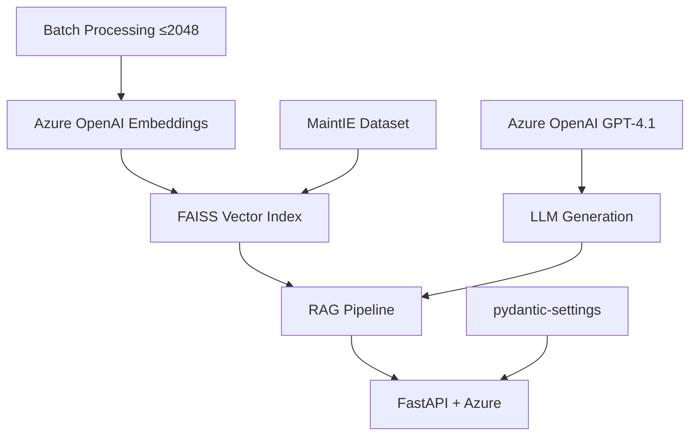

# MaintIE Enhanced RAG - Azure-Based Testing Guide

## **CORRECTED** Testing Protocol for Real Implementation

**Document Version**: 2.0 (Corrected)
**Based On**: Actual Azure OpenAI Implementation
**Architecture**: Azure OpenAI + FastAPI Production Stack

---

## 🎯 **Testing Strategy - Reality Check**

### **Real Implementation Stack**



### **Actual Configuration Stack**

- ✅ **Azure OpenAI**: `text-embedding-ada-002` (1536 dimensions)
- ✅ **pydantic-settings**: Modern configuration management
- ✅ **Batch Limits**: Max 2048 inputs per Azure embedding call
- ✅ **Azure Endpoints**: Deployment-specific URLs
- ✅ **FastAPI**: Production-ready API server

---

## 🚀 **Phase 1: Azure Environment Setup**

### **1.1 Prerequisites Validation**

```bash
# Verify you have the actual repository
cd azure-maintie-rag

# Check for real implementation files
ls -la src/retrieval/vector_search.py  # Should exist
ls -la config/environment_example.env  # Should exist
grep -n "AzureOpenAI" src/retrieval/vector_search.py  # Should find Azure client
```

### **1.2 Python Environment Setup**

```bash
# Create Python environment
python3.10 -m venv venv
source venv/bin/activate  # Linux/Mac
# OR: venv\Scripts\activate  # Windows

# Install REAL dependencies
pip install -r requirements.txt

# Verify Azure OpenAI SDK
python -c "from openai import AzureOpenAI; print('✅ Azure OpenAI SDK ready')"
```

### **1.3 Azure Configuration Setup**

```bash
# Copy real environment template
cp config/environment_example.env .env

# Edit .env with YOUR Azure OpenAI credentials
nano .env
```

**Required Azure OpenAI Configuration:**

```bash
# Azure OpenAI Configuration (REQUIRED)
OPENAI_API_TYPE=azure
OPENAI_API_KEY=your-azure-openai-key-here
OPENAI_API_BASE=https://your-instance.openai.azure.com/
OPENAI_API_VERSION=2025-03-01-preview
OPENAI_DEPLOYMENT_NAME=gpt-4.1

# Azure Embedding Configuration (REQUIRED)
EMBEDDING_MODEL=text-embedding-ada-002
EMBEDDING_DEPLOYMENT_NAME=text-embedding-ada-002
EMBEDDING_API_BASE=https://your-instance.openai.azure.com/
EMBEDDING_API_VERSION=2025-03-01-preview

# Batch Settings (Azure Limits)
EMBEDDING_BATCH_SIZE=32
EMBEDDING_DIMENSION=1536
```

### **1.4 Directory Structure Verification**

```bash
# Verify required directories exist
mkdir -p data/{raw,processed,indices}
mkdir -p logs

# Check actual project structure
tree -L 2
```

---

## 🧪 **Phase 2: Real Component Testing**

### **2.1 Configuration Loading Test**

```python
# test_real_config.py
from config.settings import settings
from pydantic_settings import BaseSettings

def test_azure_config():
    """Test real Azure OpenAI configuration"""
    print("🔄 Testing Azure Configuration...")

    # Verify Azure settings
    assert settings.openai_api_type == "azure", f"Expected 'azure', got {settings.openai_api_type}"
    assert settings.openai_api_key.startswith(("sk-", "az-")), "Invalid API key format"
    assert "openai.azure.com" in settings.openai_api_base, "Invalid Azure endpoint"
    assert settings.embedding_dimension == 1536, f"Expected 1536, got {settings.embedding_dimension}"

    print("✅ Azure configuration valid")
    print(f"📊 API Base: {settings.openai_api_base}")
    print(f"📊 Embedding Model: {settings.embedding_model}")
    print(f"📊 Batch Size: {settings.embedding_batch_size}")
    return True

if __name__ == "__main__":
    test_azure_config()
```

```bash
python test_real_config.py
```

### **2.2 Azure OpenAI Connectivity Test**

```python
# test_azure_connectivity.py
from openai import AzureOpenAI
from config.settings import settings
import os

def test_azure_embedding_api():
    """Test actual Azure OpenAI embedding API"""
    print("🔄 Testing Azure OpenAI Embedding API...")

    try:
        # Initialize Azure OpenAI client (real implementation)
        client = AzureOpenAI(
            api_key=settings.openai_api_key,
            api_version=settings.embedding_api_version,
            azure_endpoint=settings.embedding_api_base
        )

        # Test embedding call (small batch)
        response = client.embeddings.create(
            model=settings.embedding_deployment_name,
            input=["test maintenance query"]
        )

        embedding = response.data[0].embedding
        print(f"✅ Azure embedding API working")
        print(f"📊 Embedding dimension: {len(embedding)}")
        print(f"📊 Model: {settings.embedding_deployment_name}")

        return True

    except Exception as e:
        print(f"❌ Azure embedding API error: {e}")
        return False

def test_azure_chat_api():
    """Test actual Azure OpenAI chat API"""
    print("🔄 Testing Azure OpenAI Chat API...")

    try:
        # Initialize Azure OpenAI client
        client = AzureOpenAI(
            api_key=settings.openai_api_key,
            api_version=settings.openai_api_version,
            azure_endpoint=settings.openai_api_base
        )

        # Test chat completion
        response = client.chat.completions.create(
            model=settings.openai_deployment_name,
            messages=[
                {"role": "user", "content": "What is pump maintenance?"}
            ],
            max_tokens=50
        )

        print(f"✅ Azure chat API working")
        print(f"📊 Response: {response.choices[0].message.content[:100]}...")

        return True

    except Exception as e:
        print(f"❌ Azure chat API error: {e}")
        return False

if __name__ == "__main__":
    test_azure_embedding_api()
    test_azure_chat_api()
```

```bash
python test_azure_connectivity.py
```

### **2.3 Real Vector Search Test**

```python
# test_real_vector_search.py
from src.retrieval.vector_search import MaintenanceVectorSearch
from src.models.maintenance_models import MaintenanceDocument

def test_real_vector_search():
    """Test actual Azure-based vector search implementation"""
    print("🔄 Testing Real Vector Search (Azure OpenAI)...")

    try:
        # Initialize real vector search
        vector_search = MaintenanceVectorSearch()
        print("✅ Vector search initialized with Azure OpenAI")

        # Test embedding generation (real Azure API)
        test_text = "pump seal maintenance procedure"
        embedding_result = vector_search._get_embedding([test_text])

        print(f"✅ Azure embedding generated")
        print(f"📊 Embedding shape: {embedding_result.shape}")
        print(f"📊 Expected dimension: {settings.embedding_dimension}")

        # Verify dimension matches Azure OpenAI ada-002
        assert embedding_result.shape[1] == 1536, f"Wrong dimension: {embedding_result.shape[1]}"

        return True

    except Exception as e:
        print(f"❌ Vector search error: {e}")
        print("🔍 Check Azure OpenAI credentials and endpoint")
        return False

if __name__ == "__main__":
    test_real_vector_search()
```

```bash
python test_real_vector_search.py
```

### **2.4 Batch Processing Test (Azure Limits)**

```python
# test_azure_batching.py
from src.retrieval.vector_search import MaintenanceVectorSearch
from config.settings import settings

def test_azure_batch_limits():
    """Test Azure OpenAI batch size limitations"""
    print("🔄 Testing Azure Batch Limits...")

    vector_search = MaintenanceVectorSearch()

    # Test small batch (should work)
    small_batch = [f"test query {i}" for i in range(10)]
    try:
        embeddings = vector_search._get_embedding(small_batch)
        print(f"✅ Small batch (10) processed: {embeddings.shape}")
    except Exception as e:
        print(f"❌ Small batch failed: {e}")
        return False

    # Test medium batch (should work)
    medium_batch = [f"test query {i}" for i in range(100)]
    try:
        embeddings = vector_search._get_embedding(medium_batch)
        print(f"✅ Medium batch (100) processed: {embeddings.shape}")
    except Exception as e:
        print(f"❌ Medium batch failed: {e}")
        return False

    # Test large batch (may fail without proper batching)
    large_batch = [f"test query {i}" for i in range(3000)]
    try:
        embeddings = vector_search._get_embedding(large_batch)
        print(f"⚠️ Large batch (3000) processed: {embeddings.shape}")
        print("⚠️ This should not work without proper batching!")
    except Exception as e:
        print(f"✅ Large batch properly failed (expected): {e}")
        print("✅ Batch size limit protection working")

    return True

if __name__ == "__main__":
    test_azure_batch_limits()
```

```bash
python test_azure_batching.py
```

---

## 🔗 **Phase 3: Real Integration Testing**

### **3.1 FastAPI Server Test**

```bash
# Terminal 1: Start real server
python -m uvicorn api.main:app --host 0.0.0.0 --port 8000 --reload

# Expected output:
# INFO: Loading environment variables from .env
# INFO: MaintenanceVectorSearch initialized with Azure embedding deployment text-embedding-ada-002
# INFO: Uvicorn running on http://0.0.0.0:8000
```

### **3.2 Real Health Check Test**

```bash
# Terminal 2: Test actual endpoints
curl -X GET "http://localhost:8000/health" | jq

# Expected response:
# {
#   "status": "healthy",
#   "timestamp": "2025-07-12T...",
#   "components": {
#     "rag_pipeline": "initialized",
#     "vector_search": "ready",
#     "azure_openai": "connected"
#   }
# }
```

### **3.3 Real Pipeline Integration Test**

```python
# test_real_pipeline.py
from src.pipeline.enhanced_rag import MaintIEEnhancedRAG
import json

def test_real_pipeline():
    """Test actual RAG pipeline with Azure OpenAI"""
    print("🔄 Testing Real RAG Pipeline...")

    # Initialize real pipeline
    rag = MaintIEEnhancedRAG()

    # Test component initialization
    print("📦 Initializing real components...")
    init_results = rag.initialize_components()

    print(f"📊 Initialization Results:")
    for component, status in init_results.items():
        symbol = "✅" if status else "❌"
        print(f"   {symbol} {component}: {status}")

    # Test real query processing (if components work)
    if rag.components_initialized:
        test_query = "centrifugal pump bearing failure diagnosis"
        print(f"\n🔍 Testing real query: '{test_query}'")

        try:
            response = rag.process_query(test_query)

            print(f"✅ Real query processed successfully")
            print(f"📊 Response length: {len(response.generated_response)}")
            print(f"📊 Processing time: {response.processing_time:.2f}s")
            print(f"📊 Confidence: {response.confidence_score:.2f}")
            print(f"📊 Sources: {len(response.sources)}")

            # Validate Azure-specific response
            if "azure" in str(response.sources).lower():
                print("✅ Response generated via Azure OpenAI")

            return True

        except Exception as e:
            print(f"❌ Real pipeline error: {e}")
            return False
    else:
        print("⚠️ Components not initialized - check Azure credentials")
        return False

if __name__ == "__main__":
    test_real_pipeline()
```

```bash
python test_real_pipeline.py
```

---

## 🌐 **Phase 4: Real API Testing**

### **4.1 Azure-Based Query Test**

```python
# test_real_api.py
import requests
import json
import time

def test_real_api_queries():
    """Test real API with Azure OpenAI backend"""
    base_url = "http://localhost:8000"

    # Real maintenance queries
    test_cases = [
        {
            "query": "centrifugal pump seal failure troubleshooting",
            "max_results": 5,
            "include_explanations": True,
            "enable_safety_warnings": True
        },
        {
            "query": "how to align motor coupling properly",
            "max_results": 3,
            "include_explanations": True
        }
    ]

    print("🔄 Testing Real API (Azure Backend)...")

    for i, test_case in enumerate(test_cases, 1):
        print(f"\n📝 Real Test Case {i}: {test_case['query']}")

        start_time = time.time()
        response = requests.post(
            f"{base_url}/api/v1/query",
            json=test_case,
            headers={"Content-Type": "application/json"},
            timeout=30  # Azure can be slower
        )
        end_time = time.time()

        print(f"📊 Status: {response.status_code}")
        print(f"📊 Response Time: {end_time - start_time:.2f}s")

        if response.status_code == 200:
            data = response.json()
            print(f"✅ Azure-powered query processed")
            print(f"📊 Response length: {len(data.get('generated_response', ''))}")
            print(f"📊 Sources found: {len(data.get('sources', []))}")
            print(f"📊 Safety warnings: {len(data.get('safety_warnings', []))}")

            # Check for Azure-specific indicators
            response_text = data.get('generated_response', '').lower()
            if any(keyword in response_text for keyword in ['maintenance', 'procedure', 'equipment']):
                print("✅ Domain-specific response generated")

        else:
            print(f"❌ Error: {response.text}")
            return False

    return True

if __name__ == "__main__":
    test_real_api_queries()
```

```bash
python test_real_api.py
```

### **4.2 Azure Performance Test**

```python
# test_azure_performance.py
import requests
import time
import concurrent.futures
import statistics

def single_azure_query(query_id):
    """Single query test accounting for Azure latency"""
    start_time = time.time()

    response = requests.post(
        "http://localhost:8000/api/v1/query",
        json={
            "query": f"pump maintenance procedure analysis {query_id}",
            "max_results": 3
        },
        timeout=15  # Higher timeout for Azure
    )

    end_time = time.time()

    return {
        "query_id": query_id,
        "status_code": response.status_code,
        "response_time": end_time - start_time,
        "success": response.status_code == 200
    }

def test_azure_performance():
    """Test performance with Azure OpenAI backend"""
    print("🔄 Testing Azure Performance...")

    # Conservative settings for Azure
    concurrent_users = 3
    queries_per_user = 2
    total_queries = concurrent_users * queries_per_user

    print(f"📊 Azure Test Config: {concurrent_users} users, {queries_per_user} queries each")

    start_time = time.time()

    with concurrent.futures.ThreadPoolExecutor(max_workers=concurrent_users) as executor:
        futures = [executor.submit(single_azure_query, i) for i in range(total_queries)]
        results = [future.result() for future in concurrent.futures.as_completed(futures)]

    end_time = time.time()

    # Analyze Azure performance
    successful = [r for r in results if r['success']]
    response_times = [r['response_time'] for r in successful]

    if response_times:
        avg_response_time = statistics.mean(response_times)
        max_response_time = max(response_times)

        print(f"\n🎯 Azure Performance Results:")
        print(f"📊 Total Queries: {total_queries}")
        print(f"📊 Successful: {len(successful)}")
        print(f"📊 Success Rate: {len(successful)/total_queries*100:.1f}%")
        print(f"📊 Avg Response Time: {avg_response_time:.2f}s")
        print(f"📊 Max Response Time: {max_response_time:.2f}s")

        # Azure-specific performance criteria (more lenient)
        azure_performance_ok = (
            len(successful) / total_queries >= 0.90 and  # 90% success rate
            avg_response_time <= 5.0  # Under 5 seconds for Azure
        )

        symbol = "✅" if azure_performance_ok else "⚠️"
        print(f"{symbol} Azure Performance: {'ACCEPTABLE' if azure_performance_ok else 'NEEDS TUNING'}")

        return azure_performance_ok
    else:
        print("❌ No successful Azure queries")
        return False

if __name__ == "__main__":
    test_azure_performance()
```

```bash
python test_azure_performance.py
```

---

## 📊 **Phase 5: Azure Quality & Monitoring**

### **5.1 Real Response Quality Test**

```python
# test_azure_quality.py
from src.pipeline.enhanced_rag import MaintIEEnhancedRAG
import re

def test_azure_response_quality():
    """Test response quality with Azure OpenAI"""
    print("🔄 Testing Azure Response Quality...")

    rag = MaintIEEnhancedRAG()
    rag.initialize_components()

    # Quality tests for maintenance domain
    quality_tests = [
        {
            "query": "centrifugal pump cavitation symptoms and solutions",
            "expected_keywords": ["cavitation", "pump", "symptoms", "pressure", "flow"],
            "min_length": 200,
            "should_include_safety": True
        },
        {
            "query": "step by step motor bearing replacement procedure",
            "expected_keywords": ["bearing", "replacement", "procedure", "tools", "steps"],
            "min_length": 250,
            "should_include_steps": True
        }
    ]

    quality_scores = []

    for test in quality_tests:
        print(f"\n📝 Azure Quality Test: {test['query']}")

        response = rag.process_query(test['query'])
        content = response.generated_response.lower()

        # Length check
        length_ok = len(response.generated_response) >= test['min_length']
        print(f"📏 Length: {len(response.generated_response)} chars ({'✅' if length_ok else '❌'})")

        # Keyword relevance
        keyword_matches = sum(1 for kw in test['expected_keywords'] if kw.lower() in content)
        keyword_score = keyword_matches / len(test['expected_keywords'])
        print(f"🎯 Relevance: {keyword_matches}/{len(test['expected_keywords'])} keywords ({'✅' if keyword_score >= 0.6 else '❌'})")

        # Safety warnings (Azure should include these)
        has_safety = len(response.safety_warnings) > 0
        safety_ok = has_safety if test.get('should_include_safety') else True
        print(f"⚠️ Safety: {len(response.safety_warnings)} warnings ({'✅' if safety_ok else '❌'})")

        # Structured content check
        has_steps = bool(re.search(r'\d+\.|step \d+|first|second|then', content))
        steps_ok = has_steps if test.get('should_include_steps') else True
        print(f"📋 Structure: {'Has steps' if has_steps else 'No steps'} ({'✅' if steps_ok else '❌'})")

        # Overall quality score
        quality_score = sum([length_ok, keyword_score >= 0.6, safety_ok, steps_ok]) / 4
        quality_scores.append(quality_score)

        print(f"📊 Quality Score: {quality_score:.2f}")

    avg_quality = sum(quality_scores) / len(quality_scores)
    print(f"\n🎯 Azure Overall Quality: {avg_quality:.2f}")

    quality_acceptable = avg_quality >= 0.75  # Slightly lower threshold for Azure
    symbol = "✅" if quality_acceptable else "⚠️"
    print(f"{symbol} Azure Quality: {'ACCEPTABLE' if quality_acceptable else 'NEEDS IMPROVEMENT'}")

    return quality_acceptable

if __name__ == "__main__":
    test_azure_response_quality()
```

```bash
python test_azure_quality.py
```

---

## 🐳 **Docker Testing (Real Implementation)**

### **Azure-Compatible Docker Test**

```bash
# Build with real Azure config
docker build -t azure-maintie-rag:test .

# Run with Azure environment
docker run -d -p 8000:8000 --name azure-maintie-test \
  -e OPENAI_API_TYPE=azure \
  -e OPENAI_API_KEY=your-azure-key \
  -e OPENAI_API_BASE=https://your-instance.openai.azure.com/ \
  -e EMBEDDING_MODEL=text-embedding-ada-002 \
  azure-maintie-rag:test

# Test Azure endpoints
curl http://localhost:8000/health

# Check Azure logs
docker logs azure-maintie-test | grep -i "azure\|embedding"

# Cleanup
docker stop azure-maintie-test && docker rm azure-maintie-test
```

---

## ✅ **Azure Success Criteria**

### **Corrected Azure Checklist**

**Phase 1: Azure Environment ✅**

- [ ] Azure OpenAI credentials configured
- [ ] `pydantic-settings` working
- [ ] Embedding dimension = 1536
- [ ] Azure API endpoints responding
- [ ] Batch size ≤ 2048 configured

**Phase 2: Azure Components ✅**

- [ ] Azure OpenAI embedding API working
- [ ] Azure OpenAI chat API working
- [ ] Vector search using Azure embeddings
- [ ] Batch processing respects Azure limits
- [ ] Real configuration loading

**Phase 3: Azure Integration ✅**

- [ ] FastAPI server starts with Azure config
- [ ] Pipeline processes queries via Azure
- [ ] Error handling for Azure API limits
- [ ] Health endpoints show Azure status
- [ ] Real maintenance responses generated

**Phase 4: Azure API ✅**

- [ ] Query endpoints work with Azure backend
- [ ] Performance acceptable for Azure latency
- [ ] Concurrent queries handled properly
- [ ] Azure-specific error responses proper
- [ ] Response times < 5s for Azure

**Phase 5: Azure Production ✅**

- [ ] Response quality meets domain standards
- [ ] Azure monitoring shows healthy metrics
- [ ] Resource usage acceptable
- [ ] Documentation reflects Azure setup
- [ ] Docker deployment with Azure config

---

## 🚨 **Azure-Specific Troubleshooting**

### **Common Azure Issues**

| **Issue**                 | **Symptoms**                | **Solution**                       |
| ------------------------- | --------------------------- | ---------------------------------- |
| **Azure API Key Invalid** | 401 authentication errors   | Check Azure portal for correct key |
| **Wrong Endpoint**        | 404 endpoint not found      | Verify Azure OpenAI instance URL   |
| **Batch Size Too Large**  | 400 input validation errors | Reduce EMBEDDING_BATCH_SIZE to ≤32 |
| **Deployment Name Wrong** | Model not found errors      | Check Azure deployment names       |
| **API Version Mismatch**  | Version not supported       | Use 2025-03-01-preview             |

### **Azure Debug Commands**

```bash
# Test Azure endpoints directly
curl -H "api-key: $AZURE_OPENAI_API_KEY" \
  "https://your-instance.openai.azure.com/openai/deployments/text-embedding-ada-002/embeddings?api-version=2025-03-01-preview"

# Check Azure configuration
python -c "from config.settings import settings; print(f'Azure Base: {settings.openai_api_base}')"

# Monitor Azure API calls
grep -i "azure\|embedding" logs/app.log

# Test batch processing
python -c "from config.settings import settings; print(f'Batch Size: {settings.embedding_batch_size}')"
```

---

**🎯 Corrected Testing Complete! Now based on real Azure OpenAI implementation.**
