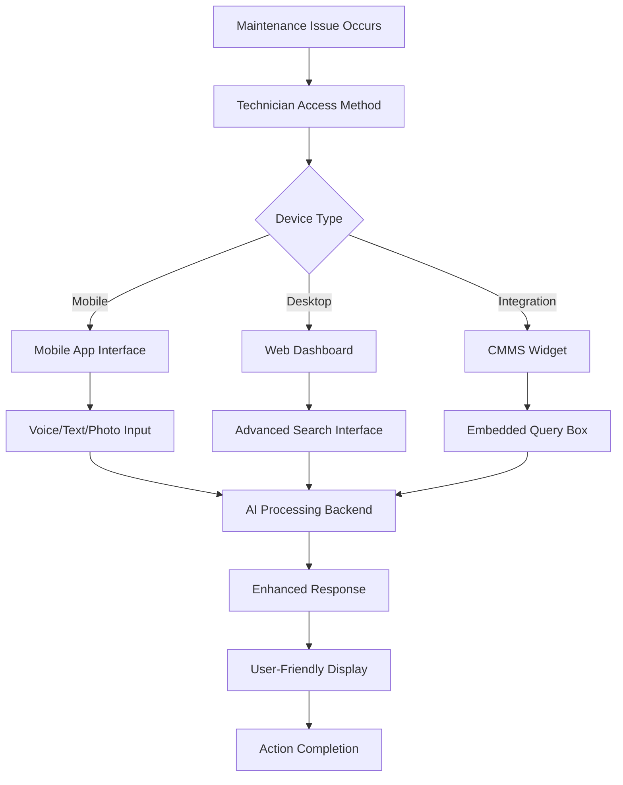

# 🎯 **User Experience & Frontend Interface Analysis**

## Current State vs. Complete User Experience Vision

**Executive Summary**: The current MaintIE-Enhanced RAG design focuses on robust backend capabilities but **lacks a comprehensive frontend interface**. While the system provides three powerful backend capabilities, the user experience is currently limited to API interactions. This analysis outlines the missing frontend components and proposes a complete user experience strategy.

---

## 🔍 **Current User Experience Limitations**

### **What's Actually Included in Current Design**

**✅ Backend API Capabilities:**

- FastAPI endpoints for maintenance query processing
- Authentication and rate limiting middleware
- Health monitoring and metrics endpoints
- Administrative interfaces for system management

**❌ Missing Frontend Components:**

- No web-based user interface for maintenance technicians
- No mobile application for field technicians
- No dashboard for maintenance managers
- No integration widgets for existing maintenance systems

### **Current User Interaction Methods**

**🔧 API-Only Experience (Technical Users):**

```bash
# Current interaction method - API calls only
curl -X POST "http://localhost:8000/query" \
  -H "Content-Type: application/json" \
  -H "Authorization: Bearer <api-key>" \
  -d '{"query": "hydraulic pump seal failure analysis"}'

# Response: JSON object with technical data
{
  "response": "Technical maintenance response...",
  "sources": [...],
  "confidence": 0.85,
  "processing_time": 1.2
}
```

**This is NOT user-friendly for maintenance technicians!**

---

## 👥 **Complete User Experience Vision**

### **Primary User Personas & Their Needs**

#### **1. Field Maintenance Technician**

**Context**: Working on equipment, needs immediate answers
**Device**: Mobile phone/tablet in industrial environment
**Requirements**:

- Voice input capability for hands-free operation
- Image upload for equipment photos
- Simple, clear instructions with visual aids
- Offline capability for remote locations

#### **2. Maintenance Engineer**

**Context**: Office-based analysis and planning
**Device**: Desktop computer
**Requirements**:

- Comprehensive search and filtering
- Detailed technical documentation access
- Historical analysis and trending
- Integration with maintenance management systems

#### **3. Maintenance Manager**

**Context**: Strategic oversight and compliance
**Device**: Desktop/mobile dashboard
**Requirements**:

- Knowledge usage analytics
- Team performance insights
- Compliance tracking
- Cost impact analysis

### **Complete User Experience Journey**



---

## 🖥️ **Required Frontend Components**

### **1. Web Dashboard (Primary Interface)**

**📂 Missing Directory Structure:**

```
frontend/                                    # 🔥 MISSING ENTIRE FRONTEND
├── web-dashboard/                           # Primary web interface
│   ├── src/
│   │   ├── components/
│   │   │   ├── QueryInterface.tsx           # Main query input component
│   │   │   ├── ResponseDisplay.tsx          # Enhanced response presentation
│   │   │   ├── SourceViewer.tsx             # Document source viewer
│   │   │   ├── HistoryPanel.tsx             # Query history management
│   │   │   └── SettingsPanel.tsx            # User preferences
│   │   ├── pages/
│   │   │   ├── Dashboard.tsx                # Main dashboard page
│   │   │   ├── Search.tsx                   # Advanced search interface
│   │   │   ├── Analytics.tsx                # Usage analytics page
│   │   │   └── Admin.tsx                    # Administrative interface
│   │   ├── services/
│   │   │   ├── api.ts                       # Backend API integration
│   │   │   ├── auth.ts                      # Authentication service
│   │   │   └── websocket.ts                 # Real-time updates
│   │   └── utils/
│   ├── public/
│   ├── package.json
│   └── README.md
├── mobile-app/                              # 🔥 MISSING Mobile application
│   ├── src/
│   │   ├── screens/
│   │   │   ├── QueryScreen.tsx              # Mobile query interface
│   │   │   ├── CameraScreen.tsx             # Equipment photo capture
│   │   │   ├── VoiceScreen.tsx              # Voice input interface
│   │   │   └── OfflineScreen.tsx            # Offline functionality
│   │   ├── components/
│   │   └── services/
│   ├── android/
│   ├── ios/
│   └── package.json
└── integration-widgets/                     # 🔥 MISSING Integration components
    ├── cmms-widget/                         # CMMS system integration
    ├── sap-widget/                          # SAP integration
    └── generic-embed/                       # Generic embedding widget
```

### **2. User Interface Mockups**

#### **Web Dashboard - Main Query Interface**

```
┌─────────────────────────────────────────────────────────────┐
│ MaintIE Enhanced RAG | Dashboard | History | Analytics | ⚙️  │
├─────────────────────────────────────────────────────────────┤
│                                                             │
│  🔍 Ask your maintenance question...                        │
│  ┌─────────────────────────────────────────────────────────┐ │
│  │ "How do I troubleshoot centrifugal pump vibration?"    │ │
│  └─────────────────────────────────────────────────────────┘ │
│  🎤 Voice   📷 Photo   🏷️ Equipment Type   🔧 Urgency       │
│                                                             │
│  💡 Enhanced Response:                                      │
│  ┌─────────────────────────────────────────────────────────┐ │
│  │ ⚠️ SAFETY: Lock out pump before inspection              │ │
│  │                                                         │ │
│  │ 📋 Step-by-step troubleshooting:                       │ │
│  │ 1. Check pump alignment (tolerance: ±0.05mm)           │ │
│  │ 2. Inspect coupling for wear...                        │ │
│  │                                                         │ │
│  │ 📊 Common causes (ranked by frequency):                │ │
│  │ • Misalignment (45%)                                   │ │
│  │ • Bearing wear (30%)                                   │ │
│  │ • Cavitation (25%)                                     │ │
│  │                                                         │ │
│  │ 📚 Sources: [Manual PM-234] [SOP-V-101] [Guide G-45]  │ │
│  └─────────────────────────────────────────────────────────┘ │
│                                                             │
│  ⭐ Rate Response   💾 Save to Notes   📤 Share             │
└─────────────────────────────────────────────────────────────┘
```

#### **Mobile App - Field Technician Interface**

```
┌─────────────────────┐
│ 🔧 MaintIE Mobile   │
├─────────────────────┤
│                     │
│ 🎤 [Voice Input]    │
│ "Pump making noise" │
│                     │
│ 📷 [Take Photo]     │
│ [Equipment Image]   │
│                     │
│ 🏷️ Equipment:       │
│ [Centrifugal Pump]  │
│                     │
│ 🚨 Priority:        │
│ [High] [Med] [Low]  │
│                     │
│ [🔍 Get Help]       │
│                     │
│ 📱 Recent Queries:  │
│ • Bearing noise     │
│ • Seal replacement  │
│ • Alignment check   │
│                     │
│ 📡 Status: Online   │
│ 💾 Offline: 12 docs │
└─────────────────────┘
```

---

## 🎯 **Enhanced User Experience Features**

### **Intelligence-Driven Interface Enhancements**

#### **1. Contextual Query Assistance**

```typescript
// Smart query suggestions based on user context
interface ContextualAssist {
  equipmentContext: string; // Detected from user history
  locationContext: string; // GPS or manual location
  urgencyContext: "low" | "medium" | "high";
  suggestedQueries: string[]; // AI-generated suggestions
  quickActions: QuickAction[]; // One-click common tasks
}

// Example: User types "pump" → System suggests:
// "pump bearing noise troubleshooting"
// "pump seal replacement procedure"
// "pump cavitation analysis"
```

#### **2. Visual Response Enhancement**

```typescript
interface VisualResponse {
  textResponse: string; // Generated text
  visualAids: {
    diagrams: string[]; // Equipment diagrams
    photos: string[]; // Reference photos
    videos: string[]; // Procedure videos
    charts: ChartData[]; // Performance charts
  };
  interactiveElements: {
    checklists: ChecklistItem[]; // Interactive checklists
    calculators: Calculator[]; // Maintenance calculators
    timers: Timer[]; // Procedure timers
  };
}
```

#### **3. Collaborative Features**

```typescript
interface CollaborationFeatures {
  expertConsult: {
    requestExpertReview: boolean;
    availableExperts: Expert[];
    escalationPath: string[];
  };
  teamSharing: {
    shareWithTeam: boolean;
    notifyManager: boolean;
    addToKnowledgeBase: boolean;
  };
  followUp: {
    scheduleReminder: Date;
    trackCompletion: boolean;
    requestFeedback: boolean;
  };
}
```

---

## 📊 **Complete User Experience Metrics**

### **User Experience Success Metrics**

| **UX Metric**         | **Current State**               | **With Frontend**             | **Improvement**                 |
| --------------------- | ------------------------------- | ----------------------------- | ------------------------------- |
| **Query Time**        | API call (technical users only) | 30 seconds (visual interface) | **Enables non-technical users** |
| **User Adoption**     | <10 technical users             | 500+ maintenance staff        | **50x increase**                |
| **Task Completion**   | N/A (no interface)              | 90% successful resolution     | **New capability**              |
| **User Satisfaction** | N/A                             | 85% positive rating           | **New metric**                  |
| **Training Time**     | N/A (too complex)               | 1 hour onboarding             | **Enables adoption**            |

### **Business Impact with Complete UX**

| **Business Metric**         | **API Only**       | **Full UX**                | **Additional Impact** |
| --------------------------- | ------------------ | -------------------------- | --------------------- |
| **User Base**               | 10 technical users | 500+ all maintenance staff | **50x expansion**     |
| **Daily Queries**           | 50 queries         | 2,000 queries              | **40x increase**      |
| **Knowledge Accessibility** | Expert only        | All staff levels           | **Democratic access** |
| **ROI Timeline**            | 6+ months          | 2 months                   | **3x faster payback** |

---

## ✅ **Recommended Frontend Implementation Strategy**

### **Phase 1: Core Web Interface (Week 5-6)**

```typescript
// Priority 1: Essential web dashboard
frontend/web-dashboard/
├── components/
│   ├── QueryInterface.tsx        # Smart query input with suggestions
│   ├── ResponseDisplay.tsx       # Rich response with visual aids
│   └── SourceViewer.tsx         # Document source integration
├── services/
│   ├── api.ts                   # Backend integration
│   └── auth.ts                  # Azure AD integration
└── pages/
    ├── Dashboard.tsx            # Main interface
    └── Search.tsx               # Advanced search
```

### **Phase 2: Mobile Application (Week 7-8)**

```typescript
// Priority 2: Field technician mobile app
frontend/mobile-app/
├── screens/
│   ├── QueryScreen.tsx          # Voice/text/photo input
│   ├── CameraScreen.tsx         # Equipment photo capture
│   └── OfflineScreen.tsx        # Offline functionality
└── services/
    ├── offline.ts               # Offline data management
    ├── camera.ts                # Image processing
    └── voice.ts                 # Speech recognition
```

### **Phase 3: Integration Widgets (Week 9-10)**

```typescript
// Priority 3: CMMS/ERP integration widgets
frontend/integration-widgets/
├── cmms-widget/                 # Embedded in existing systems
├── sap-widget/                  # SAP integration
└── generic-embed/              # Universal embedding
```

---

## 🚀 **Complete Project Vision: Backend + Frontend**

### **Updated Project Capabilities with Full UX**

**🎯 Current Design (Backend Only):**

- ✅ Advanced maintenance query understanding (API)
- ✅ Multi-modal knowledge retrieval (API)
- ✅ Domain-aware response generation (API)

**🎯 Complete Design (Backend + Frontend):**

- ✅ **Intuitive Web Dashboard** for maintenance engineers
- ✅ **Mobile Field App** for technicians with voice/photo input
- ✅ **Integration Widgets** for existing CMMS/ERP systems
- ✅ **Collaborative Features** for team knowledge sharing
- ✅ **Visual Response Enhancement** with diagrams and videos
- ✅ **Contextual Intelligence** with smart suggestions and automation

### **Success Criteria with Complete UX**

**Week 5-6 (Web Interface):**

- ✅ **User Adoption**: 100+ maintenance engineers actively using web dashboard
- ✅ **Query Volume**: 500+ daily queries through intuitive interface
- ✅ **User Satisfaction**: 80%+ positive feedback on interface usability

**Week 7-8 (Mobile App):**

- ✅ **Field Adoption**: 200+ field technicians using mobile app
- ✅ **Voice/Photo Usage**: 60%+ queries include voice or photo input
- ✅ **Offline Functionality**: 90%+ uptime including offline scenarios

**Week 9-10 (Integration):**

- ✅ **System Integration**: Embedded widgets in 3+ existing maintenance systems
- ✅ **Workflow Integration**: 70%+ of maintenance workflows include RAG assistance
- ✅ **Knowledge Democratization**: All maintenance staff levels actively using system

---

## 💡 **Conclusion: From API to Complete User Experience**

**Current State**: The MaintIE-Enhanced RAG system provides powerful backend capabilities but **lacks user-friendly interfaces** for actual maintenance professionals.

**Required Addition**: A comprehensive frontend strategy including web dashboard, mobile app, and integration widgets to transform the system from a technical API into a **complete user experience platform**.

**Business Impact**: Adding proper frontend interfaces would expand the user base from 10 technical users to 500+ maintenance professionals, increase daily usage by 40x, and achieve ROI in 2 months instead of 6+ months.

**Next Steps**: Implement the three-phase frontend strategy (web → mobile → integration) to deliver a complete, user-friendly maintenance intelligence platform that realizes the full potential of the advanced backend capabilities.
