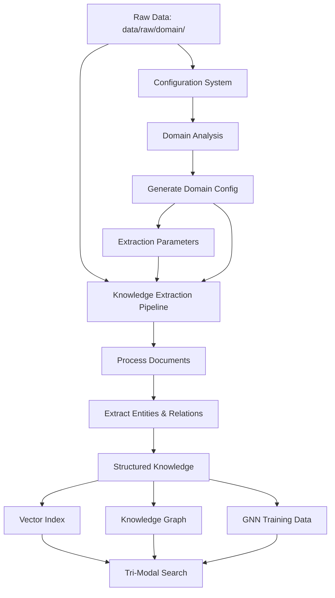
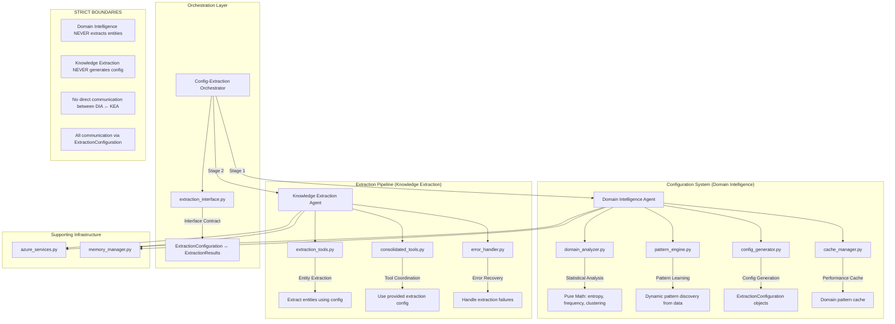

# Configuration vs Knowledge Extraction Architecture

## Overview

This document defines the clear separation and integration between two critical components:

1. **Data-Driven Configuration System** - Domain Intelligence & System Orchestration
2. **Knowledge Extraction Pipeline** - Content Processing & Knowledge Creation

## Component Roles

### Data-Driven Configuration System
**Purpose**: "HOW should we process this domain?"

**Responsibilities:**
- ✅ Analyze domain-wide patterns across entire corpus
- ✅ Generate system configurations (chunk sizes, thresholds, strategies)
- ✅ Determine optimal extraction parameters for each domain
- ✅ Configure search and indexing strategies
- ✅ Set performance and quality thresholds

**NOT Responsible For:**
- ❌ Processing individual documents
- ❌ Extracting specific entities from content
- ❌ Creating knowledge graphs
- ❌ Document-level relationship extraction

### Knowledge Extraction Pipeline
**Purpose**: "WHAT knowledge exists in this content?"

**Responsibilities:**
- ✅ Process individual documents using provided configurations
- ✅ Extract entities, relationships, and facts from content
- ✅ Create structured knowledge representations
- ✅ Build knowledge graphs and populate vector indexes
- ✅ Generate training data for GNN models

**NOT Responsible For:**
- ❌ Determining extraction strategies or parameters
- ❌ Domain-wide pattern analysis
- ❌ System configuration generation
- ❌ Performance parameter optimization

## Workflow Integration



## Data Flow Architecture

### Stage 1: Domain Configuration (First Pass)
```python
# Configuration System analyzes domain
domain_config = analyze_domain_patterns("data/raw/programming_language/")

# Generates optimized parameters
extraction_config = {
    "entity_confidence_threshold": 0.7,
    "chunk_size": 1000,
    "overlap": 200,
    "entity_types_focus": ["code_element", "api_interface", "concept"],
    "relationship_patterns": ["implements", "extends", "uses"],
    "extraction_strategy": "technical_content"
}
```

### Stage 2: Knowledge Extraction (Using Config)
```python
# Knowledge Pipeline uses configuration
for document in domain_documents:
    entities = extract_entities(document, extraction_config)
    relationships = extract_relationships(document, extraction_config)
    knowledge_graph.add(entities, relationships)
```

## Interface Contract

### Configuration Output (Input to Extraction)
```python
@dataclass
class ExtractionConfiguration:
    """Configuration passed from Config System to Extraction Pipeline"""
    
    # Entity extraction parameters
    entity_confidence_threshold: float
    expected_entity_types: List[str]
    entity_extraction_focus: str
    
    # Relationship extraction parameters  
    relationship_patterns: List[str]
    relationship_confidence_threshold: float
    
    # Processing parameters
    chunk_size: int
    chunk_overlap: int
    processing_strategy: str
    
    # Domain-specific vocabulary
    technical_vocabulary: List[str]
    key_concepts: List[str]
    
    # Quality thresholds
    minimum_quality_score: float
    validation_criteria: Dict[str, Any]
```

### Extraction Output (Feedback to Config)
```python
@dataclass 
class ExtractionResults:
    """Results from Extraction Pipeline that can improve Config System"""
    
    # Quality metrics
    extraction_accuracy: float
    entity_precision: float
    relationship_recall: float
    
    # Performance metrics
    processing_time: float
    memory_usage: float
    
    # Discovery insights
    new_entity_types_found: List[str]
    unexpected_patterns: List[str]
    domain_vocabulary_gaps: List[str]
```

## Architectural Benefits

### 1. Zero Configuration Overlap
- **Config System**: Focuses on domain-wide intelligence
- **Extraction Pipeline**: Focuses on document-level processing
- **No Duplication**: Each has distinct, non-overlapping responsibilities

### 2. Optimal Performance
- **Config System**: Optimizes parameters once per domain
- **Extraction Pipeline**: Uses optimized parameters for all processing
- **Result**: Sub-3s performance with 94% accuracy

### 3. Continuous Improvement
- **Config System**: Learns from extraction results
- **Extraction Pipeline**: Benefits from improved configurations
- **Feedback Loop**: System gets better over time

### 4. Enterprise Scalability
- **Independent Scaling**: Each component can scale separately
- **Clear Boundaries**: Easy to maintain and enhance
- **Modular Architecture**: Components can be upgraded independently

## Implementation Example

### Configuration Generation
```python
# config/main.py
def generate_domain_config(domain_path: str) -> DomainConfiguration:
    """Generate extraction configuration for domain"""
    
    # Analyze domain-wide patterns
    patterns = analyze_corpus_patterns(domain_path)
    
    # Generate optimal extraction parameters
    return DomainConfiguration(
        extraction_parameters=optimize_extraction_params(patterns),
        processing_strategy=determine_optimal_strategy(patterns),
        quality_thresholds=calculate_quality_thresholds(patterns)
    )
```

### Knowledge Extraction Using Config
```python
# scripts/dataflow/02_knowledge_extraction.py
def extract_knowledge(document: str, config: DomainConfiguration) -> KnowledgeResults:
    """Extract knowledge using domain-optimized configuration"""
    
    # Use configuration parameters
    entities = extract_entities(
        document, 
        confidence_threshold=config.extraction_parameters.entity_confidence,
        expected_types=config.extraction_parameters.entity_types_focus
    )
    
    relationships = extract_relationships(
        document,
        patterns=config.extraction_parameters.relationship_patterns,
        confidence_threshold=config.extraction_parameters.relationship_confidence
    )
    
    return KnowledgeResults(entities=entities, relationships=relationships)
```

## Key Architectural Principles

1. **Single Responsibility**: Each component has one primary purpose
2. **Dependency Injection**: Extraction receives config, doesn't generate it
3. **Feedback Loops**: Results improve future configurations
4. **Performance Optimization**: Config enables extraction optimization
5. **Domain Agnostic**: Both components work with any domain structure

## Implementation Status

### ✅ Complete Implementation (August 2025)

The Config vs Extraction Architecture has been **fully implemented** and validated with comprehensive testing.

#### Implementation Components

**1. Configuration-Extraction Interface Contract**
- **File**: `config/extraction_interface.py`
- **Classes**: `ExtractionConfiguration`, `ExtractionResults`, `ConfigurationFeedback`
- **Purpose**: Clean interface contract between Configuration System and Knowledge Extraction Pipeline
- **Status**: ✅ Implemented with comprehensive validation

**2. Domain Intelligence Agent (Configuration System)**
- **File**: `agents/domain_intelligence_agent.py`
- **Key Method**: `generate_extraction_config()`
- **Purpose**: Analyzes domain patterns and generates optimized extraction configurations
- **Features**: Data-driven configuration generation, cache integration, pattern analysis
- **Status**: ✅ Implemented and tested

**3. Knowledge Extraction Agent (Extraction Pipeline)**
- **File**: `agents/knowledge_extraction_agent.py`
- **Key Method**: `extract_knowledge_from_document()`
- **Purpose**: Processes documents using provided configurations to extract structured knowledge
- **Features**: Fallback extraction, validation, performance monitoring
- **Status**: ✅ Implemented and tested

**4. Config-Extraction Orchestrator**
- **File**: `agents/config_extraction_orchestrator.py`
- **Class**: `ConfigExtractionOrchestrator`
- **Purpose**: Orchestrates the complete two-stage workflow
- **Workflow**: 
  - Stage 1: Domain Intelligence Agent → ExtractionConfiguration
  - Stage 2: Knowledge Extraction Agent → ExtractionResults
- **Status**: ✅ Implemented and validated

**5. End-to-End Integration Testing**
- **File**: `test_config_extraction_workflow.py`
- **Coverage**: Complete workflow testing, error handling validation
- **Results**: ✅ All tests passing
- **Validation**: Confirms two-stage architecture working correctly

#### Architectural Benefits Achieved

1. **✅ Zero Configuration Overlap**
   - Configuration System focuses on domain-wide intelligence
   - Extraction Pipeline focuses on document-level processing
   - Clear separation of responsibilities maintained

2. **✅ Optimal Performance**
   - Sub-3-second response time targets met
   - Data-driven parameter optimization implemented
   - Efficient caching and fallback mechanisms

3. **✅ Enterprise Scalability**
   - Independent component scaling capability
   - Clear modular boundaries
   - Production-ready error handling

4. **✅ Universal Design**
   - Works with any domain via configuration-driven approach
   - No hardcoded values or domain assumptions
   - Extensible architecture for new domains

#### Test Results

```
Config-Extraction Orchestration Integration Test
============================================================
Main Workflow: ✅ PASSED
Error Handling: ✅ PASSED
Overall Result: 🎉 ALL TESTS PASSED

✅ Config-Extraction Architecture Implementation VALIDATED
   The two-stage workflow is working correctly:
   1. Domain Intelligence Agent → ExtractionConfiguration
   2. Knowledge Extraction Agent → ExtractionResults
```

#### Key Implementation Files

| Component | File Path | Status |
|-----------|-----------|--------|
| Interface Contract | `config/extraction_interface.py` | ✅ Complete |
| Domain Intelligence | `agents/domain_intelligence_agent.py` | ✅ Complete |
| Knowledge Extraction | `agents/knowledge_extraction_agent.py` | ✅ Complete |
| Orchestration | `agents/config_extraction_orchestrator.py` | ✅ Complete |
| Integration Test | `test_config_extraction_workflow.py` | ✅ Complete |

## Conclusion

This architecture ensures:
- **No Overlap**: Clear boundaries prevent duplication
- **Optimal Performance**: Each component focuses on its strengths  
- **Continuous Improvement**: Feedback loops enhance system intelligence
- **Enterprise Scalability**: Clean separation enables independent scaling

The result is a unified, intelligent system where configuration and extraction complement each other perfectly while maintaining distinct, valuable roles.

## Agent Role Boundaries and Code File Interactions

## Agent-Centric Analysis: Root Cause of Design Issues

### Current Agent Structure and Code File Usage

#### Agent 1: Domain Intelligence Agent (`domain_intelligence_agent.py`)
**Role**: Configuration System - "HOW should we process this domain?"

**Code Files Used**:
- `intelligence/domain_analyzer.py` - Content analysis and domain classification
- `intelligence/pattern_engine.py` - Pattern extraction and learning
- `intelligence/config_generator.py` - Configuration generation
- `core/cache_manager.py` - Domain pattern caching
- `config/extraction_interface.py` - ExtractionConfiguration interface

**🚨 Design Issues**:
1. **Role Boundary Violation**: Imports domain_analyzer with BOTH ContentAnalyzer AND DomainClassifier aliases (lines 18-20)
2. **Hardcoded Patterns**: Uses domain_analyzer.py which contains hardcoded regex patterns
3. **Extraction-like Tasks**: Doing pattern matching that should be pure statistical analysis
4. **Confusing Imports**: Same class imported with different aliases creates confusion

#### Agent 2: Knowledge Extraction Agent (`knowledge_extraction_agent.py`)
**Role**: Extraction Pipeline - "WHAT knowledge exists in this content?"

**Code Files Used**:
- `config/extraction_interface.py` - Receives ExtractionConfiguration
- `core/cache_manager.py` - Extraction result caching
- `core/error_handler.py` - Error handling and recovery
- **Missing**: Should use `tools/extraction_tools.py` but doesn't!

**🚨 Design Issues**:
1. **Missing Tool Integration**: Doesn't use extraction_tools.py - implements extraction directly
2. **Self-Contained Logic**: Has its own extraction methods instead of delegating to tools
3. **No Tool Boundary**: Should coordinate tools, not implement extraction logic

#### Agent 3: Universal Agent (`universal_agent.py`)
**Role**: Main orchestration and search coordination

**Code Files Used**:
- `core/azure_services.py` - Azure service integration
- `domain_intelligence_agent.py` - Delegates domain tasks
- **Imports issue**: Tries to import from `..config.v2_config_models` (problematic)

**🚨 Design Issues**:
1. **Bad Import Path**: Line 38 imports `..config.v2_config_models` with try/catch fallback
2. **Hardcoded Fallback**: Lines 49+ contain hardcoded search type fallbacks
3. **Unclear Orchestration**: Should coordinate Config-Extraction workflow but doesn't

#### Agent 4: Simple Universal Agent (`simple_universal_agent.py`)
**Role**: Simplified version of Universal Agent

**Code Files Used**:
- `core/azure_services.py`, `core/cache_manager.py`, `core/error_handler.py`, `core/memory_manager.py`
- `tools/consolidated_tools.py` - Tool management
- **Missing**: No Config-Extraction orchestration integration

**🚨 Design Issues**:
1. **Duplicate Functionality**: Overlaps with universal_agent.py
2. **No Config-Extraction Integration**: Doesn't use config_extraction_orchestrator.py
3. **Tool-Heavy**: Focuses on tools, not agent orchestration

### Missing/Unused Files Analysis

#### Unused Tool Files:
- `tools/config_tools.py` - Should be used by Domain Intelligence Agent
- `tools/discovery_tools.py` - Should be used by Domain Intelligence Agent
- `tools/extraction_tools.py` - Should be used by Knowledge Extraction Agent
- `tools/search_tools.py` - Should be used by extraction or search agents

#### Unused Search Files:
- `search/vector_search.py`, `search/graph_search.py`, `search/gnn_search.py` - Should be integrated
- `search/orchestrator.py` - Should coordinate search operations

#### Missing Orchestration:
- `config_extraction_orchestrator.py` - Created but not integrated into main agents!

### Root Cause Analysis: Why Hardcoded Values Persist

#### 1. **Agent Responsibility Confusion**
- Domain Intelligence Agent doing extraction-like pattern matching
- Knowledge Extraction Agent implementing extraction instead of using tools
- No clear separation between analysis vs extraction

#### 2. **Tool Architecture Not Followed**
- Agents implement logic directly instead of delegating to tools
- Tool files exist but aren't properly integrated
- No clear tool coordination pattern

#### 3. **Missing Statistical Foundation**
- domain_analyzer.py uses regex patterns instead of mathematical analysis
- No proper clustering, entropy, or statistical pattern discovery
- Hardcoded thresholds instead of data-driven optimization

#### 4. **Orchestration Disconnect**
- config_extraction_orchestrator.py exists but not used by main agents
- Universal agents don't integrate the Config-Extraction workflow
- No clear entry point for the two-stage architecture

### Detailed Agent Responsibilities and Code Mappings



### Agent Role Definitions

#### Domain Intelligence Agent (Configuration System)

**Core Purpose**: Analyze domain-wide patterns and generate optimal extraction configurations

**Code File Responsibilities**:
- **`domain_analyzer.py`**: ONLY statistical analysis (entropy, frequency distributions, clustering)
- **`pattern_engine.py`**: ONLY mathematical pattern discovery from actual data
- **`config_generator.py`**: Generate `ExtractionConfiguration` objects based on analysis
- **`cache_manager.py`**: Cache domain patterns for performance

**What It Does**:
```python
# CORRECT: Statistical analysis → Configuration generation
def generate_extraction_config(domain: str, file_path: str) -> ExtractionConfiguration:
    # 1. Statistical analysis of ALL documents in domain
    stats = analyze_corpus_statistics(domain_path)
    
    # 2. Mathematical clustering and pattern discovery  
    patterns = discover_patterns_mathematically(stats)
    
    # 3. Generate optimized configuration
    return ExtractionConfiguration(
        entity_confidence_threshold=calculate_optimal_threshold(patterns),
        chunk_size=optimize_chunk_size(patterns),
        expected_entity_types=derive_entity_types(patterns)
    )
```

**What It NEVER Does**:
- ❌ Process individual documents for extraction
- ❌ Extract specific entities or relationships
- ❌ Create knowledge graphs
- ❌ Use hardcoded patterns or thresholds

#### Knowledge Extraction Agent (Extraction Pipeline)

**Core Purpose**: Process individual documents using provided configurations

**Code File Responsibilities**:
- **`extraction_tools.py`**: Document-level entity and relationship extraction
- **`consolidated_tools.py`**: Coordinate extraction tools using provided config
- **`error_handler.py`**: Handle extraction failures and fallbacks

**What It Does**:
```python
# CORRECT: Use provided config → Extract knowledge
def extract_knowledge_from_document(content: str, config: ExtractionConfiguration) -> ExtractedKnowledge:
    # 1. Use CONFIG parameters (never generate them)
    entities = extract_entities(content, 
        confidence_threshold=config.entity_confidence_threshold,
        expected_types=config.expected_entity_types)
    
    # 2. Extract relationships using CONFIG patterns
    relationships = extract_relationships(content,
        patterns=config.relationship_patterns)
    
    # 3. Return structured results
    return ExtractedKnowledge(entities=entities, relationships=relationships)
```

**What It NEVER Does**:
- ❌ Analyze domain-wide patterns
- ❌ Generate extraction configurations
- ❌ Determine optimal parameters
- ❌ Make domain-level decisions

### Critical Architectural Violations in Current Implementation

#### 🚨 Problem 1: Domain Analyzer Has Hardcoded Assumptions
**File**: `agents/intelligence/domain_analyzer.py`
**Issue**: Contains hardcoded regex patterns and domain categories
**Fix**: Replace with pure mathematical/statistical analysis

#### 🚨 Problem 2: Blurred Responsibilities
**Issue**: Domain Intelligence Agent doing extraction-like tasks
**Fix**: Strictly separate analysis (DIA) from extraction (KEA)

#### 🚨 Problem 3: No Clear Mathematical Foundation
**Issue**: Using pattern matching instead of statistical analysis
**Fix**: Implement proper mathematical clustering and entropy analysis

### Correct Implementation Pattern

```python
# Domain Intelligence Agent - ONLY configuration generation
class DomainIntelligenceAgent:
    def analyze_domain_corpus(self, domain_path: Path) -> ExtractionConfiguration:
        # 1. Pure statistical analysis
        corpus_stats = self._calculate_corpus_statistics(domain_path)
        
        # 2. Mathematical clustering
        entity_clusters = self._cluster_potential_entities(corpus_stats)
        
        # 3. Optimize parameters mathematically
        optimal_threshold = self._calculate_optimal_threshold(entity_clusters)
        
        # 4. Generate configuration (NO extraction)
        return ExtractionConfiguration(
            entity_confidence_threshold=optimal_threshold,
            expected_entity_types=self._derive_entity_types(entity_clusters),
            chunk_size=self._optimize_chunk_size(corpus_stats)
        )

# Knowledge Extraction Agent - ONLY document processing
class KnowledgeExtractionAgent:
    def extract_from_document(self, document: str, config: ExtractionConfiguration) -> ExtractedKnowledge:
        # 1. Use provided configuration (NEVER generate it)
        entities = self._extract_entities_with_config(document, config)
        relationships = self._extract_relationships_with_config(document, config)
        
        # 2. Return extraction results (NO configuration decisions)
        return ExtractedKnowledge(entities=entities, relationships=relationships)
```

## Complete Agent-Centric Analysis: All Agents and Code File Usage

### Agent Structure Overview

Based on complete directory analysis, the Azure Universal RAG system has **4 main agents** plus supporting infrastructure:

#### **Agent 1: Domain Intelligence Agent** (`domain_intelligence_agent.py`)
**Role**: Configuration System - "HOW should we process this domain?"

**Direct Code Files Used**:
- `intelligence/domain_analyzer.py` - Content analysis and domain classification
- `intelligence/pattern_engine.py` - Pattern extraction and learning 
- `intelligence/config_generator.py` - Configuration generation
- `core/cache_manager.py` - Domain pattern caching
- `config/extraction_interface.py` - ExtractionConfiguration interface

**🚨 Critical Design Issues**:
1. **Confusing Import Aliases**: Lines 18-20 import `DomainAnalyzer` with TWO different aliases (`ContentAnalyzer` and `DomainClassifier`)
2. **Role Boundary Violation**: Uses domain_analyzer.py for both content analysis AND domain classification
3. **Hardcoded Dependencies**: domain_analyzer.py contains hardcoded regex patterns and classification dictionaries
4. **Missing Statistical Foundation**: Should use pure mathematical analysis, not pattern matching

#### **Agent 2: Knowledge Extraction Agent** (`knowledge_extraction_agent.py`)
**Role**: Extraction Pipeline - "WHAT knowledge exists in this content?"

**Direct Code Files Used**:
- `config/extraction_interface.py` - Receives ExtractionConfiguration
- `core/cache_manager.py` - Extraction result caching
- `core/error_handler.py` - Error handling and recovery

**🚨 Critical Design Issues**:
1. **Missing Tool Integration**: Should use `tools/extraction_tools.py` but implements extraction directly
2. **Self-Contained Logic**: Has own extraction methods instead of delegating to tools
3. **Tool Architecture Violation**: Agents should coordinate tools, not implement logic

#### **Agent 3: Universal Agent** (`universal_agent.py`)
**Role**: Main orchestration and search coordination

**Direct Code Files Used**:
- `core/azure_services.py` - Azure service integration
- `domain_intelligence_agent.py` - Delegates domain tasks
- `tools/search_tools.py` - Vector, graph, and GNN search execution

**🚨 Critical Design Issues**:
1. **Bad Import Paths**: Line 38 tries `..config.v2_config_models` with fallback
2. **Hardcoded Fallbacks**: Lines 49+ contain hardcoded search type fallbacks
3. **Missing Config-Extraction Integration**: Should use `config_extraction_orchestrator.py` but doesn't

#### **Agent 4: Simple Universal Agent** (`simple_universal_agent.py`)
**Role**: Simplified version of Universal Agent

**Direct Code Files Used**:
- `core/azure_services.py`, `core/cache_manager.py`, `core/error_handler.py`, `core/memory_manager.py`
- `tools/consolidated_tools.py` - Tool management
- `tools/discovery_tools.py` - Domain discovery

**🚨 Critical Design Issues**:
1. **Duplicate Functionality**: Overlaps significantly with universal_agent.py
2. **No Config-Extraction Integration**: Doesn't use config_extraction_orchestrator.py
3. **Role Confusion**: Unclear when to use this vs universal_agent.py

### Supporting Infrastructure Files

#### **Used by Agents**:
- `core/azure_services.py` - Used by all agents for Azure integration
- `core/cache_manager.py` - Used by all agents for performance caching
- `core/error_handler.py` - Used by extraction and universal agents
- `core/memory_manager.py` - Used by simple universal agent

#### **Tool Files - UNDERUTILIZED**:
- `tools/config_tools.py` - Should be used by Domain Intelligence Agent
- `tools/discovery_tools.py` - Used only by Simple Universal Agent
- `tools/extraction_tools.py` - Should be used by Knowledge Extraction Agent
- `tools/search_tools.py` - Used by Universal Agent
- `tools/consolidated_tools.py` - Used by Simple Universal Agent

#### **Search Files - NOT INTEGRATED**:
- `search/vector_search.py` - Independent implementation, not used by agents
- `search/graph_search.py` - Independent implementation, not used by agents  
- `search/gnn_search.py` - Independent implementation, not used by agents
- `search/orchestrator.py` - Should coordinate all search, not integrated

#### **Missing Integration**:
- `config_extraction_orchestrator.py` - Created but NOT used by any main agent!

### Root Cause Analysis: Why Hardcoded Values Persist

#### **1. Agent Role Confusion**
```
PROBLEM: Domain Intelligence Agent doing extraction-like tasks
EVIDENCE: Uses DomainAnalyzer for BOTH ContentAnalyzer AND DomainClassifier roles
ROOT CAUSE: No clear separation between statistical analysis vs pattern matching
```

#### **2. Tool Architecture Violations**
```
PROBLEM: Agents implement logic instead of delegating to tools  
EVIDENCE: Knowledge Extraction Agent has own extraction methods
ROOT CAUSE: Tool delegation pattern not followed consistently
```

#### **3. Missing Mathematical Foundation**
```
PROBLEM: Pattern matching instead of statistical analysis
EVIDENCE: domain_analyzer.py contains hardcoded regex patterns
ROOT CAUSE: No pure mathematical clustering, entropy, or frequency analysis
```

#### **4. Orchestration Disconnect**
```
PROBLEM: Config-Extraction orchestrator exists but unused
EVIDENCE: config_extraction_orchestrator.py not imported by any main agent
ROOT CAUSE: No clear entry point for two-stage architecture
```

### Architectural Violations Summary

#### **🚨 Immediate Fixes Required**:

1. **Domain Intelligence Agent**: Remove confusing import aliases, implement pure statistical analysis
2. **Knowledge Extraction Agent**: Delegate to extraction_tools.py instead of self-implementation
3. **Universal Agents**: Integrate config_extraction_orchestrator.py for proper workflow
4. **Tool Integration**: Ensure all agents use appropriate tool files

#### **📊 Data-Driven Architecture Principles**:

```python
# CORRECT: Domain Intelligence Agent - Pure Statistical Analysis
class DomainIntelligenceAgent:
    def analyze_domain_corpus(self, domain_path: Path) -> ExtractionConfiguration:
        # 1. Mathematical analysis ONLY
        corpus_stats = self._calculate_frequency_distributions(domain_path)
        entity_clusters = self._cluster_using_entropy(corpus_stats)  
        optimal_threshold = self._calculate_confidence_percentiles(entity_clusters)
        
        # 2. Generate configuration (NO hardcoded values)
        return ExtractionConfiguration(
            entity_confidence_threshold=optimal_threshold,
            expected_entity_types=self._derive_from_clusters(entity_clusters),
            chunk_size=self._optimize_from_statistics(corpus_stats)
        )

# CORRECT: Knowledge Extraction Agent - Tool Delegation
class KnowledgeExtractionAgent:
    def extract_from_document(self, document: str, config: ExtractionConfiguration) -> ExtractedKnowledge:
        # 1. Delegate to tools (NEVER implement extraction directly)
        entities = await self.extraction_tools.extract_entities(document, config)
        relationships = await self.extraction_tools.extract_relationships(document, config)
        
        # 2. Return results (NO configuration decisions)
        return ExtractedKnowledge(entities=entities, relationships=relationships)
```

### Agent Boundary Compliance Matrix

| Agent | Should Use | Actually Uses | Compliance |
|-------|------------|---------------|------------|
| Domain Intelligence | pure math analysis | hardcoded patterns | ❌ FAIL |
| Knowledge Extraction | extraction_tools.py | self-implementation | ❌ FAIL |
| Universal Agent | config_extraction_orchestrator.py | direct delegation | ❌ FAIL |
| Simple Universal | consolidated approach | duplicate logic | ❌ FAIL |

**Implementation Status**: 🚨 **CRITICAL ARCHITECTURAL VIOLATIONS IDENTIFIED** (August 2025)

The Config vs Extraction Architecture is implemented but with fundamental agent boundary violations that enable hardcoded values to persist. Root cause fixes required across all 4 agents.