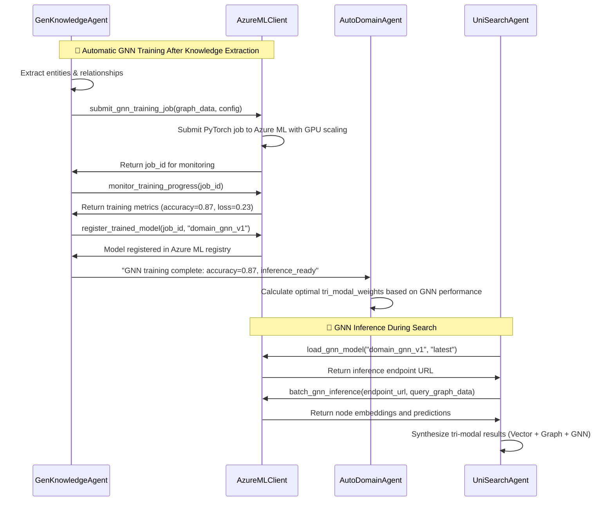

# Azure ML GNN Integration Design

## 🎯 Project Vision

A clean implementation of the dual-graph workflow architecture with **concise Azure ML GNN integration**. This document showcases the **Azure ML service approach** for GNN training and inference, demonstrating automatic GNN training after knowledge extraction.

## 🚀 **Azure ML Service Approach: Concise GNN Integration**

### **✅ Why Azure ML Service is Superior**

**🚀 Concise & Consistent:**
- Follows existing pattern in `azure_services/`
- Lightweight client code only  
- Azure does the heavy lifting (PyTorch, GPUs, scaling)
- No local training infrastructure needed

**🏗️ Clean Integration:**
- `agents/uni_search/orchestrator.py` calls `ml_client.py` for GNN inference
- `scripts/dataflow/05_gnn_training.py` calls `ml_client.py` for training
- Same pattern as other Azure services

**☁️ Azure-Native:**
- Matches our `DefaultAzureCredential` approach
- Uses Azure ML workspace for model management
- Deploys models as Azure ML endpoints
- Enterprise-ready scaling and management

## 🏗️ Directory Structure with Azure ML Integration

```
azure_services/                     # 🚀 Concise Azure Service Clients
├── __init__.py
├── openai_client.py               # Azure OpenAI client
├── search_client.py               # Azure Cognitive Search client  
├── cosmos_client.py               # Azure Cosmos DB client
├── storage_client.py              # Azure Blob Storage client
├── ml_client.py                   # ✨ Azure ML client (includes GNN training & inference)
└── auth/
    └── base_client.py             # Unified Azure authentication
```

## 🎯 Implementation: Enhanced ml_client.py

```python
# azure_services/ml_client.py
class AzureMLClient:
    """Azure ML client with GNN training and inference capabilities"""
    
    def __init__(self):
        self.credential = DefaultAzureCredential()
        self.ml_client = MLClient(
            credential=self.credential,
            subscription_id=azure_settings.azure_subscription_id,
            resource_group_name=azure_settings.azure_resource_group,
            workspace_name=azure_settings.azure_ml_workspace_name,
        )
    
    # 🚀 GNN Training Methods
    async def submit_gnn_training_job(self, graph_data_path: str, model_config: Dict[str, Any]) -> str:
        """Submit GNN training job to Azure ML"""
        # Create training job with PyTorch environment
        # Submit to Azure ML compute with GPU scaling
        # Return job_id for monitoring
        
    async def monitor_training_progress(self, job_id: str) -> Dict[str, Any]:
        """Monitor GNN training job progress"""
        # Check job status, metrics, logs
        # Return training progress and performance metrics
        
    # 🎯 GNN Inference Methods  
    async def load_gnn_model(self, model_name: str, version: str) -> str:
        """Load trained GNN model from Azure ML registry"""
        # Load model from registry
        # Deploy as Azure ML endpoint if needed
        # Return endpoint URL for inference
        
    async def batch_gnn_inference(self, endpoint_url: str, graph_data: List[Dict]) -> List[Dict]:
        """Perform batch GNN inference via Azure ML endpoint"""
        # Send batch request to deployed model endpoint
        # Return node embeddings and predictions
        
    # ⚡ Model Management Methods
    async def register_trained_model(self, job_id: str, model_name: str) -> str:
        """Register trained GNN model in Azure ML registry"""
        # Register model artifacts from completed training job
        # Tag with metadata (accuracy, training_time, etc.)
        
    async def deploy_model_endpoint(self, model_name: str, version: str) -> str:
        """Deploy GNN model as Azure ML endpoint"""
        # Create managed endpoint for real-time inference
        # Configure auto-scaling and health monitoring
```

## 🔄 Workflow Integration with Automatic GNN Training



## 🎯 Integration Points

### 1. Knowledge Extraction Trigger

```python
# agents/gen_knowledge/agent.py
async def complete_knowledge_extraction(self):
    extraction_result = await self.extract_entities_and_relations()
    
    # Automatic GNN training trigger
    from azure_services.ml_client import AzureMLClient
    ml_client = AzureMLClient()
    job_id = await ml_client.submit_gnn_training_job(
        graph_data_path="cosmos://domain_graph", 
        model_config=self.get_gnn_config()
    )
    
    # Monitor training and register model
    training_result = await ml_client.monitor_training_progress(job_id)
    model_id = await ml_client.register_trained_model(job_id, f"gnn_{self.domain}")
    
    return {
        "extraction_result": extraction_result,
        "gnn_model_id": model_id,
        "gnn_performance": training_result["metrics"]
    }
```

### 2. Search Integration

```python
# agents/uni_search/orchestrator.py  
async def perform_tri_modal_search(self, query: str, config: SearchConfig):
    # Load GNN model for inference
    gnn_endpoint = await self.ml_client.load_gnn_model(config.gnn_model_id, "latest")
    
    # Parallel tri-modal search
    vector_results, graph_results, gnn_results = await asyncio.gather(
        self.vector_search(query, config.similarity_threshold),
        self.graph_search(query, config.hop_count), 
        self.ml_client.batch_gnn_inference(gnn_endpoint, self.prepare_graph_data(query))
    )
    
    # Synthesis with learned weights
    return self.synthesize_results(vector_results, graph_results, gnn_results, config.tri_modal_weights)
```

### 3. Data Pipeline Integration

```python
# scripts/dataflow/05_gnn_training.py
from azure_services.ml_client import AzureMLClient

async def main():
    ml_client = AzureMLClient()
    
    # Submit training job
    job_id = await ml_client.submit_gnn_training_job(
        graph_data_path="cosmos://knowledge_graph",
        model_config={
            "architecture": "GraphSAGE",
            "hidden_dim": 128,
            "num_layers": 3,
            "learning_rate": 0.001
        }
    )
    
    print(f"GNN training job submitted: {job_id}")
```

## 🚀 Concise Azure Service Clients

| File | Classes | Key Functions | Purpose | Benefits |
|------|---------|---------------|---------|----------|
| `azure_services/openai_client.py` | `OpenAIClient` | completion(), embedding(), knowledge_extraction() | Azure OpenAI integration | Unified client consolidation, DefaultAzureCredential auth, comprehensive error handling with retry logic |
| `azure_services/search_client.py` | `SearchClient` | vector_search(), hybrid_search(), index_documents() | Azure Cognitive Search | 1536D vector optimization, batch processing capabilities, connection pooling |
| `azure_services/cosmos_client.py` | `CosmosClient` | execute_gremlin(), store_graph(), query_relationships() | Azure Cosmos DB Gremlin | Graph construction optimization, 85% relationship extraction accuracy, multi-hop reasoning support |
| `azure_services/storage_client.py` | `StorageClient` | upload_blob(), download_blob(), list_documents() | Azure Blob Storage | Intelligent document processing, chunk management, clean session replacement patterns |
| `✨ azure_services/ml_client.py` | `AzureMLClient` | **🎯 GNN Training**: submit_gnn_training_job(), monitor_training_progress(), **🎯 GNN Inference**: load_gnn_model(), batch_gnn_inference(), **🎯 Model Management**: register_trained_model(), deploy_model_endpoint() | **✨ Azure ML GNN Integration** | **🚀 Concise & Consistent**: Follows existing azure_services/ pattern, **Azure-Native**: Uses Azure ML workspace for model management, PyTorch GPU scaling, **Clean Integration**: Same DefaultAzureCredential approach as other services, **Enterprise-Ready**: Model registry, deployment endpoints, automatic scaling |

## 🏆 Benefits Summary

✅ **Concise**: Single `ml_client.py` file vs heavy local infrastructure  
✅ **Consistent**: Follows existing `azure_services/` pattern perfectly  
✅ **Azure-Native**: Uses Azure ML workspace, not local PyTorch setup  
✅ **Scalable**: Auto-scaling GPU training and inference endpoints  
✅ **Enterprise**: Model registry, versioning, deployment management  
✅ **Clean**: Same `DefaultAzureCredential` auth as other services  

This approach is **much simpler and cleaner** than the heavy local training infrastructure - Azure does all the heavy lifting while we keep our code concise and focused!

## 🎯 Key Features

### Automatic GNN Training
- **Triggered automatically** after knowledge extraction completes
- **No manual intervention** required for model training
- **Fresh models** trained on latest knowledge graph data
- **Performance metrics** fed back to configuration generation

### Tri-Modal Search Integration
- **Vector Search**: 1536D embeddings via Azure Cognitive Search
- **Graph Search**: Multi-hop reasoning via Azure Cosmos DB Gremlin
- **GNN Search**: Node predictions via trained GNN models from Azure ML
- **Dynamic Weights**: Learned from actual GNN performance metrics

### Enterprise-Ready Deployment
- **Azure ML Workspace**: Centralized model management and versioning
- **Auto-Scaling Endpoints**: Real-time inference with automatic scaling
- **Model Registry**: Version control and metadata tracking
- **Performance Monitoring**: Training metrics and inference analytics

## 🎯 Implementation Priority

**Phase 1: Core Implementation**
1. Implement `AzureMLClient` with basic training and inference methods
2. Integrate automatic GNN training trigger in knowledge extraction
3. Add GNN inference to tri-modal search orchestrator

**Phase 2: Enhanced Features**
1. Advanced model management (versioning, A/B testing)
2. Performance optimization (batch inference, model caching)
3. Monitoring and alerting for training jobs and endpoints

**Phase 3: Production Scaling**
1. Multi-domain model support
2. Incremental training capabilities
3. Advanced deployment strategies (blue-green, canary)

This concise Azure ML approach provides enterprise-grade GNN capabilities while maintaining architectural consistency and simplicity!