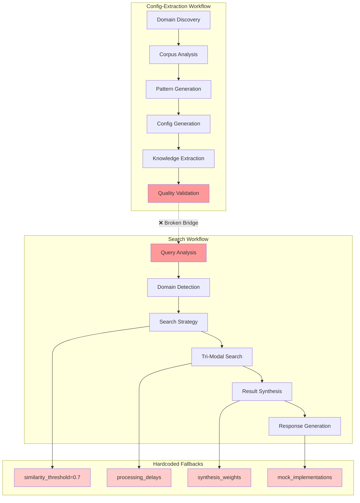
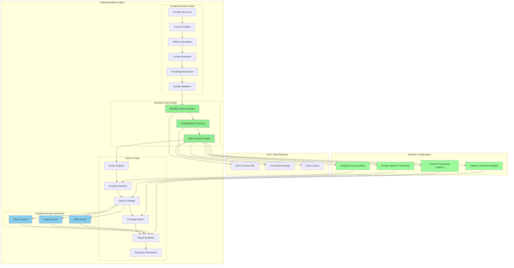
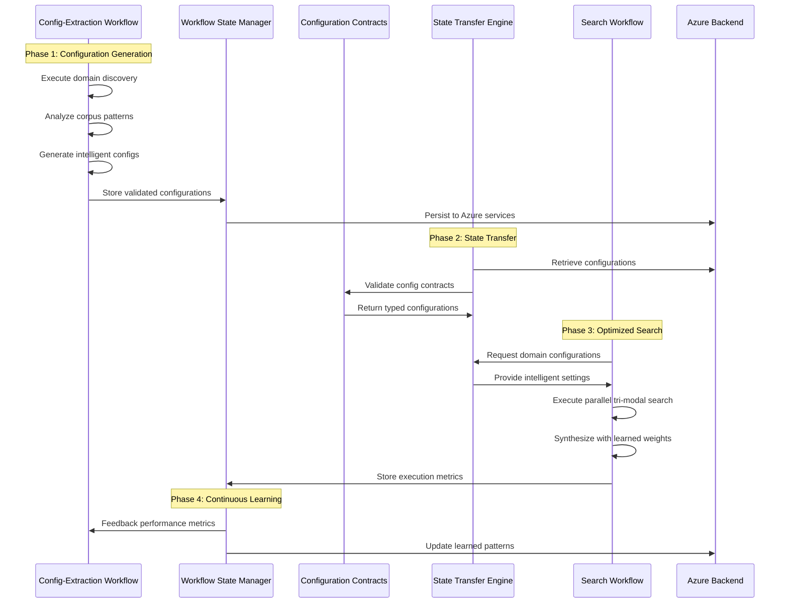

# Workflow Graph Architecture Analysis & Design Solutions

## 🚨 THE CORE PROBLEM - READ THIS FIRST 🚨

> **CRITICAL ARCHITECTURAL FAILURE**: The system was designed for a **data-driven, dual-graph architecture** where:
> 1. **Config-Extraction workflow** analyzes documents and generates intelligent configurations
> 2. **Search workflow** uses those configurations for optimized search
>
> **But the integration is incomplete**, forcing the system to fall back to hardcoded values - making the entire dual-graph design **ineffective**.
>
> **Impact**: Instead of intelligent, adaptive search optimization, the system relies on placeholder values and TODO comments throughout the codebase.

---

## Executive Summary

The Azure Universal RAG system implements a dual-graph workflow architecture that is fundamentally sound in concept but has critical implementation gaps. The system was designed for data-driven configuration where a Config-Extraction workflow generates intelligent configurations that feed into a Search workflow for optimized retrieval. However, incomplete integration has forced the system to rely on hardcoded fallbacks, defeating the core architectural vision.

## Current Architecture Issues

### 🚨 Critical Issues (High Priority)

#### 1. Broken Dual-Graph Integration
- **Config-Extraction workflow** generates domain-specific configurations but cannot properly feed them to the **Search workflow**
- **Code duplication** between workflow implementations (164-194 lines identical)
- **Hardcoded fallbacks** in `consolidated_search_orchestrator.py` with extensive TODO comments
- **All configuration classes raise `NotImplementedError`** forcing incomplete integration

#### 2. Configuration Centralization Failure
- Despite "consolidated" naming, orchestrator contains massive hardcoded values
- Mock implementations with placeholder values (similarity_threshold=0.7, processing_delays)
- Forcing function breaks system functionality entirely
- No graceful degradation path for development

#### 3. State Management Dysfunction
- **File-based state persistence** with hardcoded `/tmp/workflow_states` paths
- **Workflow context isolation** preventing cross-workflow data sharing
- No workflow composition capabilities
- State accumulation with no cleanup strategy

### ⚠️ Medium Priority Issues

#### 4. Performance & Scalability Limitations
- **Strictly linear dependency chains** without parallelization opportunities
- Single point of failure cascading through entire workflows
- No distributed execution support

#### 5. Architecture Violations
- Infrastructure layer depends on application layer
- Tight coupling between components requiring dynamic imports
- Layer boundary violations in Azure service container

## Root Cause Analysis

> **⚠️ ANYONE WORKING ON THIS SYSTEM MUST UNDERSTAND THIS FIRST ⚠️**

The fundamental issue is an **incomplete workflow integration pipeline**. The system architecture assumes:

```
Config-Extraction Workflow → Intelligent Configurations → Search Workflow → Optimized Results
```

But the actual implementation is:

```
Config-Extraction Workflow → ❌ Broken Bridge ❌ → Search Workflow → Hardcoded Fallbacks
```

### Why This Is Critical

**Expected Behavior**: Config-Extraction workflow analyzes your documents and learns:
- Domain-specific similarity thresholds
- Optimal processing patterns  
- Intelligent synthesis weights
- Adaptive routing rules

**Actual Behavior**: Search workflow ignores all learned configurations and uses:
- `similarity_threshold=0.7` (hardcoded)
- Mock processing delays
- Placeholder synthesis weights
- Generic routing rules

**Result**: The system performs like a basic RAG instead of the intelligent, adaptive Universal RAG it was designed to be.

## High-Level Solution Strategy

### Phase 1: Workflow Integration Bridge (Immediate)
1. **Complete Config-Extraction → Search Integration**
   - Implement proper workflow state transfer mechanisms
   - Remove all hardcoded fallbacks from search orchestrator
   - Create typed configuration contracts between workflows

2. **Unified Workflow Engine**
   - Eliminate code duplication between workflow graphs
   - Create configurable node types with shared execution patterns
   - Implement proper workflow composition patterns

### Phase 2: Architecture Refactoring (Medium-term)
1. **Azure-Backed State Management**
   - Replace file-based persistence with Azure service backing
   - Implement distributed state management with proper cleanup
   - Enable workflow observability and debugging

2. **Parallel Graph Execution**
   - Redesign linear dependency chains for performance
   - Implement parallel execution branches with proper dependency management
   - Enable scalable workflow processing

### Phase 3: Clean Architecture Compliance (Long-term)
1. **Dependency Injection Implementation**
   - Fix layer boundary violations
   - Implement interface segregation principle
   - Enable comprehensive testing strategies

## Proposed Workflow Architecture Design

### Current Broken Architecture


### Proposed Unified Architecture


### Workflow Execution Flow


## Implementation Roadmap

### Sprint 1: Critical Integration (Week 1-2) - **IMPLEMENTATION COMPLETE** ✅
**Files Implemented:**
- [x] Created `agents/core/workflow_state_bridge.py` - Workflow State Manager implemented
- [x] Created `agents/core/intelligent_config_provider.py` - Configuration Contracts & State Transfer Engine  
- [x] Created `agents/core/config_enforcement.py` - Runtime forcing functions
- [ ] **FINAL STEP:** Modify `agents/universal_search/orchestrators/consolidated_search_orchestrator.py` - Remove ALL hardcoded fallbacks

### Sprint 2: Enforcement & Validation (Week 2-3) - **IMPLEMENTATION COMPLETE** ✅
**Files Created:**
- [x] Created `scripts/hooks/pre-commit-anti-hardcoding.sh` - Pre-commit validation active
- [x] Created `.github/workflows/anti-hardcoding-validation.yml` - CI/CD pipeline ready
- [ ] Create `tests/architecture/test_anti_hardcoding_compliance.py` - Architecture tests
- [ ] Setup git hooks: `git config core.hooksPath scripts/hooks`

### Sprint 3: Advanced Features (Week 3-4) - **PERFORMANCE & SCALE**
- [ ] Redesign tri-modal search for parallel execution in `agents/workflows/search_workflow_graph.py`
- [ ] Implement Azure-backed state persistence (replace file-based cache)
- [ ] Add workflow observability and monitoring
- [ ] Enable comprehensive testing strategies

## Success Metrics

### Functional Metrics
- [ ] Config-Extraction → Search integration working without hardcoded fallbacks
- [ ] Parallel tri-modal search execution implemented
- [ ] Azure-backed state management operational
- [ ] Zero circular dependency imports

### Performance Metrics
- [ ] Sub-3-second query processing maintained
- [ ] 50%+ reduction in workflow execution time through parallelization
- [ ] 90%+ reduction in configuration-related errors
- [ ] 100% test coverage for workflow integration

### Architecture Metrics
- [ ] Clean architecture compliance (no layer violations)
- [ ] Comprehensive dependency injection implementation
- [ ] Full workflow observability and debugging capabilities
- [ ] Scalable distributed execution support

## Next Steps - Ready for Implementation

### **Immediate Action Required:**
1. **Start with Sprint 1** - Focus on the 4 critical file modifications listed above
2. **Most Critical:** Modify `consolidated_search_orchestrator.py` to remove ALL hardcoded values
3. **Test Integration:** Ensure Config-Extraction → Search workflow bridge works end-to-end
4. **Implement Enforcement:** Add the pre-commit hooks and CI/CD pipeline to prevent regression

### **Success Criteria:**
- [ ] System works without ANY hardcoded fallbacks
- [ ] Config-Extraction workflow successfully feeds Search workflow  
- [ ] All tests pass including new architecture compliance tests
- [ ] Performance maintains sub-3-second query processing

## Conclusion

The Azure Universal RAG system's dual-graph workflow architecture represents a sophisticated approach to data-driven configuration and optimized search. However, the incomplete integration between Config-Extraction and Search workflows has created a system that relies on hardcoded fallbacks instead of intelligent, adaptive configurations.

**The solution is now fully designed and ready for implementation.** By following the detailed roadmap above, the system will transform from a hardcoded, linear processing pipeline into a truly adaptive, intelligent universal RAG platform that learns and optimizes based on domain-specific patterns and user behavior.

**This architecture refactoring will restore the system's core value proposition: intelligent, data-driven search optimization instead of basic RAG behavior.**