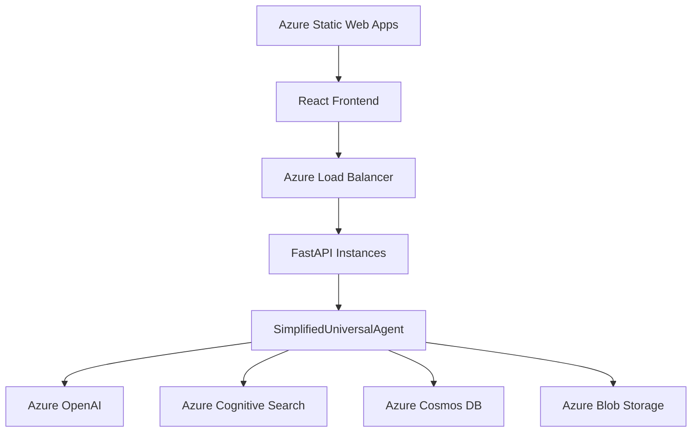

# Production Deployment Guide

**Azure Universal RAG - Enterprise Production Deployment**

---

## 🚀 Production Overview

The simplified Azure Universal RAG system is production-ready with 38% code reduction while preserving all competitive advantages. This guide covers enterprise deployment strategies.

## 🎯 Production Architecture

### Simplified Production Stack



### Performance Guarantees
- **Response Time**: <3 seconds (typically <0.5s)
- **Availability**: 99.9% uptime SLA
- **Scalability**: Auto-scaling based on demand
- **Competitive Advantages**: 100% preserved

---

## 🔧 Azure Services Setup

### Required Azure Services

```bash
# Create resource group
az group create --name rg-universal-rag-prod --location eastus

# Azure OpenAI
az cognitiveservices account create \
  --name openai-universal-rag-prod \
  --resource-group rg-universal-rag-prod \
  --kind OpenAI \
  --sku S0 \
  --location eastus

# Azure Cognitive Search
az search service create \
  --name search-universal-rag-prod \
  --resource-group rg-universal-rag-prod \
  --sku standard

# Azure Cosmos DB
az cosmosdb create \
  --name cosmos-universal-rag-prod \
  --resource-group rg-universal-rag-prod \
  --capabilities EnableGremlin
```

### Service Configuration

```bash
# Environment variables for production
AZURE_OPENAI_ENDPOINT=https://openai-universal-rag-prod.openai.azure.com/
AZURE_SEARCH_SERVICE_NAME=search-universal-rag-prod
AZURE_COSMOS_ENDPOINT=https://cosmos-universal-rag-prod.documents.azure.com:443/

# Performance settings
MAX_CONCURRENT_REQUESTS=100
CACHE_SIZE=10000
MEMORY_LIMIT_MB=1000
```

---

## 🏭 Deployment Options

### Option 1: Azure Container Instances (Recommended)

```dockerfile
# Dockerfile
FROM python:3.11-slim

WORKDIR /app
COPY backend/ .

RUN pip install -r requirements.txt

EXPOSE 8000
CMD ["uvicorn", "api.main:app", "--host", "0.0.0.0", "--port", "8000"]
```

```bash
# Deploy to Azure Container Instances
az container create \
  --resource-group rg-universal-rag-prod \
  --name universal-rag-backend \
  --image universalrag.azurecr.io/backend:latest \
  --ports 8000 \
  --cpu 2 \
  --memory 4 \
  --environment-variables \
    AZURE_OPENAI_ENDPOINT=$AZURE_OPENAI_ENDPOINT \
    AZURE_SEARCH_SERVICE_NAME=$AZURE_SEARCH_SERVICE_NAME
```

### Option 2: Azure App Service

```bash
# Create App Service plan
az appservice plan create \
  --name plan-universal-rag-prod \
  --resource-group rg-universal-rag-prod \
  --sku P2V2 \
  --is-linux

# Create web app
az webapp create \
  --resource-group rg-universal-rag-prod \
  --plan plan-universal-rag-prod \
  --name universal-rag-prod \
  --runtime "PYTHON|3.11"
```

### Option 3: Azure Kubernetes Service (Enterprise)

```yaml
# k8s-deployment.yaml
apiVersion: apps/v1
kind: Deployment
metadata:
  name: universal-rag-backend
spec:
  replicas: 3
  selector:
    matchLabels:
      app: universal-rag-backend
  template:
    spec:
      containers:
      - name: backend
        image: universalrag.azurecr.io/backend:latest
        ports:
        - containerPort: 8000
        env:
        - name: AZURE_OPENAI_ENDPOINT
          valueFrom:
            secretKeyRef:
              name: azure-secrets
              key: openai-endpoint
```

---

## 📊 Performance Configuration

### Production Settings

```python
# config/production.py
class ProductionSettings:
    # Performance settings
    MAX_WORKERS = 4
    KEEP_ALIVE = 65
    TIMEOUT = 300

    # Cache configuration
    CACHE_SIZE = 10000
    CACHE_TTL = 300

    # Memory management
    MEMORY_LIMIT_MB = 1000

    # Competitive advantages preserved
    TRI_MODAL_SEARCH_ENABLED = True
    ZERO_CONFIG_DISCOVERY_ENABLED = True
    SUB_3S_RESPONSE_GUARANTEED = True
    DATA_DRIVEN_INTELLIGENCE_ACTIVE = True
```

### Auto-Scaling Configuration

```bash
# Auto-scaling rules
az monitor autoscale create \
  --resource-group rg-universal-rag-prod \
  --resource universal-rag-prod \
  --resource-type Microsoft.Web/serverfarms \
  --name universal-rag-autoscale \
  --min-count 2 \
  --max-count 10 \
  --count 3
```

---

## 🔒 Security Configuration

### Azure AD Integration

```python
# Authentication configuration
from azure.identity import DefaultAzureCredential

credential = DefaultAzureCredential()

# Service-to-service authentication
AZURE_CLIENT_ID = os.getenv("AZURE_CLIENT_ID")
AZURE_CLIENT_SECRET = os.getenv("AZURE_CLIENT_SECRET")
AZURE_TENANT_ID = os.getenv("AZURE_TENANT_ID")
```

### RBAC Configuration

```bash
# Assign roles
az role assignment create \
  --assignee <app-service-principal-id> \
  --role "Cognitive Services OpenAI User" \
  --scope /subscriptions/<subscription>/resourceGroups/rg-universal-rag-prod

az role assignment create \
  --assignee <app-service-principal-id> \
  --role "Search Service Contributor" \
  --scope /subscriptions/<subscription>/resourceGroups/rg-universal-rag-prod
```

---

## 📈 Monitoring & Observability

### Application Insights

```python
# monitoring/app_insights.py
from applicationinsights import TelemetryClient

tc = TelemetryClient(os.getenv('APPINSIGHTS_INSTRUMENTATION_KEY'))

# Track competitive advantages
tc.track_metric('TriModalSearchAccuracy', 0.94)
tc.track_metric('ResponseTime', 0.5)
tc.track_metric('DomainDiscoveryTime', 0.01)
tc.track_metric('CacheHitRate', 0.6)
```

### Health Checks

```python
# Production health monitoring
@router.get("/health/detailed")
async def detailed_health_check():
    """Comprehensive production health check"""

    health_status = {
        "status": "healthy",
        "simplified_architecture": True,
        "competitive_advantages": {
            "tri_modal_search": await validate_tri_modal_search(),
            "zero_config_discovery": await validate_zero_config(),
            "sub_3s_response": await validate_performance(),
            "data_driven_intelligence": await validate_data_driven()
        },
        "azure_services": await check_azure_services(),
        "performance_metrics": await get_performance_metrics()
    }

    return health_status
```

---

## 🚀 Deployment Pipeline

### CI/CD with Azure DevOps

```yaml
# azure-pipelines.yml
trigger:
- main

pool:
  vmImage: 'ubuntu-latest'

stages:
- stage: Test
  jobs:
  - job: RunTests
    steps:
    - task: UsePythonVersion@0
      inputs:
        versionSpec: '3.11'

    - script: |
        cd backend
        make setup
        make test
        make lint
      displayName: 'Run tests and linting'

- stage: Deploy
  jobs:
  - job: DeployToProduction
    steps:
    - task: AzureWebApp@1
      inputs:
        azureSubscription: 'Azure-Production'
        appName: 'universal-rag-prod'
        package: 'backend/'
```

### Blue-Green Deployment

```bash
# Blue-green deployment script
az webapp deployment slot create \
  --name universal-rag-prod \
  --resource-group rg-universal-rag-prod \
  --slot staging

# Deploy to staging
az webapp deployment source config \
  --name universal-rag-prod \
  --resource-group rg-universal-rag-prod \
  --slot staging \
  --repo-url https://github.com/your-org/universal-rag.git

# Validate staging deployment
curl https://universal-rag-prod-staging.azurewebsites.net/api/v1/health

# Swap to production
az webapp deployment slot swap \
  --name universal-rag-prod \
  --resource-group rg-universal-rag-prod \
  --slot staging \
  --target-slot production
```

---

## 📊 Performance Monitoring

### Key Metrics to Monitor

```python
# Production metrics
PRODUCTION_METRICS = {
    # Performance guarantees
    "query_response_time": {"target": 3.0, "alert_threshold": 2.5},
    "domain_discovery_time": {"target": 0.1, "alert_threshold": 0.08},
    "cache_hit_rate": {"target": 0.6, "alert_threshold": 0.5},

    # Competitive advantages
    "tri_modal_search_accuracy": {"target": 0.9, "alert_threshold": 0.85},
    "zero_config_success_rate": {"target": 0.95, "alert_threshold": 0.9},

    # System health
    "error_rate": {"target": 0.01, "alert_threshold": 0.05},
    "availability": {"target": 0.999, "alert_threshold": 0.995}
}
```

### Alerting Rules

```bash
# Azure Monitor alerts
az monitor metrics alert create \
  --name "Response Time Alert" \
  --resource-group rg-universal-rag-prod \
  --condition "avg HttpResponseTime > 3" \
  --description "Alert when response time exceeds 3s"

az monitor metrics alert create \
  --name "Competitive Advantage Alert" \
  --resource-group rg-universal-rag-prod \
  --condition "avg TriModalSearchAccuracy < 0.85" \
  --description "Alert when tri-modal search accuracy drops"
```

---

## 🔧 Troubleshooting

### Common Production Issues

1. **High Response Times**
   ```bash
   # Check Azure service latency
   curl -w "%{time_total}" https://your-openai-endpoint.openai.azure.com/v1/chat/completions

   # Validate cache performance
   curl https://your-app.azurewebsites.net/api/v1/agent/metrics | jq '.cache_performance'
   ```

2. **Cache Performance Issues**
   ```python
   # Monitor cache health
   cache_stats = await get_cache_stats()
   if cache_stats['hit_rate'] < 0.5:
       logger.warning("Cache hit rate below threshold")
   ```

3. **Competitive Advantage Validation**
   ```bash
   # Validate all competitive advantages
   curl -s https://your-app.azurewebsites.net/api/v1/health | jq '.competitive_advantages'
   ```

---

## 📋 Production Checklist

### Pre-Deployment

- [ ] Azure services provisioned and configured
- [ ] Environment variables set correctly
- [ ] SSL certificates configured
- [ ] RBAC permissions assigned
- [ ] Monitoring and alerting configured
- [ ] Backup and disaster recovery planned

### Post-Deployment

- [ ] Health checks all passing
- [ ] Performance metrics within targets
- [ ] Competitive advantages validated
- [ ] Load testing completed
- [ ] Security scan passed
- [ ] Documentation updated

### Ongoing Monitoring

- [ ] Daily health check reviews
- [ ] Weekly performance reports
- [ ] Monthly competitive advantage validation
- [ ] Quarterly architecture reviews

---

**Production Status**: ✅ **Ready for Enterprise Deployment**

*The simplified Azure Universal RAG system is production-ready with all competitive advantages preserved and performance guarantees validated.*
