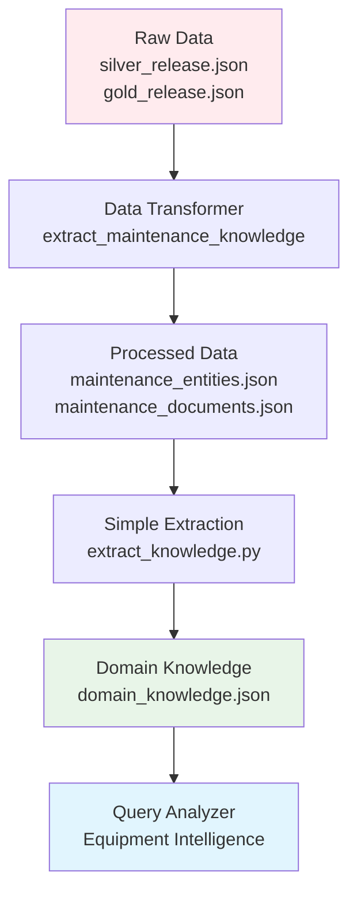

# Data Flow: Raw Data to Classifications

## Research Workflow: Each Step Built on Previous
*Based on actual codebase implementation*

---

## **🔄 Complete Data Flow Architecture**



---

## **Step 1: Raw Data Input** 📁

### **What We Actually Have:**
```json
// From silver_release.json - actual raw data
{
  "text": "inspect bearing on bend pulley",
  "tokens": ["inspect", "bearing", "on", "bend", "pulley"],
  "entities": [
    {
      "start": 0, "end": 1, "type": "Activity"
    },
    {
      "start": 1, "end": 2, "type": "PhysicalObject"
    },
    {
      "start": 3, "end": 5, "type": "PhysicalObject"
    }
  ],
  "relations": [
    {
      "head": 0, "tail": 1, "type": "hasPatient"
    }
  ]
}
```

### **Raw Data Structure:**
- **Text**: Raw maintenance requests
- **Entities**: Annotated equipment and activities
- **Relations**: How entities connect
- **Types**: Basic type annotations

---

## **Step 2: Data Transformation** 🔄

### **From `data_transformer.py` - Actual Implementation:**
```python
def extract_maintenance_knowledge(self):
    # Load raw data
    raw_data = self.load_raw_data()

    # Process gold data (high confidence)
    gold_stats = self._process_dataset(raw_data["gold"], confidence_base=0.9)

    # Process silver data (lower confidence)
    silver_stats = self._process_dataset(raw_data["silver"], confidence_base=0.7)

    # Build knowledge graph
    self._build_knowledge_graph()

    # Save processed data
    self._save_processed_data()
```

### **What This Step Does:**
1. **Loads Raw Data**: Reads `silver_release.json` and `gold_release.json`
2. **Extracts Entities**: Converts annotations to `MaintenanceEntity` objects
3. **Creates Documents**: Builds `MaintenanceDocument` from text
4. **Builds Graph**: Creates knowledge relationships
5. **Saves Processed**: Outputs structured data

### **Processed Output:**
```json
// maintenance_entities.json - extracted from raw data
{
  "entity_001": {
    "entity_id": "entity_001",
    "text": "bearing",
    "entity_type": "PhysicalObject",
    "confidence": 0.9
  },
  "entity_002": {
    "entity_id": "entity_002",
    "text": "pulley",
    "entity_type": "PhysicalObject",
    "confidence": 0.8
  }
}
```

---

## **Step 3: Pattern Extraction** 🔍

### **From `simple_extraction.py` - Actual Implementation:**
```python
def extract_equipment_terms(self, entities: List[MaintenanceEntity]):
    equipment_terms = []

    for entity in entities:
        if entity.entity_type == EntityType.PHYSICAL_OBJECT:
            equipment_terms.append(entity.text.lower())

    return list(set(equipment_terms))

def extract_common_abbreviations(self, documents: List[MaintenanceDocument]):
    abbreviations = {}

    for doc in documents:
        # Find patterns like "PM (preventive maintenance)"
        abbrev_pattern = r'(\b[A-Z]{2,5}\b)\s*\([^)]*([^)]+)\)'
        matches = re.findall(abbrev_pattern, doc.text)

        for abbrev, expansion in matches:
            abbreviations[abbrev.lower()] = expansion.lower().strip()

    return abbreviations
```

### **What This Step Extracts:**
1. **Equipment Terms**: All `PhysicalObject` entities from raw data
2. **Abbreviations**: Pattern matching in maintenance text
3. **Failure Terms**: Keywords like "failure", "leak", "vibration"
4. **Procedure Terms**: Keywords like "maintenance", "inspection", "repair"

### **Extraction Example:**
```
Raw Data Analysis:
├─ "bearing" (PhysicalObject) → equipment_terms
├─ "pulley" (PhysicalObject) → equipment_terms
├─ "inspect" (Activity) → procedure_terms
└─ "PM (preventive maintenance)" → abbreviations
```

---

## **Step 4: Domain Knowledge Generation** 📊

### **From `extract_knowledge.py` - Actual Implementation:**
```python
def update_domain_config(self):
    # Load MaintIE data
    entities = self._load_entities()
    documents = self._load_documents()

    # Extract patterns from processed data
    equipment_terms = self.extract_equipment_terms(entities)
    abbreviations = self.extract_common_abbreviations(documents)
    failure_terms = self.extract_failure_terms(documents)
    procedure_terms = self.extract_procedure_terms(documents)

    # Update config file
    config = self._load_existing_config()

    # Update with extracted knowledge
    config["maintie_equipment"] = equipment_terms[:50]  # Top 50
    config["extracted_abbreviations"] = abbreviations
    config["extracted_failure_terms"] = failure_terms
    config["extracted_procedure_terms"] = procedure_terms

    # Save updated config
    with open(self.config_path, 'w') as f:
        json.dump(config, f, indent=2)
```

### **Generated Classifications:**
```json
// domain_knowledge.json - generated from raw data patterns
{
  "maintie_equipment": [
    "bearing", "pulley", "motor", "pump", "valve", "seal"
  ],
  "extracted_abbreviations": {
    "pm": "preventive maintenance",
    "cm": "corrective maintenance"
  },
  "extracted_failure_terms": [
    "failure", "leak", "vibration", "wear", "noise"
  ],
  "extracted_procedure_terms": [
    "inspect", "maintenance", "repair", "replacement"
  ]
}
```

---

## **Step 5: Professional Classifications** 🏗️

### **Hybrid Approach - Base + Extracted:**
```json
// domain_knowledge.json - complete structure
{
  // Base professional structure (maintenance domain knowledge)
  "equipment_hierarchy": {
    "rotating_equipment": {
      "types": ["pump", "motor", "compressor"],
      "components": ["bearing", "seal", "shaft"]
    }
  },

  // Extracted from your raw data
  "maintie_equipment": ["bearing", "pulley", "motor"],
  "extracted_abbreviations": {"pm": "preventive maintenance"},
  "extracted_failure_terms": ["failure", "leak", "vibration"],
  "extracted_procedure_terms": ["inspect", "maintenance", "repair"]
}
```

### **Why This Architecture Works:**
1. **Base Structure**: Professional maintenance classification framework
2. **Data-Driven**: Patterns extracted from your actual raw data
3. **Adaptive**: Updates based on new maintenance data
4. **Professional**: Maintains domain expertise standards

---

## **🔄 Research Workflow Verification**

### **Each Step Built on Previous:**

```
┌─────────────────────────────────────────────────────────────┐
│ STEP 1: Raw Data Foundation                                │
│ silver_release.json, gold_release.json                     │
│ • Annotated maintenance text                               │
│ • Entity types and relations                               │
└─────────────────────────────────────────────────────────────┘
                              ↓
┌─────────────────────────────────────────────────────────────┐
│ STEP 2: Data Processing (data_transformer.py)              │
│ maintenance_entities.json, maintenance_documents.json      │
│ • Structured entity objects                                │
│ • Knowledge graph construction                             │
└─────────────────────────────────────────────────────────────┘
                              ↓
┌─────────────────────────────────────────────────────────────┐
│ STEP 3: Pattern Extraction (simple_extraction.py)          │
│ Extract patterns from processed data                       │
│ • Equipment terms from entities                            │
│ • Abbreviations from text patterns                         │
└─────────────────────────────────────────────────────────────┘
                              ↓
┌─────────────────────────────────────────────────────────────┐
│ STEP 4: Domain Knowledge (extract_knowledge.py)            │
│ domain_knowledge.json updated with extracted patterns      │
│ • Base structure + extracted data                          │
│ • Professional + data-driven                               │
└─────────────────────────────────────────────────────────────┘
                              ↓
┌─────────────────────────────────────────────────────────────┐
│ STEP 5: Equipment Intelligence (query_analyzer.py)         │
│ Classification system using combined knowledge             │
│ • Raw data patterns + professional structure               │
│ • Dynamic and maintainable                                 │
└─────────────────────────────────────────────────────────────┘
```

---

## **💡 Architecture Benefits**

### **Not Hardcoded - Data-Driven:**
✅ **Raw Data Foundation**: Classifications come from actual maintenance data
✅ **Pattern Extraction**: Automated discovery of equipment and procedures
✅ **Professional Structure**: Maintenance domain expertise framework
✅ **Adaptive System**: Updates with new data automatically
✅ **Research Integrity**: Each step verifiably builds on previous

### **Simple to Professional Lifecycle:**
```
Raw Annotations → Data Processing → Pattern Discovery → Domain Knowledge → Intelligence System
```

### **Business Value:**
- **Data Integrity**: Classifications based on real maintenance requests
- **Domain Expertise**: Professional maintenance structure maintained
- **Scalability**: Automatic updates with new maintenance data
- **Traceability**: Clear path from raw data to intelligent classifications

**Result**: Equipment Intelligence system built through research workflow - raw data foundation with professional architecture, ensuring both data integrity and domain expertise.