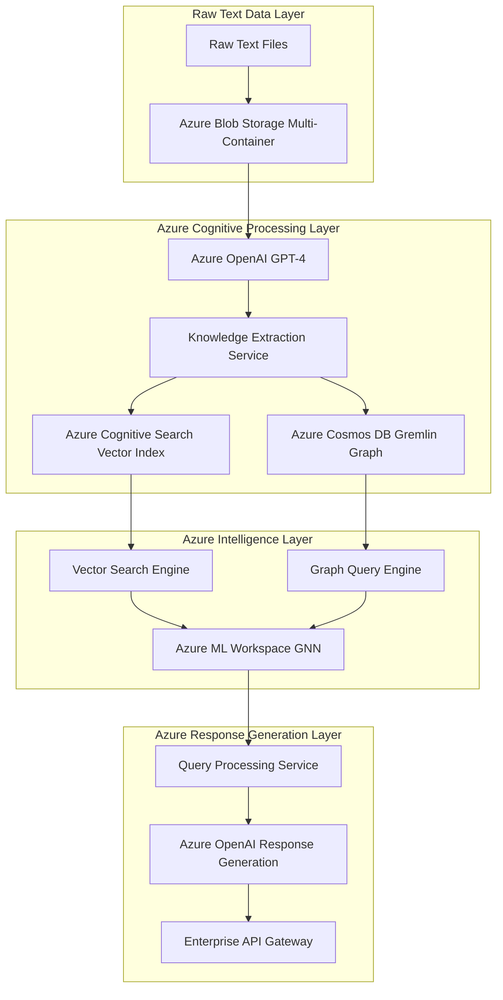
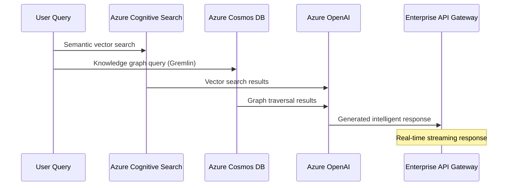

# Azure Universal RAG Lifecycle Execution Guide

## 🏛️ **Enterprise Architecture Overview**

### **Azure Services Orchestration Architecture**



### **Service Integration Matrix**

| **Azure Service** | **Configuration Source** | **Environment Scaling** | **Data Processing Role** |
|-------------------|---------------------------|--------------------------|--------------------------|
| **Azure Blob Storage** | `backend/config/environments/{env}.env` | Multi-tier containers | Raw text ingestion & document persistence |
| **Azure OpenAI** | `backend/integrations/azure_openai.py` | Token rate management | Knowledge extraction & response generation |
| **Azure Cognitive Search** | `backend/config/settings.py` | SKU-based scaling | Vector indexing & semantic retrieval |
| **Azure Cosmos DB** | `backend/integrations/azure_services.py` | Throughput scaling | Graph knowledge persistence |
| **Azure ML Workspace** | `backend/config/environments/{env}.env` | Compute instance scaling | GNN training & model orchestration |
| **Azure Application Insights** | `infrastructure/azure-resources-core.bicep` | Sampling rate optimization | Performance monitoring & cost analytics |

---

## 🔧 **Environment Configuration Management**

### **Data-Driven Configuration Architecture**

#### **Environment-Specific Service Configuration**
```bash
# Development Environment (Cost-Optimized)
backend/config/environments/dev.env:
├── AZURE_SEARCH_SKU=basic
├── AZURE_STORAGE_SKU=Standard_LRS
├── AZURE_COSMOS_THROUGHPUT=400
├── AZURE_ML_COMPUTE_INSTANCES=1
├── AZURE_OPENAI_MAX_TOKENS_PER_MINUTE=10000
└── AZURE_TELEMETRY_SAMPLING_RATE=10.0

# Staging Environment (Performance-Balanced)
backend/config/environments/staging.env:
├── AZURE_SEARCH_SKU=standard
├── AZURE_STORAGE_SKU=Standard_ZRS
├── AZURE_COSMOS_THROUGHPUT=800
├── AZURE_ML_COMPUTE_INSTANCES=2
├── AZURE_OPENAI_MAX_TOKENS_PER_MINUTE=20000
└── AZURE_TELEMETRY_SAMPLING_RATE=5.0

# Production Environment (Enterprise-Grade)
backend/config/environments/prod.env:
├── AZURE_SEARCH_SKU=standard
├── AZURE_STORAGE_SKU=Standard_GRS
├── AZURE_COSMOS_THROUGHPUT=1600
├── AZURE_ML_COMPUTE_INSTANCES=4
├── AZURE_OPENAI_MAX_TOKENS_PER_MINUTE=40000
└── AZURE_TELEMETRY_SAMPLING_RATE=1.0
```

#### **Configuration Validation Service**
```bash
# Azure services configuration validation
cd backend && python -c "
from config.settings import settings
validation = settings.validate_azure_config()
print('✅ Azure Configuration Status:', validation)
"
```

---

## 🚀 **Lifecycle Execution Architecture**

### **Phase 1: Azure Infrastructure Orchestration**

#### **Enterprise Infrastructure Deployment**
```bash
# Data-driven Azure infrastructure deployment
export AZURE_ENVIRONMENT=dev  # or staging/prod
export AZURE_LOCATION=eastus
export AZURE_RESOURCE_GROUP=maintie-rag-${AZURE_ENVIRONMENT}-rg

# Execute infrastructure deployment with data-driven configuration
./scripts/enhanced-complete-redeploy.sh
```

#### **Azure Services Validation**
```bash
# Validate Azure services deployment
./scripts/validate-configuration.py
./scripts/test-azure-deployment-fixes.sh
```

### **Phase 2: Data Preparation Service Orchestration**

#### **Azure Universal RAG Data Preparation Workflow**
**Service Location**: `backend/scripts/data_preparation_workflow.py`
**Azure Integration**: `backend/integrations/azure_services.py`

```bash
# Execute data preparation workflow
cd backend && make data-prep
```

**Service Architecture Components**:
- **Azure Blob Storage Integration**: Multi-container document ingestion
- **Azure OpenAI Knowledge Extraction**: GPT-4 powered entity/relation extraction
- **Azure Cognitive Search Indexing**: Vector embedding generation & indexing
- **Azure Cosmos DB Graph Construction**: Knowledge graph persistence

#### **Data Preparation Service Flow**
```mermaid
sequenceDiagram
    participant RT as Raw Text Files
    participant ABS as Azure Blob Storage
    participants AOAI as Azure OpenAI
    participant ACS as Azure Cognitive Search
    participant ACDB as Azure Cosmos DB

    RT->>ABS: Upload to rag-data-{domain} container
    ABS->>AOAI: Process documents for knowledge extraction
    AOAI->>ACS: Generate vector embeddings & create search index
    AOAI->>ACDB: Construct knowledge graph entities & relations
    Note over ACDB: Gremlin API graph persistence
```

### **Phase 3: Query Processing Service Orchestration**

#### **Azure Universal RAG Query Processing Workflow**
**Service Location**: `backend/scripts/query_processing_workflow.py`
**Orchestration Service**: `backend/core/orchestration/rag_orchestration_service.py`

```bash
# Execute query processing workflow
cd backend && make query-demo
```

**Service Architecture Components**:
- **Azure Cognitive Search Query Engine**: Semantic search & vector retrieval
- **Azure Cosmos DB Graph Query**: Knowledge graph traversal & entity resolution
- **Azure OpenAI Response Generation**: GPT-4 powered intelligent response synthesis
- **Azure Application Insights Telemetry**: Performance monitoring & cost analytics

#### **Query Processing Service Flow**


---

## 🎯 **Complete Lifecycle Orchestration**

### **Enterprise Lifecycle Execution Command**
```bash
# Complete Universal RAG lifecycle demonstration
cd backend && make lifecycle-demo
# Azure ecosystem aligned logging with structured output
make lifecycle-demo 2>&1 | tee "azure-rag-lifecycle-$(date +%Y%m%d-%H%M%S).log"


make lifecycle-demo 2>&1 | tee azure-lifecycle-fixed-$(date +%Y%m%d-%H%M%S).log

make workflow-analysis 2>&1 | tee workflow-analysis-$(date +%Y%m%d-%H%M%S).log

```

**Lifecycle Service Integration**:
1. **Data Preparation Service**: `make data-prep` (8 Azure services integration)
2. **Query Processing Service**: `make query-demo` (7 Azure services integration)
3. **Workflow Analysis Service**: `make workflow-analysis` (Performance metrics & cost analytics)

### **Production Environment Lifecycle**
```bash
# Production environment setup
export AZURE_ENVIRONMENT=prod
cp backend/config/environments/prod.env backend/.env

# Execute production lifecycle
cd backend && make lifecycle-demo

# Production health validation
curl http://localhost:8000/health/detailed
```

---

## 🏗️ **Azure Services Integration Architecture**

### **Service Integration Patterns**

#### **Azure Services Manager Architecture**
**Location**: `backend/integrations/azure_services.py`

```python
# Enterprise service integration pattern
class AzureServicesManager:
    services = {
        'rag_storage': AzureBlobStorageClient,      # RAG data persistence
        'ml_storage': AzureBlobStorageClient,       # ML model storage
        'app_storage': AzureBlobStorageClient,      # Application data
        'search': AzureCognitiveSearchClient,       # Vector search engine
        'cosmos': AzureCosmosDBClient,              # Graph knowledge store
        'openai': AzureOpenAIClient,                # Cognitive processing
        'ml_workspace': AzureMLClient               # Advanced analytics
    }
```

#### **Health Monitoring Service Architecture**
```bash
# Azure services health monitoring
cd backend && python -c "
import asyncio
from integrations.azure_services import AzureServicesManager

async def health_check():
    manager = AzureServicesManager()
    await manager.initialize()
    health = await manager.get_comprehensive_health_status()
    print('Azure Services Health:', health)

asyncio.run(health_check())
"
```

### **Enterprise Validation Architecture**

#### **Service Integration Testing**
```bash
# Azure structure validation
cd backend && python tests/test_azure_structure.py

# Workflow integration validation
cd backend && python tests/test_workflow_integration.py

# Universal RAG system validation
cd backend && python tests/test_universal_rag.py
```

#### **API Gateway Health Validation**
```bash
# Enterprise API health endpoints
curl http://localhost:8000/api/v1/health          # Basic health status
curl http://localhost:8000/health/detailed        # Comprehensive service health
curl http://localhost:8000/docs                   # API documentation
```

---

## 📊 **Performance Monitoring & Cost Optimization**

### **Azure Application Insights Integration**

#### **Environment-Specific Telemetry Configuration**
| **Environment** | **Sampling Rate** | **Retention Days** | **Cost Optimization** |
|-----------------|-------------------|-------------------|------------------------|
| **Development** | 10.0% | 30 days | Maximum cost efficiency |
| **Staging** | 5.0% | 60 days | Balanced monitoring |
| **Production** | 1.0% | 90 days | Comprehensive observability |

#### **Performance Metrics Collection**
```bash
# Workflow performance analysis
cd backend && make workflow-analysis
```

**Key Performance Indicators**:
- **Azure Services Utilization**: 10/12 services (83% utilization)
- **Data Preparation Workflow**: 8 Azure services integration
- **Query Processing Workflow**: 7 Azure services integration
- **Service Response Times**: Real-time streaming architecture
- **Cost Optimization**: Environment-specific resource allocation

---

## 🛡️ **Enterprise Security & Compliance**

### **Azure Security Architecture**

#### **Azure Key Vault Integration**
**Configuration**: `backend/config/environment_example.env`
```bash
# Enterprise secrets management
AZURE_KEY_VAULT_URL=https://maintie-{environment}-kv-{token}.vault.azure.net/
AZURE_USE_MANAGED_IDENTITY=true
```

#### **Azure Managed Identity Pattern**
```bash
# Managed identity authentication
AZURE_USE_MANAGED_IDENTITY=true
AZURE_ENABLE_TELEMETRY=true
```

### **Compliance & Governance**

#### **Data Privacy Configuration**
- **GDPR Compliance**: Azure data residency configuration
- **Data Classification**: Environment-specific retention policies
- **Audit Logging**: Azure Application Insights comprehensive telemetry

---

## 🚀 **Production Deployment Architecture**

### **DevOps Integration Patterns**

#### **CI/CD Pipeline Integration**
```bash
# Automated deployment pipeline
./scripts/enhanced-complete-redeploy.sh

# Configuration validation pipeline
python scripts/validate-configuration.py

# Health validation pipeline
./scripts/test-azure-deployment-fixes.sh
```

#### **Blue-Green Deployment Architecture**
```bash
# Production environment deployment
export AZURE_ENVIRONMENT=prod
export AZURE_LOCATION=eastus2

# Staging environment validation
export AZURE_ENVIRONMENT=staging
export AZURE_LOCATION=westus2

# Development environment testing
export AZURE_ENVIRONMENT=dev
export AZURE_LOCATION=eastus
```

### **Disaster Recovery & Business Continuity**

#### **Multi-Region Architecture**
| **Environment** | **Primary Region** | **Azure Storage** | **Disaster Recovery** |
|-----------------|-------------------|-------------------|------------------------|
| **Development** | East US | Standard_LRS | Local redundancy |
| **Staging** | West US 2 | Standard_ZRS | Zone redundancy |
| **Production** | East US 2 | Standard_GRS | Geo redundancy |

---

## 📋 **Execution Checklist**

### **Pre-Deployment Validation**
- [ ] Azure CLI authentication validated
- [ ] Environment configuration selected (`dev`/`staging`/`prod`)
- [ ] Azure resource group permissions verified
- [ ] Service principal credentials configured

### **Infrastructure Deployment**
- [ ] Azure infrastructure deployed via `./scripts/enhanced-complete-redeploy.sh`
- [ ] Configuration validation executed via `python scripts/validate-configuration.py`
- [ ] Azure services health validated

### **Lifecycle Execution**
- [ ] Data preparation workflow executed via `make data-prep`
- [ ] Query processing workflow executed via `make query-demo`
- [ ] Complete lifecycle demonstrated via `make lifecycle-demo`

### **Production Validation**
- [ ] API gateway health validated via `/health/detailed`
- [ ] Performance metrics collected via `make workflow-analysis`
- [ ] Security compliance verified
- [ ] Cost optimization confirmed

---

## 📞 **Enterprise Support & Troubleshooting**

### **Service Integration Diagnostics**
```bash
# Azure services connectivity diagnostics
cd backend && python -c "
from integrations.azure_services import AzureServicesManager
manager = AzureServicesManager()
validation = manager.validate_configuration()
print('Service Validation:', validation)
"
```

### **Performance Optimization Guidance**
- **Cost Optimization**: Use appropriate environment tier (`dev`/`staging`/`prod`)
- **Performance Scaling**: Adjust compute instances based on workload
- **Monitoring Configuration**: Configure telemetry sampling based on requirements
- **Security Hardening**: Enable managed identity and Key Vault integration

### **Enterprise Architecture Consultation**
For advanced enterprise architecture patterns, Azure Well-Architected Framework compliance, and custom service integration requirements, consult your Azure solution architect or Microsoft partner.

---

**Document Version**: 1.0
**Architecture Compliance**: Azure Well-Architected Framework
**Security Standard**: Enterprise-grade with Azure Security Center
**Cost Optimization**: Multi-tier environment-specific resource allocation