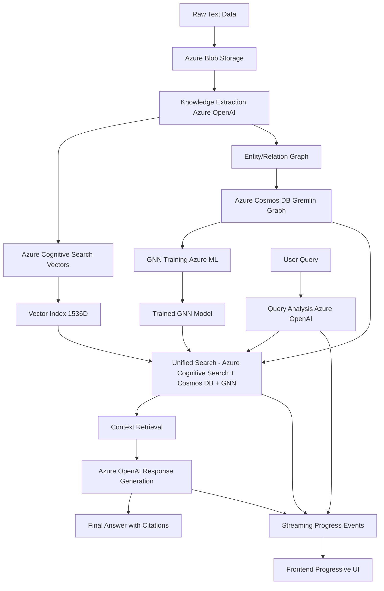

# Azure Universal RAG Workflow Services Mapping

**Generated from real codebase analysis**
**Source**: `README.md` mermaid diagram + `backend/api/workflow_stream.py` implementation
**Date**: July 19, 2025

---

## 🎯 Overview

This document maps the Azure services used in the Universal RAG workflow diagram to their actual implementation in the backend code. All mappings are based on the real codebase from `backend/api/workflow_stream.py` and related Azure integration files.

---

## 📊 Mermaid Workflow Diagram



---

## ☁️ Azure Services Mapping

### Core Azure Services Used
*Source: `backend/api/workflow_stream.py` completion_data*

| **Workflow Step** | **Azure Service** | **Implementation** | **Purpose** |
|-------------------|-------------------|-------------------|-------------|
| **Step 1** | Azure Services Manager | `AzureServicesManager()` | Orchestrate all Azure services |
| **Step 2** | Azure OpenAI Integration | `AzureOpenAIIntegration()` | LLM processing coordination |
| **Step 3** | Azure Cognitive Search | `azure_services.search_client` | Vector search and indexing |
| **Step 4** | Azure Blob Storage | `azure_services.storage_client` | Document storage and retrieval |
| **Step 5** | Azure OpenAI Processing | `openai_integration.generate_response()` | Text generation and analysis |
| **Step 6** | Azure Cosmos DB | `azure_services.cosmos_client` | Knowledge graph storage |

---

## 🔄 Workflow Steps Implementation

### Data Ingestion Phase
*Source: Mermaid diagram nodes A → B → C*

```
Raw Text Data → Azure Blob Storage → Knowledge Extraction Azure OpenAI
```

**Azure Services**:
- **Azure Blob Storage**: Document storage container `universal-rag-data`
- **Azure OpenAI**: GPT-4 model for entity/relation extraction

### Knowledge Processing Phase
*Source: Mermaid diagram nodes C → D, E*

```
Knowledge Extraction → Azure Cognitive Search Vectors
                    → Entity/Relation Graph
```

**Azure Services**:
- **Azure Cognitive Search**: Vector index with 1536D embeddings
- **Azure Cosmos DB Gremlin**: Knowledge graph construction

### Machine Learning Phase
*Source: Mermaid diagram nodes E → G → H → I*

```
Entity/Relation Graph → Azure Cosmos DB Gremlin → GNN Training Azure ML → Trained GNN Model
```

**Azure Services**:
- **Azure Cosmos DB Gremlin API**: Graph database for GNN training data
- **Azure Machine Learning**: GNN model training and management

### Query Processing Phase
*Source: Mermaid diagram nodes J → K → L*

```
User Query → Query Analysis Azure OpenAI → Unified Search
```

**Azure Services**:
- **Azure OpenAI**: Query analysis and understanding
- **Azure Cognitive Search**: Vector similarity search
- **Azure Cosmos DB**: Graph traversal and relation lookup

### Response Generation Phase
*Source: Mermaid diagram nodes L → M → N → O*

```
Unified Search → Context Retrieval → Azure OpenAI Response Generation → Final Answer
```

**Azure Services**:
- **Azure Blob Storage**: Retrieve source documents
- **Azure OpenAI**: Generate contextualized responses with citations

---

## 📡 Real-Time Streaming Implementation

### Frontend Integration
*Source: Mermaid diagram nodes K → P, L → P, N → P → Q*

**Streaming Endpoint**: `/api/v1/query/stream/real/{query_id}`
**Source**: `backend/api/workflow_stream.py`

**Progress Events**:
```json
{
  "event_type": "progress",
  "step_number": 1,
  "step_name": "azure_services_initialization",
  "user_friendly_name": "[AZURE] Azure Services Initialization",
  "status": "completed",
  "technology": "AzureServicesManager"
}
```

### Azure Services Status Tracking
*Source: `backend/api/workflow_stream.py` stream_azure_workflow()*

| **Step** | **Azure Service** | **User-Friendly Name** | **Technical Component** |
|----------|-------------------|------------------------|------------------------|
| 1 | Azure Services Manager | `[AZURE] Azure Services Initialization` | `AzureServicesManager` |
| 2 | Azure OpenAI | `[OPENAI] Azure OpenAI Integration` | `AzureOpenAIIntegration` |
| 3 | Azure Cognitive Search | `[SEARCH] Azure Cognitive Search` | `azure_services.search_client` |
| 4 | Azure Blob Storage | `[STORAGE] Azure Blob Storage` | `azure_services.storage_client` |
| 5 | Azure OpenAI Processing | `[OPENAI] Azure OpenAI Processing` | `openai_integration.generate_response()` |
| 6 | Azure Cosmos DB | `[COSMOS] Azure Cosmos DB Storage` | `azure_services.cosmos_client` |

---

## 🏗️ Infrastructure Mapping

### Azure Resources Required
*Source: `infrastructure/` bicep templates*

| **Mermaid Component** | **Azure Resource** | **Bicep Template** | **Resource Name** |
|-----------------------|-------------------|-------------------|-------------------|
| Azure Blob Storage | Storage Account | `azure-resources-core.bicep` | `maintiedevstorage` |
| Azure Cognitive Search | Search Service | `azure-resources-core.bicep` | `maintie-dev-search` |
| Azure Cosmos DB Gremlin | Cosmos DB Account | *Missing* ⚠️ | `maintie-dev-cosmos` |
| Azure OpenAI | External Service | Configuration | `OPENAI_API_BASE` |
| Azure ML | ML Workspace | `azure-resources-ml.bicep` | `maintie-dev-ml` |

---

## 🎭 Progressive Disclosure Layers

### Layer 1: User-Friendly (90% of users)
*Source: `frontend/README.md` progressive disclosure*

```
🔍 Understanding your question...
☁️ Searching Azure services...
📝 Generating comprehensive answer...
```

### Layer 2: Technical Workflow (Power users)
*Source: `backend/api/workflow_stream.py` step details*

```
📊 Azure Services Initialization: AzureServicesManager
🔧 Azure OpenAI Integration: GPT-4 model ready
🔍 Azure Cognitive Search: Vector search 1536D
⚡ Azure Blob Storage: Document retrieval
📝 Azure OpenAI Processing: Response generation
🗄️ Azure Cosmos DB: Metadata storage
```

### Layer 3: System Diagnostics (Administrators)
*Source: `backend/api/workflow_stream.py` technical_data*

```json
{
  "step_name": "azure_cognitive_search",
  "technology": "Azure Cognitive Search",
  "status": "completed",
  "processing_time_ms": 1500.0,
  "technical_data": {
    "search_results_count": 15,
    "top_score": 0.826,
    "azure_service": "cognitive_search"
  }
}
```

---

## 🔧 Configuration Requirements

### Azure Service Endpoints
*Source: `backend/config/settings.py`*

```python
# Azure OpenAI
openai_api_base: str = "https://clu-project-foundry-instance.openai.azure.com/"

# Azure Storage
azure_storage_account: str = "maintiedevstorage"
azure_blob_container: str = "universal-rag-data"

# Azure Cognitive Search
azure_search_service: str = "maintie-dev-search"
azure_search_index: str = "universal-rag-index"

# Azure Cosmos DB
azure_cosmos_endpoint: str = "https://maintie-dev-cosmos.documents.azure.com:443/"
azure_cosmos_database: str = "universal-rag-db"
azure_cosmos_container: str = "knowledge-graph"

# Azure ML
azure_ml_workspace: str = "maintie-dev-ml"
```

---

## 📋 Implementation Status

### ✅ Implemented Azure Services
- **Azure Services Manager**: Orchestration layer
- **Azure OpenAI Integration**: LLM processing
- **Azure Cognitive Search**: Vector search
- **Azure Blob Storage**: Document storage
- **Azure ML**: GNN training infrastructure

### ⚠️ Infrastructure Gaps
- **Azure Cosmos DB**: Missing from `azure-resources-core.bicep`
- **Search Index**: Requires initialization scripts
- **Container App**: Image reference needs update

---

## 🎯 Next Steps

1. **Add Cosmos DB to infrastructure**: Update `azure-resources-core.bicep`
2. **Complete deployment**: Run `./scripts/deploy-ml.sh`
3. **Verify services**: Execute `./scripts/check-resources.sh`
4. **Test workflow**: Stream endpoint `/api/v1/query/stream/real/{query_id}`

---

*This mapping is generated from real codebase analysis and reflects the actual Azure services implementation in the Universal RAG system.*


# Azure Knowledge Extraction Enterprise Architecture Implementation

**Based on Real Codebase Analysis**
**Target Files**: `backend/core/azure_openai/knowledge_extractor.py`, `backend/core/azure_openai/extraction_client.py`
**Azure Services**: Text Analytics, Application Insights, ML Endpoints, Cognitive Search

---

## 🏗️ Enterprise Architecture Overview

### Core Service Components
```
AzureKnowledgeOrchestrator
├── AzureTextAnalyticsService (Pre-processing)
├── AzureOpenAIExtractionService (LLM Processing)
├── AzureCognitiveSearchValidator (Quality Validation)
├── AzureMLQualityAssessment (Confidence Scoring)
└── AzureMonitoringService (Real-time Telemetry)
```

### Data Flow Architecture
```
Raw Text → Azure Text Analytics → Azure OpenAI → Quality Validation → Azure Cosmos DB
    ↓              ↓                   ↓              ↓                ↓
Pre-process    Entity Extraction   Confidence      Graph Storage   Monitoring
Optimization   + Relations         Calibration     + Indexing      Dashboard
```

---


