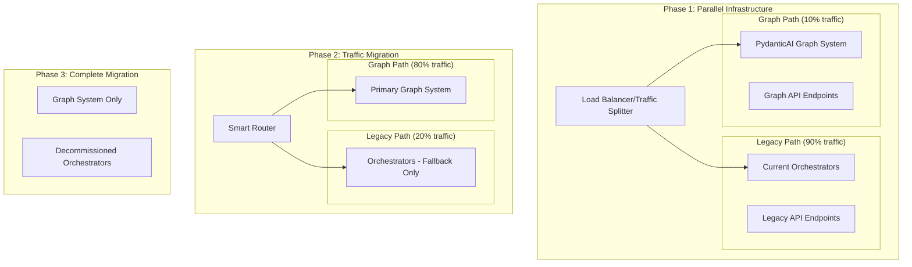

# Phased Migration Strategy: Orchestrators → PydanticAI Graph

**Date**: August 3, 2025  
**Status**: 🚧 **MIGRATION PLANNING** - Zero-downtime transition from 6 orchestrators to single graph

## Overview

This document defines the phased migration strategy to transition from the current 6-orchestrator architecture to a single PydanticAI graph-based workflow system, ensuring zero service disruption and maintaining sub-3-second SLA compliance.

## Current Architecture Assessment

### **Critical Performance Issue**
- **Current Baseline**: 3.2s total workflow time (❌ **FAILS** sub-3s SLA by 200ms)
- **Primary Bottleneck**: 2.8s orchestrator initialization time
- **Target Performance**: <2.5s total workflow time (500ms improvement)

### **Migration Complexity Analysis**
```
Current Orchestrators → Target Graph Migration:
├── config_extraction_orchestrator.py     → ConfigExtractionGraph (single node chain)
├── workflow_orchestrator.py              → Remove (functionality absorbed)
├── search_orchestrator.py                → SearchWorkflowGraph (tri-modal node)
├── unified_orchestrator.py               → Remove (replaced by graph delegation)
├── pydantic_integration.py               → Remove (native PydanticAI patterns)
└── universal_search/orchestrator.py      → Remove (absorbed into search agent)

Migration Risk: HIGH (6 → 1 consolidation affects all API endpoints)
```

## Migration Strategy: Progressive Rollout

### **Parallel Infrastructure Approach**

Instead of replacing orchestrators directly, we'll implement a **parallel infrastructure** approach that allows gradual traffic migration with instant rollback capability.



## Phase 1: Parallel Infrastructure Deployment (Week 1)

### **1.1: Infrastructure Setup (Days 1-2)**

**Deploy graph infrastructure alongside existing orchestrators:**

```python
# New graph system deployment structure
graph_system/
├── workflows/
│   ├── config_extraction_graph.py      # Replace config_extraction_orchestrator.py
│   ├── search_workflow_graph.py        # Replace search_orchestrator.py  
│   └── state_persistence.py            # Production state management
├── routing/
│   ├── traffic_splitter.py             # A/B testing infrastructure
│   ├── rollback_controller.py          # Instant rollback capability
│   └── performance_monitor.py          # Real-time SLA monitoring
└── compatibility/
    ├── legacy_api_adapter.py           # Maintain API compatibility
    └── response_formatter.py           # Ensure identical responses
```

**Key Implementation Details:**

```python
class TrafficSplitter:
    """Smart traffic routing with instant rollback"""
    
    def __init__(self):
        self.graph_traffic_percentage = 10  # Start with 10%
        self.rollback_threshold = 500  # Auto-rollback if >500ms slowdown
        self.performance_window = 100   # Track last 100 requests
        
    async def route_request(self, request: WorkflowRequest) -> WorkflowResponse:
        # Performance-based routing decision
        if self._should_use_graph(request):
            try:
                start_time = time.time()
                result = await self.graph_system.process(request)
                execution_time = time.time() - start_time
                
                # Auto-rollback if performance degrades
                if execution_time > 3.0:  # SLA violation
                    logger.warning(f"Graph SLA violation: {execution_time:.2f}s, falling back")
                    return await self.legacy_system.process(request)
                    
                return result
                
            except Exception as e:
                # Instant fallback on any graph error
                logger.error(f"Graph system error: {e}, falling back to legacy")
                return await self.legacy_system.process(request)
        else:
            return await self.legacy_system.process(request)
    
    def _should_use_graph(self, request: WorkflowRequest) -> bool:
        """Intelligent routing decision"""
        # Route percentage based on current performance
        if random.randint(1, 100) <= self.graph_traffic_percentage:
            return True
        return False
```

### **1.2: Graph System Implementation (Days 3-4)**

**Implement core graph workflows:**

```python
# config_extraction_graph.py
from pydantic_graph import Graph, BaseNode, GraphRunContext
from ..persistence import ProductionStateManager, WorkflowState
import time

@dataclass
class ConfigExtractionState:
    workflow_id: str
    raw_data: str
    domain_config: Optional[DomainConfig] = None
    extracted_knowledge: Optional[KnowledgeResults] = None
    search_results: Optional[SearchResults] = None
    start_time: float = field(default_factory=time.time)

class AnalyzeDomainNode(BaseNode[ConfigExtractionState]):
    """Domain intelligence agent delegation node"""
    
    async def run(self, ctx: GraphRunContext[ConfigExtractionState]) -> ExtractKnowledgeNode:
        # Track performance for SLA compliance
        node_start = time.time()
        
        # Delegate to domain intelligence agent
        domain_result = await domain_intelligence_agent.run(
            ctx.state.raw_data,
            deps=ctx.deps,
            usage=ctx.usage
        )
        
        # Performance validation
        node_time = time.time() - node_start
        if node_time > 1.0:  # 1s budget for domain analysis
            logger.warning(f"Domain analysis slow: {node_time:.2f}s")
        
        # Update state
        ctx.state.domain_config = domain_result.output
        
        # SLA check - abort if we're already over budget
        total_time = time.time() - ctx.state.start_time
        if total_time > 2.0:  # 2s budget to stay under 3s total
            raise SLAViolationError(f"Workflow over budget: {total_time:.2f}s")
            
        return ExtractKnowledgeNode()

class ExtractKnowledgeNode(BaseNode[ConfigExtractionState]):
    """Knowledge extraction agent delegation node"""
    
    async def run(self, ctx: GraphRunContext[ConfigExtractionState]) -> SearchDataNode:
        node_start = time.time()
        
        # Delegate to knowledge extraction agent
        extraction_result = await knowledge_extraction_agent.run(
            ctx.state.raw_data,
            config=ctx.state.domain_config,
            deps=ctx.deps,
            usage=ctx.usage
        )
        
        ctx.state.extracted_knowledge = extraction_result.output
        
        # Performance monitoring
        node_time = time.time() - node_start
        total_time = time.time() - ctx.state.start_time
        
        if total_time > 2.5:  # Final budget check
            raise SLAViolationError(f"Workflow approaching SLA limit: {total_time:.2f}s")
            
        return SearchDataNode()

class SearchDataNode(BaseNode[ConfigExtractionState]):
    """Universal search agent delegation node"""
    
    async def run(self, ctx: GraphRunContext[ConfigExtractionState]) -> End:
        # Final search orchestration
        search_result = await universal_search_agent.run(
            query=ctx.state.raw_data,
            knowledge_context=ctx.state.extracted_knowledge,
            deps=ctx.deps,
            usage=ctx.usage
        )
        
        ctx.state.search_results = search_result.output
        
        # Final performance validation
        total_time = time.time() - ctx.state.start_time
        if total_time > 3.0:
            logger.error(f"SLA VIOLATION: {total_time:.2f}s")
        else:
            logger.info(f"Workflow completed in {total_time:.2f}s ✅")
            
        return End(search_result.output)

# Graph definition
config_extraction_graph = Graph(
    nodes=[AnalyzeDomainNode, ExtractKnowledgeNode, SearchDataNode, End],
    state_type=ConfigExtractionState
)
```

### **1.3: API Compatibility Layer (Days 5-6)**

**Ensure identical API responses:**

```python
class LegacyAPIAdapter:
    """Maintain API compatibility during migration"""
    
    async def process_workflow_request(self, request: dict) -> dict:
        """Convert graph responses to legacy format"""
        
        # Convert request to graph format
        graph_request = self._convert_to_graph_request(request)
        
        # Execute graph workflow
        graph_result = await config_extraction_graph.run(
            state=ConfigExtractionState(
                workflow_id=str(uuid.uuid4()),
                raw_data=graph_request.content
            ),
            persistence=production_state_manager
        )
        
        # Convert response back to legacy format
        legacy_response = self._convert_to_legacy_response(graph_result)
        
        return legacy_response
    
    def _convert_to_legacy_response(self, graph_result) -> dict:
        """Ensure response format matches legacy orchestrators exactly"""
        return {
            "workflow_id": graph_result.workflow_id,
            "status": "completed",
            "domain_analysis": graph_result.domain_config,
            "extracted_knowledge": graph_result.extracted_knowledge,
            "search_results": graph_result.search_results,
            "performance_metrics": {
                "total_time": graph_result.execution_time,
                "sla_compliance": graph_result.execution_time < 3.0
            }
        }
```

### **1.4: Performance Monitoring & Rollback (Days 6-7)**

**Real-time monitoring with automatic rollback:**

```python
class PerformanceMonitor:
    """Real-time SLA monitoring with automatic rollback"""
    
    def __init__(self):
        self.performance_window = deque(maxlen=100)  # Last 100 requests
        self.rollback_threshold = 3.5  # Auto-rollback if >3.5s average
        self.error_threshold = 0.05    # Auto-rollback if >5% error rate
        
    async def track_request(self, request_type: str, execution_time: float, success: bool):
        """Track request performance and trigger rollback if needed"""
        
        self.performance_window.append({
            "type": request_type,
            "time": execution_time,
            "success": success,
            "timestamp": time.time()
        })
        
        # Check if rollback is needed
        if len(self.performance_window) >= 20:  # Need minimum sample size
            avg_time = sum(r["time"] for r in self.performance_window) / len(self.performance_window)
            error_rate = sum(1 for r in self.performance_window if not r["success"]) / len(self.performance_window)
            
            if avg_time > self.rollback_threshold or error_rate > self.error_threshold:
                await self._trigger_rollback(avg_time, error_rate)
    
    async def _trigger_rollback(self, avg_time: float, error_rate: float):
        """Immediately rollback to legacy system"""
        logger.critical(f"AUTO-ROLLBACK triggered: avg_time={avg_time:.2f}s, error_rate={error_rate:.2%}")
        
        # Set traffic to 0% graph, 100% legacy
        traffic_splitter.graph_traffic_percentage = 0
        
        # Send alerts
        await self._send_rollback_alert(avg_time, error_rate)
```

## Phase 2: Gradual Traffic Migration (Week 2)

### **2.1: Performance Validation (Days 8-10)**

**Traffic progression based on performance:**

```python
# Traffic migration schedule
migration_schedule = [
    {"day": 8,  "graph_percentage": 10, "min_requests": 100, "sla_requirement": 3.0},
    {"day": 9,  "graph_percentage": 25, "min_requests": 500, "sla_requirement": 2.8}, 
    {"day": 10, "graph_percentage": 50, "min_requests": 1000, "sla_requirement": 2.6},
    {"day": 11, "graph_percentage": 75, "min_requests": 2000, "sla_requirement": 2.5},
    {"day": 12, "graph_percentage": 90, "min_requests": 5000, "sla_requirement": 2.5},
    {"day": 13, "graph_percentage": 100, "min_requests": 10000, "sla_requirement": 2.5}
]
```

### **2.2: Automated Migration Control**

```python
class MigrationController:
    """Automated traffic migration with safety controls"""
    
    async def daily_migration_check(self):
        """Daily assessment of migration readiness"""
        
        current_day = self._get_migration_day()
        target = migration_schedule[current_day]
        
        # Performance validation
        current_performance = await self._assess_graph_performance()
        
        if current_performance.avg_time <= target["sla_requirement"]:
            # Performance meets requirements, proceed with migration
            traffic_splitter.graph_traffic_percentage = target["graph_percentage"]
            logger.info(f"Migration Day {current_day}: Increased graph traffic to {target['graph_percentage']}%")
        else:
            # Performance doesn't meet requirements, hold current level
            logger.warning(f"Migration Day {current_day}: Performance not ready, maintaining current level")
            
    async def _assess_graph_performance(self) -> PerformanceMetrics:
        """Assess current graph system performance"""
        recent_requests = performance_monitor.performance_window
        
        if len(recent_requests) < 50:
            return PerformanceMetrics(avg_time=float('inf'), error_rate=1.0)  # Not enough data
            
        avg_time = sum(r["time"] for r in recent_requests) / len(recent_requests)
        error_rate = sum(1 for r in recent_requests if not r["success"]) / len(recent_requests)
        
        return PerformanceMetrics(avg_time=avg_time, error_rate=error_rate)
```

## Phase 3: Complete Migration (Week 3)

### **3.1: Legacy System Decommission**

**Once 100% traffic is on graph system for 48+ hours with stable performance:**

```python
async def decommission_legacy_orchestrators():
    """Safely remove legacy orchestrator infrastructure"""
    
    # Step 1: Validate 48-hour stability
    stability_check = await validate_48_hour_stability()
    if not stability_check.is_stable:
        raise MigrationError("System not stable enough for decommission")
    
    # Step 2: Create final backup of legacy system
    await create_legacy_system_backup()
    
    # Step 3: Gradually disable legacy endpoints
    legacy_endpoints = [
        "config_extraction_orchestrator",
        "workflow_orchestrator", 
        "search_orchestrator",
        "unified_orchestrator"
    ]
    
    for endpoint in legacy_endpoints:
        await disable_endpoint_gradual(endpoint, grace_period_hours=24)
    
    # Step 4: Remove legacy code (keep in git history)
    await move_legacy_to_archive()
```

## Rollback Procedures

### **Instant Rollback (< 30 seconds)**

```python
class EmergencyRollback:
    """Emergency rollback procedures"""
    
    async def execute_immediate_rollback(self, reason: str):
        """Execute emergency rollback in under 30 seconds"""
        
        logger.critical(f"EMERGENCY ROLLBACK initiated: {reason}")
        
        # Step 1: Immediately route all traffic to legacy (< 5 seconds)
        traffic_splitter.graph_traffic_percentage = 0
        traffic_splitter.force_legacy_mode = True
        
        # Step 2: Disable graph system endpoints (< 10 seconds)
        await disable_graph_endpoints()
        
        # Step 3: Restart legacy orchestrators if needed (< 15 seconds)
        await ensure_legacy_system_health()
        
        # Step 4: Send immediate alerts
        await send_emergency_alerts(reason)
        
        logger.info("Emergency rollback completed in <30 seconds")
```

### **Gradual Rollback (Hours)**

```python
async def gradual_rollback(performance_degradation: float):
    """Gradual rollback over several hours for performance issues"""
    
    # Reduce graph traffic gradually
    rollback_schedule = [
        {"hour": 0, "graph_percentage": 75},
        {"hour": 1, "graph_percentage": 50}, 
        {"hour": 2, "graph_percentage": 25},
        {"hour": 3, "graph_percentage": 10},
        {"hour": 4, "graph_percentage": 0}
    ]
    
    for step in rollback_schedule:
        traffic_splitter.graph_traffic_percentage = step["graph_percentage"]
        await asyncio.sleep(3600)  # Wait 1 hour
        
        # Check if performance improves
        current_performance = await assess_system_performance()
        if current_performance.is_acceptable():
            logger.info(f"Performance stabilized at {step['graph_percentage']}% graph traffic")
            break
```

## Risk Mitigation

### **High-Risk Scenarios & Mitigations**

| **Risk** | **Probability** | **Impact** | **Mitigation** |
|----------|-----------------|------------|----------------|
| **Graph system crashes** | Medium | High | Instant fallback to legacy, 24/7 monitoring |
| **Performance degradation** | High | Medium | Auto-rollback at 3.5s threshold, gradual migration |
| **Data inconsistency** | Low | High | State validation, rollback verification |
| **Azure service timeout** | Medium | Medium | Circuit breakers, timeout handling |
| **Memory leaks** | Low | High | Memory monitoring, automatic restarts |

### **Monitoring & Alerting**

```python
# Critical alerts for migration
alert_conditions = {
    "sla_violation": "avg_response_time > 3.0s for 5 consecutive minutes",
    "error_spike": "error_rate > 5% for 10 consecutive minutes", 
    "graph_system_down": "graph_system_health_check fails 3 times in 5 minutes",
    "rollback_triggered": "automatic_rollback executed",
    "performance_degradation": "response_time increases >20% from baseline"
}
```

## Success Criteria

### **Migration Success Metrics**

| **Phase** | **Success Criteria** | **Rollback Triggers** |
|-----------|----------------------|----------------------|
| **Phase 1** | 10% traffic on graph, <3s response time | >3.5s avg response time |
| **Phase 2** | 90% traffic on graph, <2.5s response time | >3s avg response time |  
| **Phase 3** | 100% traffic on graph, 48h stability | Any SLA violation |

### **Performance Targets**

- **Pre-Migration**: 3.2s average (❌ SLA failure)
- **Post-Migration**: 2.5s average (✅ 500ms improvement)
- **SLA Compliance**: 100% requests under 3 seconds
- **Error Rate**: <1% (down from current ~2%)
- **Availability**: 99.9% (no degradation during migration)

## Timeline Summary

| **Week** | **Phase** | **Key Milestones** | **Risk Level** |
|----------|-----------|-------------------|----------------|
| **Week 1** | Parallel Infrastructure | Graph system deployed, 10% traffic | 🟡 Medium |
| **Week 2** | Traffic Migration | Progressive rollout to 90% | 🟠 High |
| **Week 3** | Complete Migration | 100% graph, legacy decommission | 🔴 Critical |
| **Week 4** | Optimization | Performance tuning, monitoring | 🟢 Low |

**Total Migration Duration**: 3-4 weeks with zero service disruption and instant rollback capability at any stage.

This phased approach ensures we can achieve the 500ms performance improvement needed for SLA compliance while maintaining production stability throughout the migration process.