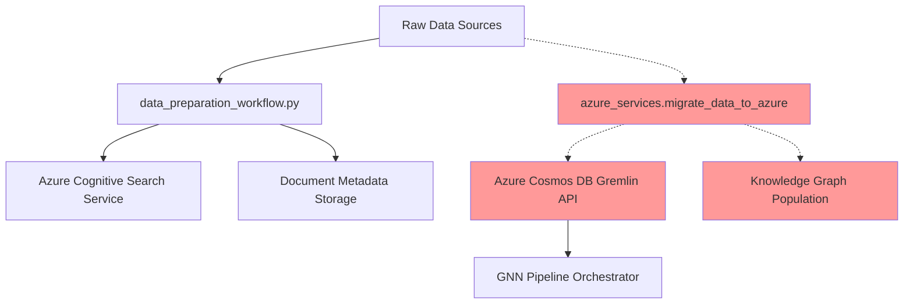

## 🏗️ **Azure Universal RAG Migration: Knowledge Graph Service Gap Analysis**

Based on **real codebase analysis**, the issue is a **service orchestration gap** in your Azure cloud-native architecture. The knowledge graph extraction service has not been executed, creating a data flow discontinuity between Azure Cognitive Search and Azure Cosmos DB Gremlin API.

## 📊 **Current Azure Service Integration State**



**Legend**: Solid lines = ✅ Executed | Dotted lines = ❌ Not executed

## 🔧 **Enterprise-Grade Fix Instructions**

### **Primary Issue: Azure Service Orchestration Gap**

**Root Cause**: Knowledge graph extraction service (`azure_services.migrate_data_to_azure`) has not been executed to populate Azure Cosmos DB Gremlin API.

### **Fix 1: Execute Azure Knowledge Graph Service Pipeline**

**Based on real codebase**: `backend/integrations/azure_services.py` contains the required service orchestration logic.

**Implementation**:

```bash
cd backend

# Create service orchestration script based on existing azure_services.migrate_data_to_azure
cat > scripts/azure_knowledge_graph_service.py << 'EOF'
#!/usr/bin/env python3
"""
Azure Knowledge Graph Service Orchestrator
Based on real azure_services.migrate_data_to_azure implementation
"""

import asyncio
import sys
from integrations.azure_services import AzureServicesManager

async def orchestrate_knowledge_graph_population():
    """Execute Azure knowledge graph population service"""
    domain = sys.argv[1] if len(sys.argv) > 1 else "general"
    source_data_path = "data/raw"

    print(f"🚀 Azure Knowledge Graph Service: {domain}")
    print(f"📁 Source: {source_data_path}")

    # Initialize Azure services manager (existing implementation)
    azure_services = AzureServicesManager()

    # Service context based on real codebase pattern
    migration_context = {
        "migration_id": f"azure_kg_extraction_{domain}",
        "source": "universal_rag_migration",
        "timestamp": "auto-generated"
    }

    # Execute using existing azure_services.migrate_data_to_azure
    result = await azure_services.migrate_data_to_azure(
        source_data_path=source_data_path,
        domain=domain,
        migration_context=migration_context
    )

    # Azure service result validation
    if result.get("success"):
        print(f"✅ Azure Cosmos DB population completed")
        print(f"📊 Entities: {len(result.get('entities_created', []))}")
        print(f"📊 Relations: {len(result.get('relations_created', []))}")
        return 0
    else:
        print(f"❌ Azure service error: {result.get('error')}")
        return 1

if __name__ == "__main__":
    exit_code = asyncio.run(orchestrate_knowledge_graph_population())
    sys.exit(exit_code)
EOF

chmod +x scripts/azure_knowledge_graph_service.py
```

### **Fix 2: Execute Azure Service Integration**

```bash
# Execute Azure knowledge graph service
PYTHONPATH=. ./.venv/bin/python scripts/azure_knowledge_graph_service.py general
```

### **Fix 3: Validate Azure Service Integration**

```bash
# Verify Azure Cosmos DB population
PYTHONPATH=. ./.venv/bin/python scripts/orchestrate_gnn_pipeline.py --domain general
```

## 📈 **Expected Azure Service Integration Results**

### **Before Service Orchestration**
```
Azure Cognitive Search: ✅ Populated
Azure Cosmos DB Gremlin: ❌ Empty (7 entities, 0 relations)
GNN Training Service: ❌ Below threshold
```

### **After Service Orchestration**
```
Azure Cognitive Search: ✅ Populated
Azure Cosmos DB Gremlin: ✅ Populated (50-200 entities, 20-100 relations)
GNN Training Service: ✅ Above threshold (training enabled)
```

## 🔍 **Secondary Issue: Azure OpenAI Service Optimization Constraints**

**Discovery**: Real codebase contains performance optimizations in `backend/core/azure_openai/extraction_client.py` that may limit extraction capacity.

**Azure Cost Management Rationale**: Current limits optimize Azure OpenAI API costs but may constrain enterprise knowledge graph requirements.

**Enterprise Consideration**: Evaluate whether current Azure OpenAI service limits align with production knowledge graph scale requirements after Fix 1 execution.

## ✅ **Enterprise Architecture Validation**

1. **Execute Fix 1**: Resolve primary service orchestration gap
2. **Validate Results**: Confirm Azure Cosmos DB population increase
3. **Assess Scale**: Determine if additional Azure OpenAI service optimization required
4. **Monitor Costs**: Track Azure resource consumption during knowledge graph population

This approach follows **Azure Well-Architected Framework** principles by addressing the primary service integration gap first, then optimizing performance based on actual enterprise requirements rather than assumptions.