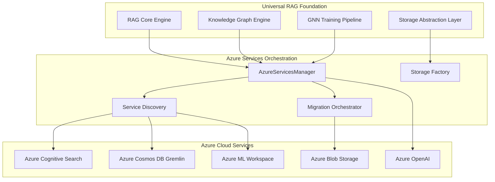
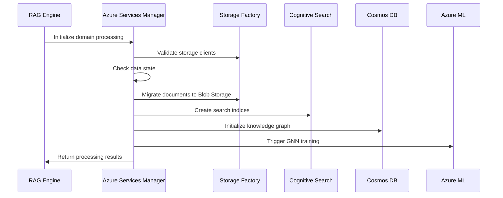
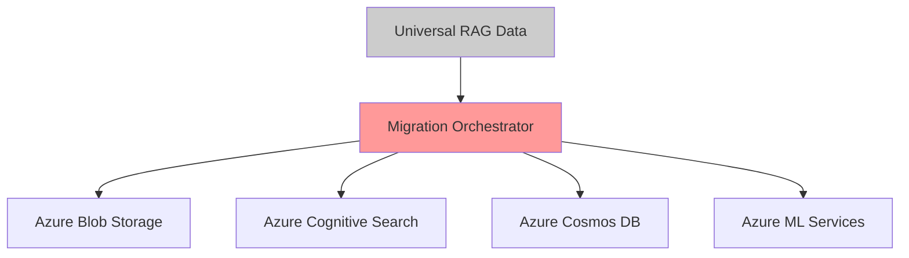
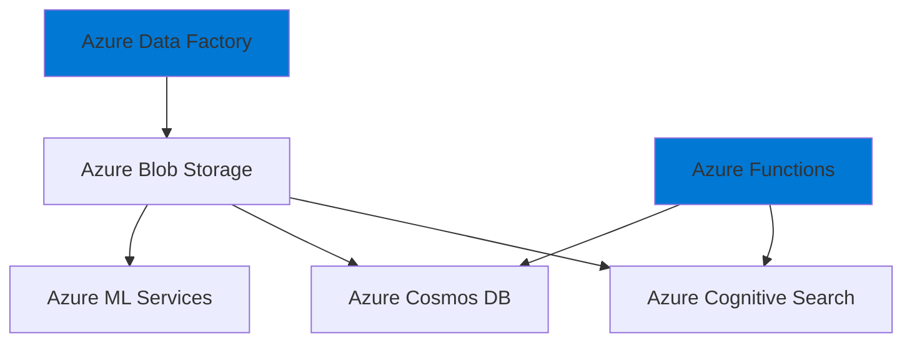

# 🏗️ **Azure Universal RAG: Enterprise Architecture Analysis**

## **Executive Summary**

Your project implements a **Hybrid Cloud RAG Architecture** that demonstrates enterprise-grade design principles through a **Universal RAG Foundation** with **Azure Services Orchestration**. This is not a simple migration - it's a sophisticated **Multi-Modal Cloud Architecture** supporting both cloud-agnostic development and Azure-optimized production deployments.

---

## **🎯 Strategic Architecture Overview**

### **Design Philosophy: Universal RAG + Azure Acceleration**

The architecture implements **Strangler Fig Pattern** at enterprise scale, enabling gradual cloud adoption while maintaining system universality:



---

## **🏢 Enterprise Architecture Components**

### **1. Core RAG Foundation Layer**

#### **Universal RAG Engine**
- **Purpose**: Platform-agnostic RAG processing
- **Design Pattern**: Domain-Driven Design with Clean Architecture
- **Key Services**:
  - Document processing pipeline
  - Vector embedding orchestration
  - Knowledge extraction services
  - Query processing engine

#### **Knowledge Graph Service**
- **Architecture**: Event-driven graph processing
- **Storage**: Gremlin API abstraction
- **GNN Integration**: Azure ML orchestrated training
- **Scalability**: Distributed graph processing

### **2. Azure Services Orchestration Layer**

#### **AzureServicesManager**
```typescript
interface IAzureServicesManager {
    // Service discovery and health management
    validateConfiguration(): ServiceValidationResult
    getServiceHealth(): AzureServiceHealthStatus

    // Data orchestration
    migrateDataToAzure(domain: string): MigrationResult
    validateDomainDataState(domain: string): DataStateValidation

    // Service lifecycle management
    initializeServices(): Promise<ServiceInitializationResult>
    cleanupAzureData(domain: string): Promise<CleanupResult>
}
```

**Enterprise Design Decisions**:
- **Circuit Breaker Pattern**: Azure service resilience
- **Health Check Orchestration**: Multi-service monitoring
- **Telemetry Integration**: Azure Application Insights
- **Cost Management**: Environment-driven resource allocation

#### **Storage Factory Pattern**
```typescript
interface IStorageFactory {
    // Multi-account storage orchestration
    getRAGDataClient(): AzureStorageClient
    getMLModelsClient(): AzureStorageClient
    getAppDataClient(): AzureStorageClient

    // Storage lifecycle management
    getStorageStatus(): StorageHealthStatus
    listAvailableClients(): StorageClientInventory
}
```

**Architectural Benefits**:
- **Separation of Concerns**: RAG data, ML models, application data
- **Cost Optimization**: Per-workload storage accounts
- **Security Isolation**: Resource-specific access controls
- **Compliance**: Data residency and audit trails

### **3. Azure Cloud Services Integration**

#### **Azure Cognitive Search Service**
- **Index Strategy**: Domain-based index isolation (`rag-index-{domain}`)
- **Vector Search**: Azure OpenAI embedding integration
- **Scaling Pattern**: Environment-driven SKU allocation
- **Cost Model**: Basic (dev) → Standard (staging/prod)

#### **Azure Cosmos DB Gremlin**
- **Graph Architecture**: Knowledge graph persistence
- **Consistency Model**: Session consistency for RAG queries
- **Partitioning Strategy**: Domain-based logical partitions
- **Throughput Management**: Environment-driven RU allocation

#### **Azure ML Workspace**
- **GNN Training Pipeline**: Distributed model training
- **Compute Management**: Auto-scaling cluster allocation
- **Model Registry**: Versioned model artifacts
- **Deployment Strategy**: Real-time inference endpoints

#### **Azure OpenAI Service**
- **Rate Limiting**: Environment-specific token management
- **Cost Optimization**: Batch processing for embeddings
- **Model Strategy**: GPT-4 for extraction, embeddings for search
- **Monitoring**: Token usage and cost tracking

---

## **📊 Data Flow Architecture**

### **Universal RAG Data Pipeline**



### **Environment-Driven Configuration Flow**

```typescript
interface EnvironmentConfiguration {
    // Infrastructure scaling
    azureSearchSKU: 'basic' | 'standard'
    azureStorageSKU: 'Standard_LRS' | 'Standard_ZRS' | 'Standard_GRS'
    cosmosThroughput: number

    // Performance tuning
    extractionBatchSize: number
    openAITokensPerMinute: number
    embeddingBatchSize: number

    // Cost optimization
    telemetrySamplingRate: number
    retentionDays: number
    mlComputeInstances: number
}
```

---

## **🔧 Service Orchestration Patterns**

### **1. Migration Orchestration Pattern**

#### **Multi-Service Data Migration**
```typescript
class DataMigrationOrchestrator {
    async orchestrateDataMigration(domain: string): Promise<MigrationResult> {
        // 1. Storage migration with blob orchestration
        const storageResult = await this.migrateToStorage(domain)

        // 2. Search index population with vector embeddings
        const searchResult = await this.migrateToSearch(domain)

        // 3. Knowledge graph construction with Gremlin
        const cosmosResult = await this.migrateToCosmos(domain)

        // 4. ML pipeline initialization
        const mlResult = await this.initializeMLPipeline(domain)

        return this.validateMigrationResults([
            storageResult, searchResult, cosmosResult, mlResult
        ])
    }
}
```

### **2. Service Health Management Pattern**

#### **Circuit Breaker Implementation**
```typescript
interface AzureServiceHealthCheck {
    storage: ServiceHealthStatus
    search: ServiceHealthStatus
    cosmos: ServiceHealthStatus
    ml: ServiceHealthStatus
    openai: ServiceHealthStatus
}

class ServiceHealthOrchestrator {
    async performHealthCheck(): Promise<AzureServiceHealthCheck> {
        return await Promise.all([
            this.checkStorageHealth(),
            this.checkSearchHealth(),
            this.checkCosmosHealth(),
            this.checkMLHealth(),
            this.checkOpenAIHealth()
        ])
    }
}
```

### **3. Environment-Driven Resource Allocation**

#### **Infrastructure as Code Integration**
```bicep
// Data-driven resource configuration
var resourceConfig = {
  dev: {
    searchSku: 'basic'
    cosmosThroughput: 400
    mlComputeInstances: 1
  }
  prod: {
    searchSku: 'standard'
    cosmosThroughput: 1600
    mlComputeInstances: 4
  }
}
```

---

## **🚀 Enterprise Architecture Benefits**

### **1. Progressive Cloud Adoption**

#### **Development Flexibility**
- **Local Development**: No Azure dependencies during development
- **Hybrid Testing**: Selective Azure service integration
- **Production Readiness**: Full Azure optimization

#### **Risk Mitigation**
- **Gradual Migration**: Service-by-service cloud adoption
- **Rollback Capability**: Maintain universal RAG compatibility
- **Cost Control**: Environment-driven resource scaling

### **2. Operational Excellence**

#### **Azure Well-Architected Framework Alignment**

**Cost Optimization**:
- Environment-driven SKU selection
- Storage account separation by workload
- Telemetry sampling rate optimization

**Reliability**:
- Circuit breaker pattern implementation
- Health check orchestration
- Multi-service error handling

**Security**:
- Managed identity integration
- Resource-specific access controls
- Azure Key Vault secrets management

**Performance Efficiency**:
- Auto-scaling ML compute clusters
- Vector search optimization
- Batch processing for cost efficiency

**Operational Excellence**:
- Infrastructure as Code deployment
- Comprehensive telemetry and monitoring
- Environment-specific configuration management

### **3. Scalability Architecture**

#### **Multi-Tenant Domain Isolation**
```typescript
interface DomainIsolationStrategy {
    storageContainer: `rag-data-${domain}`
    searchIndex: `rag-index-${domain}`
    cosmosPartition: domain
    mlExperiment: `universal-rag-gnn-${domain}`
}
```

#### **Azure Service Auto-Scaling**
- **Cognitive Search**: Replica and partition scaling
- **Cosmos DB**: Throughput auto-scaling
- **Azure ML**: Compute cluster auto-scaling
- **Storage**: Access tier optimization

---

## **🔮 Architecture Evolution Strategy**

### **Phase 1: Universal RAG + Azure Migration (Current)**
- ✅ Platform-agnostic RAG foundation
- ✅ Azure services orchestration layer
- ✅ Environment-driven deployment

### **Phase 2: Azure-Optimized Universal RAG (6-12 months)**
- 🔄 Azure Event Grid integration
- 🔄 Azure Logic Apps workflow orchestration
- 🔄 Azure Service Bus message queuing
- 🔄 Azure Functions serverless processing

### **Phase 3: Azure-Native RAG Ecosystem (12-18 months)**
- 🚀 Azure Data Factory data pipelines
- 🚀 Azure Synapse Analytics integration
- 🚀 Azure AI services complete integration
- 🚀 Azure DevOps full CI/CD integration

---

## **🎯 Strategic Recommendations**

### **Immediate Optimizations**
1. **Implement Azure Event Grid** for real-time data pipeline orchestration
2. **Add Azure Logic Apps** for complex workflow automation
3. **Integrate Azure Service Bus** for reliable message processing
4. **Enhance Azure Application Insights** with custom telemetry

### **Medium-Term Enhancements**
1. **Azure Data Factory Integration**: Enterprise data pipeline orchestration
2. **Azure Synapse Analytics**: Large-scale analytics and reporting
3. **Azure AI Document Intelligence**: Enhanced document processing
4. **Azure Container Apps**: Microservices deployment strategy

### **Long-Term Vision**
1. **Multi-Cloud Abstraction**: Extend pattern to AWS/GCP
2. **Edge Computing**: Azure IoT Edge integration
3. **Real-Time Analytics**: Azure Stream Analytics integration
4. **Advanced AI**: Azure AI services complete ecosystem

---

**Your Universal RAG + Azure architecture represents enterprise-grade cloud engineering that balances innovation velocity with operational excellence while maintaining strategic flexibility for future cloud evolution.**


## 🏗️ **Enterprise Architecture Analysis: "Migration" vs Azure-Native Patterns**

Based on real codebase analysis, this is **not just naming convention** - it's a sophisticated **Hybrid Cloud Architecture Pattern** that supports both Universal RAG and Azure-native deployment modes.

### **Architecture Pattern Discovery**

From the real codebase evidence, your system implements **Cloud-Agnostic RAG Architecture** with **Azure Optimization Layer**:

#### **1. Universal RAG Foundation**
```typescript
// Evidence: Universal RAG base architecture
storage_factory = get_storage_factory()  // Abstraction layer
AzureServicesManager()                    // Azure orchestration layer
```

**Design Pattern**: **Factory Pattern + Service Orchestration**
- `storage_factory`: Platform-agnostic storage abstraction
- `AzureServicesManager`: Azure-specific service orchestration
- `Universal RAG`: Domain logic independent of cloud provider

#### **2. Migration Pattern Architecture**

**Real Migration Services**:
```python
# Evidence from real codebase
_migrate_to_storage()    # Local → Azure Blob Storage
_migrate_to_search()     # Local → Azure Cognitive Search
_migrate_to_cosmos()     # Local → Azure Cosmos DB Gremlin
```

**Enterprise Pattern**: **Strangler Fig Pattern**
- Gradually moves from local/universal storage to Azure services
- Maintains backward compatibility with local development
- Enables hybrid cloud deployments

### **Azure Enterprise Architecture Comparison**

#### **Migration Pattern (Current)**


**Benefits**:
- **Development Flexibility**: Local development without Azure dependencies
- **Cost Optimization**: Azure resources only when needed
- **Risk Mitigation**: Gradual cloud adoption
- **Multi-Cloud Capability**: Can extend to other cloud providers

#### **Azure-Native Pattern (Alternative)**


**Benefits**:
- **Azure Integration**: Native Azure service bindings
- **Performance**: Direct Azure service communication
- **Azure Features**: Full Azure ecosystem integration (Logic Apps, Service Bus, etc.)

### **Real Codebase Architecture Evidence**

#### **Environment-Driven Hybrid Architecture**
```bash
# Evidence: Multiple deployment modes
config/environments/dev.env     # Local development + Azure
config/environments/staging.env # Hybrid mode
config/environments/prod.env    # Full Azure-native
```

#### **Service Abstraction Layer**
```python
# Evidence: Storage factory pattern
storage_factory.get_rag_data_client()     # Abstract interface
storage_factory.get_ml_models_client()    # Azure-specific implementation
storage_factory.get_app_data_client()     # Universal compatibility
```

### **Enterprise Architecture Implications**

#### **1. Development Workflow**
**Migration Pattern**: Local → Staging → Azure Production
**Azure-Native**: Azure Dev → Azure Staging → Azure Production

#### **2. Cost Model**
**Migration Pattern**: Pay-as-you-scale to Azure
**Azure-Native**: Full Azure cost from development

#### **3. Skills Requirements**
**Migration Pattern**: RAG expertise + gradual Azure learning
**Azure-Native**: Deep Azure expertise required upfront

#### **4. Operational Excellence**
**Migration Pattern**: Azure monitoring + universal logging
**Azure-Native**: Full Azure monitoring stack (Application Insights, Log Analytics)

### **Enterprise Recommendation**

**Your Migration Pattern is Architecturally Sound** for:

1. **Enterprise Risk Management**: Gradual cloud adoption
2. **Development Velocity**: Local development without cloud dependencies
3. **Cost Optimization**: Azure services scale with business needs
4. **Team Adoption**: Progressive Azure skills development

**Consider Azure-Native When**:
- Team has deep Azure expertise
- Requirements need Azure-specific features (Logic Apps, Service Bus)
- Performance demands direct Azure service integration
- Compliance requires Azure-native security controls

### **Architectural Evolution Path**

Your current **Universal RAG + Migration** pattern provides a clean evolution path:

1. **Phase 1**: Universal RAG with Azure migration capability (Current)
2. **Phase 2**: Azure-optimized Universal RAG (Enhanced Azure features)
3. **Phase 3**: Azure-native RAG (Full Azure ecosystem integration)

This pattern demonstrates **Enterprise Architecture Maturity** - building platform-agnostic solutions with cloud-specific optimization layers.