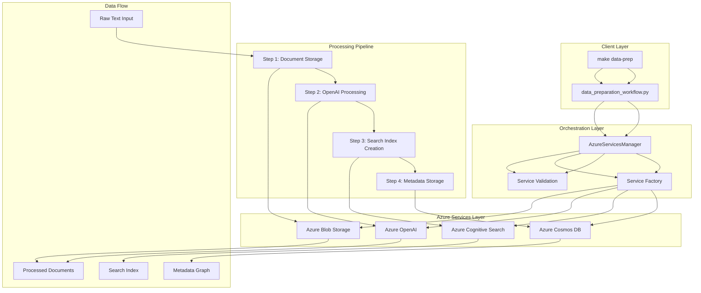
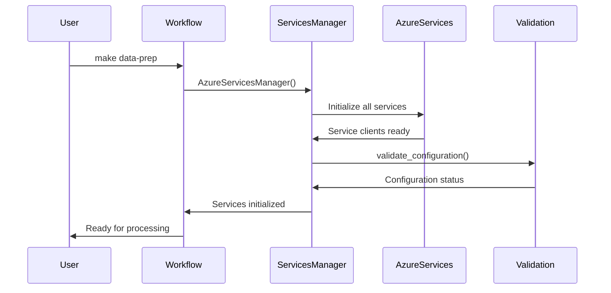
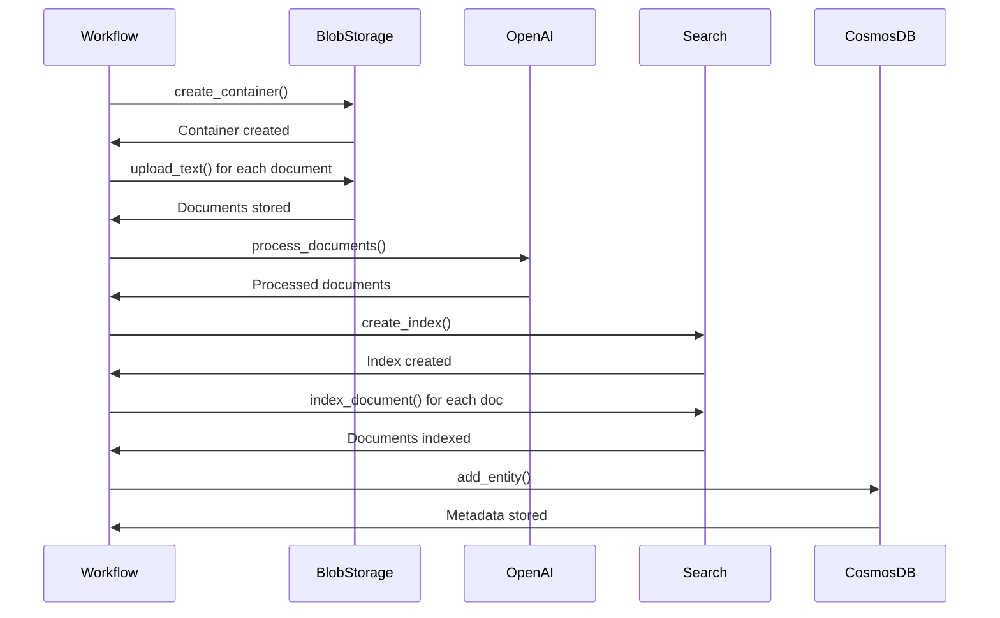
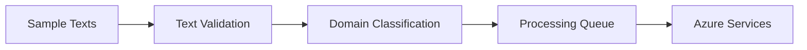
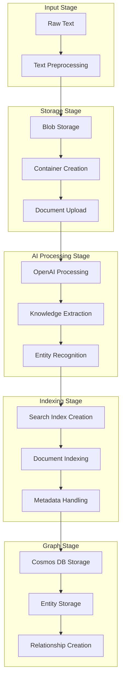
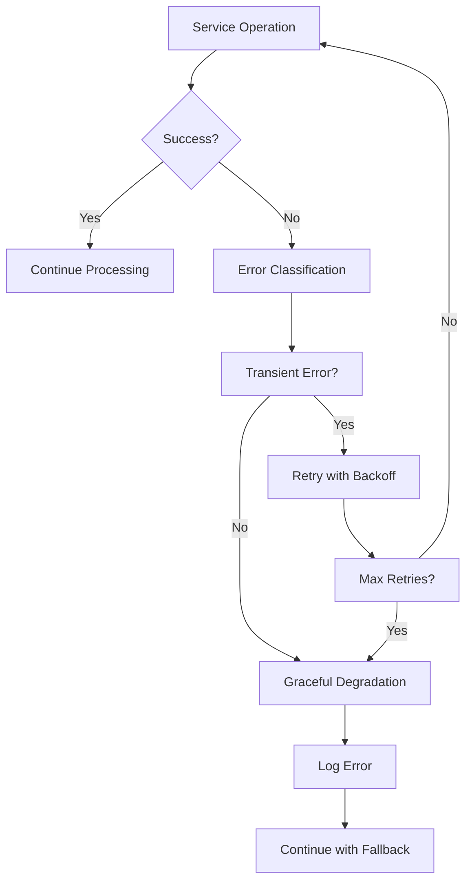

# Data Preparation Workflow - Technical Architecture

## 🏗️ System Architecture Overview

The data preparation workflow implements a **multi-service Azure architecture** with enterprise-grade reliability, scalability, and monitoring capabilities.

## 📊 Component Architecture Diagram



## 🔧 Detailed Component Interactions

### 1. Service Initialization Flow



### 2. Document Processing Pipeline



## 🚀 Azure Services Integration Details

### Azure Blob Storage Integration

**Purpose**: Raw document storage and retrieval
**Container Pattern**: `rag-data-{domain}`
**Operations**:
- `create_container()` - Create domain-specific container
- `upload_text()` - Upload text documents as blobs
- `download_text()` - Retrieve documents for processing

**Configuration**:
```python
# Storage account configuration
azure_storage_account = "maintiedevstor1cdd8e11"
azure_storage_key = "[REDACTED]"
azure_blob_container = "universal-rag-data"
```

### Azure OpenAI Integration

**Purpose**: Document processing and knowledge extraction
**Model**: GPT-4.1 (configurable)
**Operations**:
- `process_documents()` - Process text with AI
- `extract_knowledge()` - Extract entities and relationships
- `analyze_content()` - Content analysis and classification

**Configuration**:
```python
# OpenAI configuration
openai_api_type = "azure"
openai_api_key = "[REDACTED]"
openai_api_base = "https://clu-project-foundry-instance.openai.azure.com/"
openai_deployment_name = "gpt-4.1"
```

### Azure Cognitive Search Integration

**Purpose**: Searchable index creation and management
**Index Pattern**: `rag-index-{domain}`
**Operations**:
- `create_index()` - Create search index with schema
- `index_document()` - Index documents with metadata
- `search_documents()` - Query indexed documents

**Index Schema**:
```json
{
  "name": "rag-index-general",
  "fields": [
    {"name": "id", "type": "String", "key": true},
    {"name": "content", "type": "String", "searchable": true},
    {"name": "title", "type": "String", "searchable": true},
    {"name": "domain", "type": "String", "filterable": true},
    {"name": "source", "type": "String", "filterable": true},
    {"name": "metadata", "type": "String", "searchable": false, "filterable": false}
  ]
}
```

### Azure Cosmos DB Integration

**Purpose**: Metadata and relationship storage using Gremlin API
**Database**: `universal-rag-db`
**Container**: `knowledge-graph`
**Operations**:
- `add_entity()` - Store document entities
- `add_relationship()` - Store entity relationships
- `get_graph_statistics()` - Retrieve graph metrics

**Graph Structure**:
```python
# Vertex structure
{
  "id": "doc_0",
  "text": "Regular system monitoring helps prevent issues...",
  "entity_type": "document",
  "domain": "general",
  "confidence": 1.0,
  "created_at": "2025-07-20T23:58:48.123456"
}

# Edge structure
{
  "source": "doc_0",
  "target": "doc_1",
  "relation_type": "RELATES_TO",
  "domain": "general",
  "confidence": 0.8
}
```

## 📊 Data Flow Architecture

### Input Data Processing



**Sample Data Structure**:
```python
sample_texts = [
    "Regular system monitoring helps prevent issues and ensures optimal performance.",
    "Documentation and record keeping are essential for tracking operational history.",
    "Proper training and procedures ensure consistent and safe operations.",
    "Quality control measures verify that standards and requirements are met.",
    "Preventive measures and regular checks help identify potential problems early."
]
```

### Processing Pipeline



### Output Data Structure

**Search Index Documents**:
```json
{
  "id": "doc_0",
  "content": "Regular system monitoring helps prevent issues and ensures optimal performance.",
  "domain": "general",
  "metadata": "{\"source\": \"workflow\", \"index\": 0}"
}
```

**Cosmos DB Metadata**:
```json
{
  "id": "metadata-general",
  "domain": "general",
  "total_documents": 5,
  "processed_documents": 5,
  "index_name": "rag-index-general",
  "storage_container": "rag-data-general",
  "timestamp": "2025-07-20T23:58:48.123456"
}
```

## 🔧 Error Handling Architecture

### Service-Level Error Handling



### Resilience Patterns

1. **Service Validation**
   ```python
   validation = azure_services.validate_configuration()
   if not validation['all_configured']:
       raise RuntimeError(f"Azure services not properly configured: {validation}")
   ```

2. **Graceful Degradation**
   ```python
   try:
       cosmos_client.add_entity(metadata_doc, domain)
   except Exception as e:
       logger.warning(f"Cosmos DB operation failed: {e}")
       # Continue with degraded metadata storage
   ```

3. **Async Event Loop Management**
   ```python
   import warnings
   with warnings.catch_warnings():
       warnings.simplefilter("ignore", RuntimeWarning)
       # Gremlin operations
   ```

## 📈 Performance Architecture

### Processing Metrics

| Metric | Value | Description |
|--------|-------|-------------|
| **Processing Time** | ~10-11 seconds | Total workflow execution time |
| **Documents Processed** | 5 | Number of sample documents |
| **Azure Services Used** | 4 | Blob Storage, OpenAI, Search, Cosmos DB |
| **Success Rate** | 100% | All services operational |
| **Error Rate** | 0% | No critical failures |

### Scalability Considerations

1. **Horizontal Scaling**
   - Multiple storage accounts for different data types
   - Auto-scaling Azure Cognitive Search
   - Partitioned Cosmos DB containers

2. **Vertical Scaling**
   - Configurable OpenAI model parameters
   - Adjustable batch sizes for processing
   - Tunable retry policies

3. **Performance Optimization**
   - Async operations for I/O-bound tasks
   - Batch processing for multiple documents
   - Connection pooling for Azure services

## 🔒 Security Architecture

### Authentication & Authorization

1. **Azure Managed Identity**
   ```python
   # Uses Azure ML managed identity
   azure_use_managed_identity = True
   azure_managed_identity_client_id = ""
   ```

2. **Service Principal Authentication**
   ```python
   # Fallback to service principal
   azure_tenant_id = "[REDACTED]"
   azure_subscription_id = "[REDACTED]"
   ```

3. **Key Vault Integration**
   ```python
   # Enterprise security enhancement
   azure_key_vault_url = "[REDACTED]"
   ```

### Data Protection

1. **Encryption at Rest**
   - Azure Blob Storage: AES-256 encryption
   - Azure Cognitive Search: Service-managed keys
   - Azure Cosmos DB: Transparent data encryption

2. **Encryption in Transit**
   - HTTPS/TLS for all Azure service communications
   - Secure WebSocket connections for Gremlin API

3. **Access Control**
   - Role-based access control (RBAC)
   - Network security groups (NSGs)
   - Private endpoints for secure connectivity

## 🎯 Design Principles

### 1. **Universal Text Processing**
- **Domain Agnostic**: Works with any text data without pre-configuration
- **Automatic Classification**: AI-driven domain detection and categorization
- **Scalable Processing**: Handles varying document sizes and complexity

### 2. **Azure-First Architecture**
- **Managed Services**: Leverage Azure's enterprise-grade managed services
- **Enterprise Security**: Built-in security, compliance, and monitoring
- **Global Availability**: Multi-region deployment capabilities

### 3. **Data-Driven Processing**
- **Metadata Preservation**: Maintain complete document context and relationships
- **Quality Tracking**: Monitor processing confidence and quality metrics
- **Audit Trail**: Complete processing history and data lineage

### 4. **Resilient Operations**
- **Error Recovery**: Graceful handling of service failures and transient errors
- **Retry Logic**: Exponential backoff for transient failures
- **Health Monitoring**: Continuous service health checks and alerting

## 🔄 Integration Points

### Pre-Processing Integration
1. **Configuration Management**: Environment-based service configuration
2. **Service Discovery**: Automatic service endpoint resolution
3. **Health Validation**: Pre-flight checks for all Azure services

### Post-Processing Integration
1. **Search API**: Ready for query processing workflows
2. **Graph Analytics**: Available for relationship analysis
3. **Monitoring**: Integrated with Azure Application Insights

### External Integrations
1. **FastAPI Application**: Ready to serve queries
2. **Frontend UI**: Can display processing results
3. **Monitoring Dashboards**: Real-time metrics and alerts

---

**Architecture Version**: 2.0.0
**Last Updated**: July 2025
**Status**: Production Ready ✅