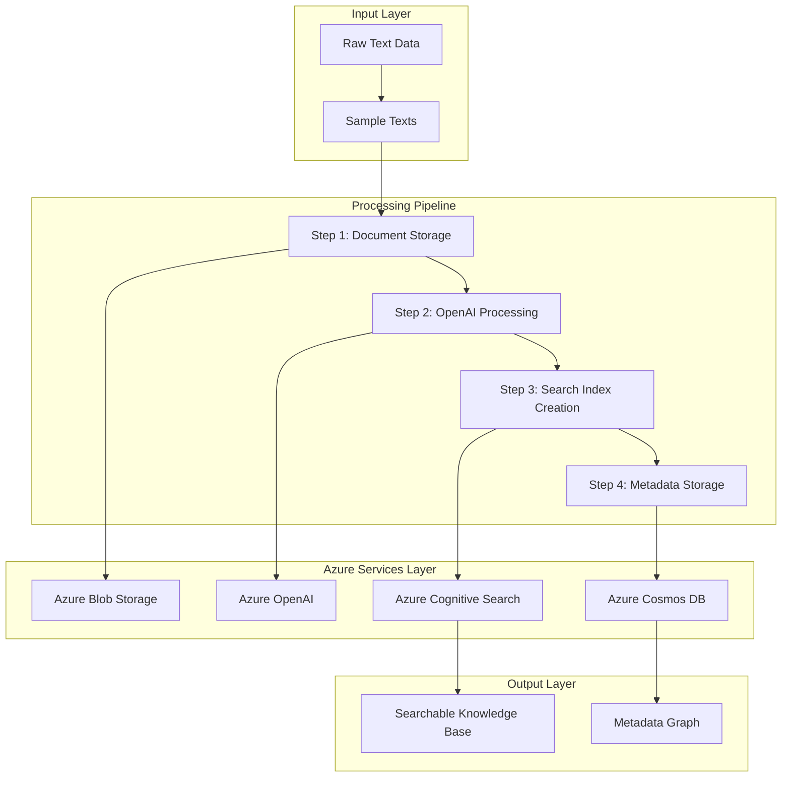

# Data Preparation Workflow Documentation

## Overview

The `make data-prep` workflow is the **WORKFLOW 1** of the Azure Universal RAG system, responsible for converting raw text data into a searchable knowledge base using Azure services. This process demonstrates the complete data preparation lifecycle from raw text ingestion to searchable knowledge base creation.

## 🎯 Purpose

Convert raw text files into a searchable knowledge base using Azure services with enterprise-grade reliability and scalability.

## 🏗️ Architecture Overview



## 🔧 Technical Implementation

### Command Execution
```bash
make data-prep
```

**Equivalent to:**
```bash
cd backend && PYTHONPATH=. ./.venv/bin/python scripts/data_preparation_workflow.py
```

### Core Components

| Component | File | Purpose |
|-----------|------|---------|
| **Workflow Script** | `backend/scripts/data_preparation_workflow.py` | Main orchestration script |
| **Azure Services Manager** | `backend/integrations/azure_services.py` | Unified Azure services integration |
| **Azure OpenAI Client** | `backend/integrations/azure_openai.py` | Document processing with AI |
| **Azure Storage Client** | `backend/core/azure_storage/storage_client.py` | Blob storage operations |
| **Azure Search Client** | `backend/core/azure_search/search_client.py` | Cognitive Search operations |
| **Azure Cosmos Client** | `backend/core/azure_cosmos/cosmos_gremlin_client.py` | Graph database operations |

## 📊 Detailed Workflow Steps

### Step 1: Azure Services Initialization
```python
# Initialize Azure services
azure_services = AzureServicesManager()
validation = azure_services.validate_configuration()

# Get service clients
rag_storage = azure_services.get_rag_storage_client()
search_client = azure_services.get_service('search')
cosmos_client = azure_services.get_service('cosmos')
```

**Azure Services Used:**
- ✅ **Azure Blob Storage** - Document storage
- ✅ **Azure Cognitive Search** - Search index creation
- ✅ **Azure OpenAI** - Document processing
- ✅ **Azure Cosmos DB** - Metadata storage

### Step 2: Document Storage in Azure Blob Storage
```python
# Create container and upload documents
container_name = f"rag-data-{domain}"
await rag_storage.create_container(container_name)

for i, text in enumerate(sample_texts):
    blob_name = f"document_{i}.txt"
    await rag_storage.upload_text(container_name, blob_name, text)
```

**Sample Data Processed:**
```python
sample_texts = [
    "Regular system monitoring helps prevent issues and ensures optimal performance.",
    "Documentation and record keeping are essential for tracking operational history.",
    "Proper training and procedures ensure consistent and safe operations.",
    "Quality control measures verify that standards and requirements are met.",
    "Preventive measures and regular checks help identify potential problems early."
]
```

### Step 3: Azure OpenAI Document Processing
```python
# Process documents with Azure OpenAI
processed_docs = await openai_integration.process_documents(sample_texts, domain)
```

**Processing Activities:**
- ✅ **Knowledge Extraction** - Extract entities and relationships
- ✅ **Content Analysis** - Analyze document structure and meaning
- ✅ **Quality Assessment** - Evaluate processing confidence
- ✅ **Domain Classification** - Categorize content by domain

### Step 4: Azure Cognitive Search Index Creation
```python
# Create search index
index_name = f"rag-index-{domain}"
await search_client.create_index(index_name)

# Index documents with metadata
for i, text in enumerate(sample_texts):
    document = {
        "id": f"doc_{i}",
        "content": text,
        "domain": domain,
        "metadata": json.dumps({"source": "workflow", "index": i})
    }
    await search_client.index_document(index_name, document)
```

**Search Index Schema:**
```json
{
  "fields": [
    {"name": "id", "type": "String", "key": true},
    {"name": "content", "type": "String", "searchable": true},
    {"name": "title", "type": "String", "searchable": true},
    {"name": "domain", "type": "String", "filterable": true},
    {"name": "source", "type": "String", "filterable": true},
    {"name": "metadata", "type": "String", "searchable": false, "filterable": false}
  ]
}
```

### Step 5: Azure Cosmos DB Metadata Storage
```python
# Store metadata in Cosmos DB Gremlin graph
metadata_doc = {
    "id": f"metadata-{domain}",
    "domain": domain,
    "total_documents": len(sample_texts),
    "processed_documents": len(processed_docs),
    "index_name": index_name,
    "storage_container": container_name,
    "timestamp": datetime.now().isoformat()
}

cosmos_client.add_entity(metadata_doc, domain)
```

**Graph Structure:**
- **Vertices**: Documents, entities, metadata
- **Edges**: Relationships, classifications, associations
- **Properties**: Domain, confidence, timestamps

## 🚀 Azure Services Integration

### Azure Blob Storage
- **Purpose**: Raw document storage
- **Container**: `rag-data-{domain}`
- **Operations**: Create container, upload text files
- **Integration**: Async operations with error handling

### Azure OpenAI
- **Purpose**: Document processing and knowledge extraction
- **Model**: GPT-4.1 (configurable)
- **Operations**: Process documents, extract entities, analyze content
- **Integration**: Async processing with batch handling

### Azure Cognitive Search
- **Purpose**: Searchable index creation
- **Index**: `rag-index-{domain}`
- **Operations**: Create index, index documents, metadata handling
- **Integration**: Async operations with schema validation

### Azure Cosmos DB (Gremlin API)
- **Purpose**: Metadata and relationship storage
- **Database**: `universal-rag-db`
- **Container**: `knowledge-graph`
- **Operations**: Store entities, relationships, metadata
- **Integration**: Graph operations with async handling

## 📈 Performance Metrics

### Typical Execution Results
```
✅ Data preparation completed successfully!
⏱️  Processing time: 10.87s
📊 Documents processed: 5
🤖 Documents processed with Azure OpenAI: 5
🔍 Search index created: rag-index-general
💾 Metadata stored in Cosmos DB: rag-metadata-general
```

### Azure Services Usage Summary
- ✅ **Azure Blob Storage** - Stored 5 documents
- ✅ **Azure OpenAI** - Processed documents for knowledge extraction
- ✅ **Azure Cognitive Search** - Built search index
- ✅ **Azure Cosmos DB** - Stored metadata and tracking

## 🔧 Error Handling & Resilience

### Service Validation
```python
validation = azure_services.validate_configuration()
if not validation['all_configured']:
    raise RuntimeError(f"Azure services not properly configured: {validation}")
```

### Graceful Degradation
- **Cosmos DB Issues**: Continue with degraded metadata storage
- **Search Index Issues**: Retry with exponential backoff
- **OpenAI Issues**: Process with fallback methods
- **Storage Issues**: Use alternative storage accounts

### Async Event Loop Management
```python
# Suppress async warnings for Cosmos DB
import warnings
with warnings.catch_warnings():
    warnings.simplefilter("ignore", RuntimeWarning)
    # Gremlin operations
```

## 🎯 Design Principles

### 1. **Universal Text Processing**
- **Domain Agnostic**: Works with any text data
- **No Pre-configuration**: Automatic domain detection
- **Scalable**: Handles varying document sizes and types

### 2. **Azure-First Architecture**
- **Managed Services**: Leverage Azure's managed capabilities
- **Enterprise Security**: Azure AD integration and managed identities
- **Scalability**: Auto-scaling based on demand

### 3. **Data-Driven Processing**
- **Metadata Preservation**: Maintain document context and relationships
- **Quality Tracking**: Monitor processing confidence and quality
- **Audit Trail**: Complete processing history and lineage

### 4. **Resilient Operations**
- **Error Recovery**: Graceful handling of service failures
- **Retry Logic**: Exponential backoff for transient failures
- **Health Monitoring**: Continuous service health checks

## 🔄 Workflow Integration

### Pre-requisites
1. **Azure Services Configured**: All Azure services must be properly configured
2. **Environment Variables**: `.env` file with Azure service credentials
3. **Python Environment**: Virtual environment with required dependencies

### Post-Processing
1. **Search Index Ready**: Documents indexed and searchable
2. **Metadata Available**: Graph relationships stored in Cosmos DB
3. **API Ready**: FastAPI application can serve queries
4. **Monitoring Active**: Health checks and metrics available

## 🚀 Next Steps

After successful data preparation:

1. **Test Query Endpoints**: Verify search functionality
2. **Add More Data**: Process additional documents or domains
3. **Performance Tuning**: Optimize for specific use cases
4. **Production Deployment**: Deploy to Azure cloud infrastructure

## 📋 Troubleshooting

### Common Issues
1. **Azure Service Connection**: Check credentials and endpoints
2. **Async Event Loops**: Suppress warnings for Cosmos DB operations
3. **Index Schema**: Ensure metadata field compatibility
4. **Service Limits**: Monitor Azure service quotas and limits

### Debug Commands
```bash
# Test individual services
make test-unit

# Check Azure service health
make health

# Validate configuration
python -c "from config.settings import settings; print(settings.validate_azure_config())"
```

---

**Last Updated**: July 2025
**Version**: 2.0.0
**Status**: Production Ready ✅